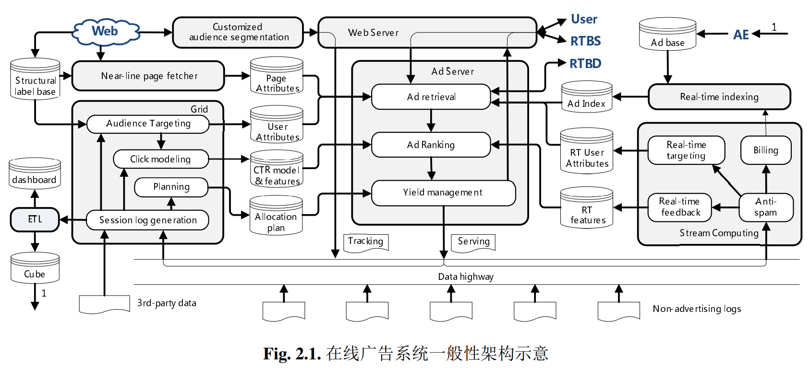
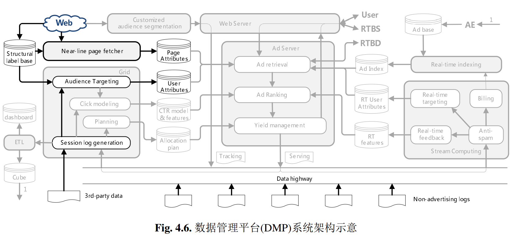
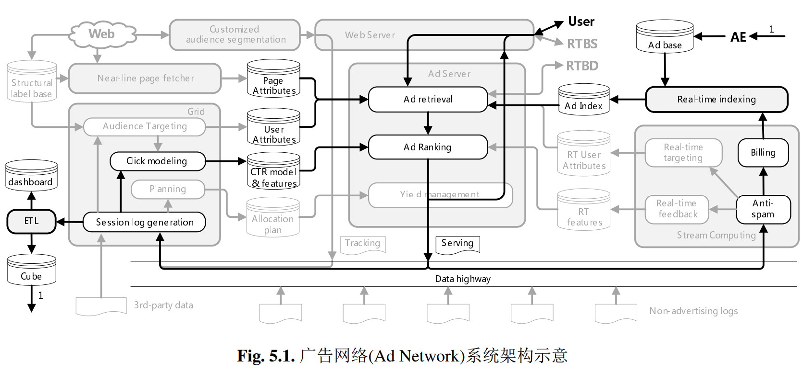
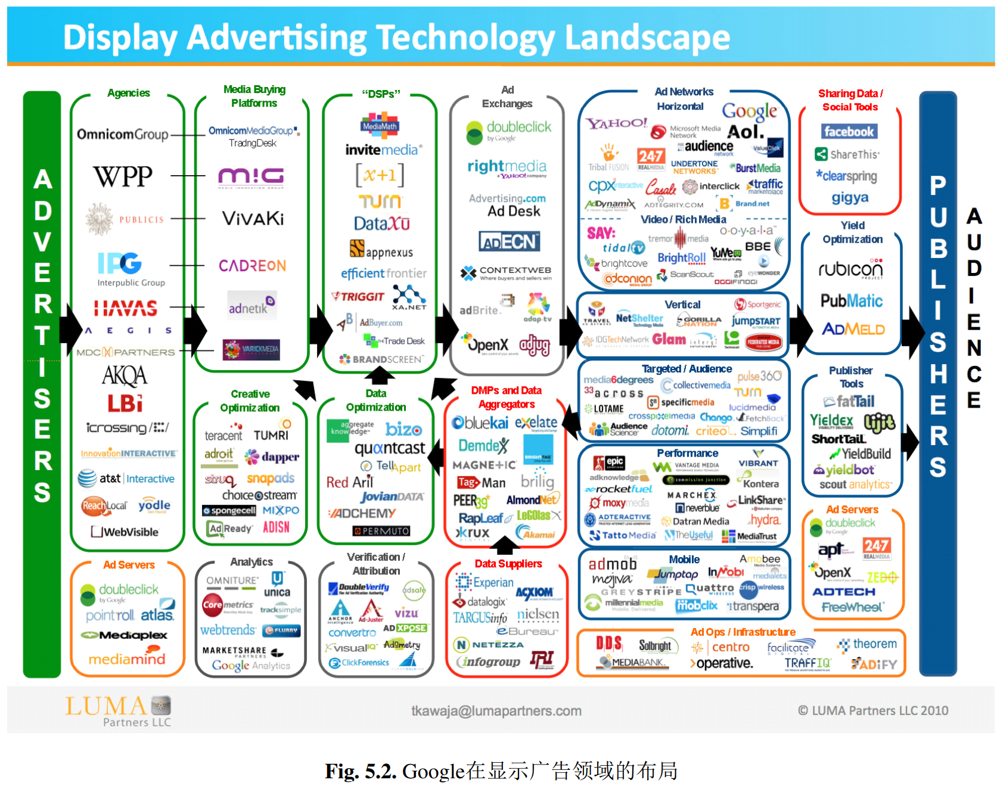
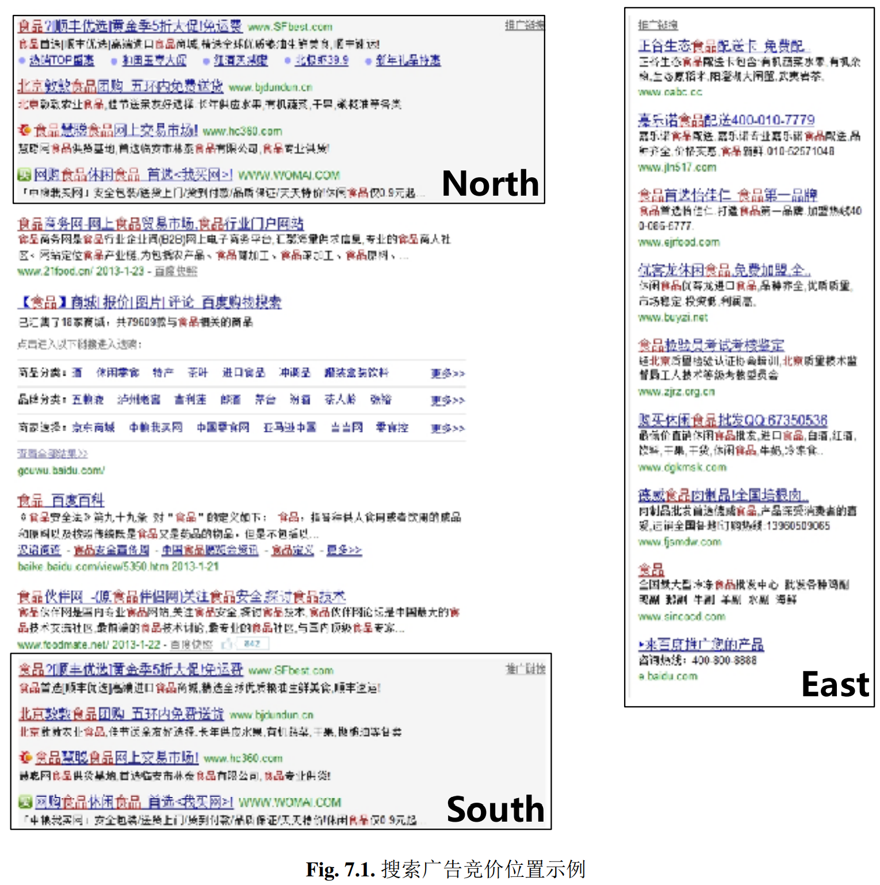
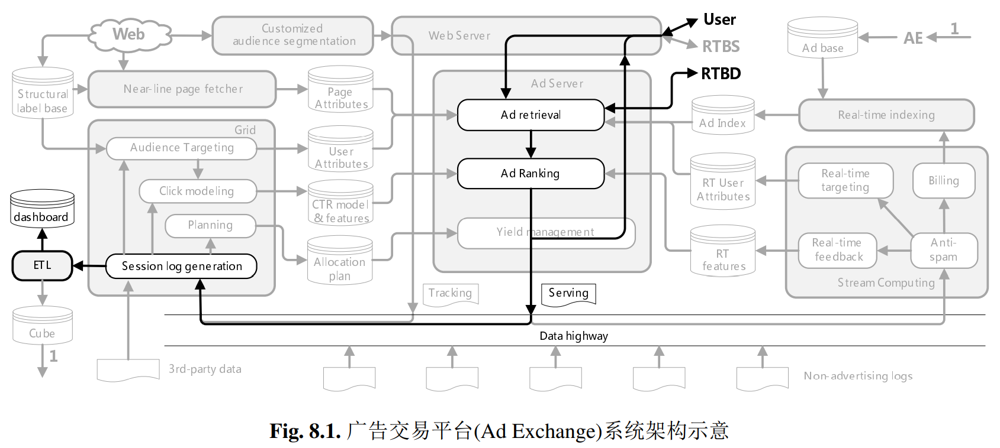
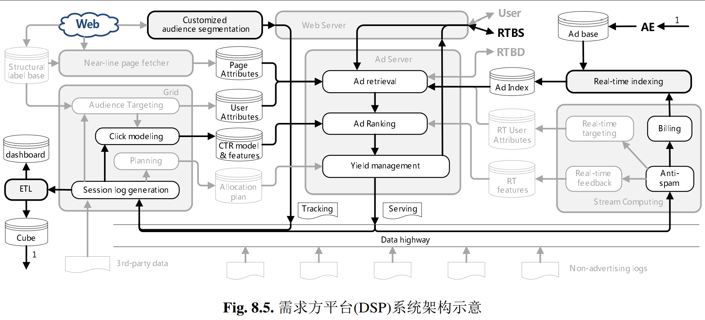
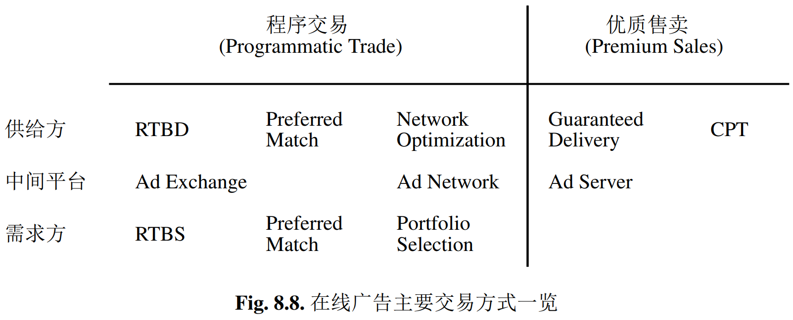
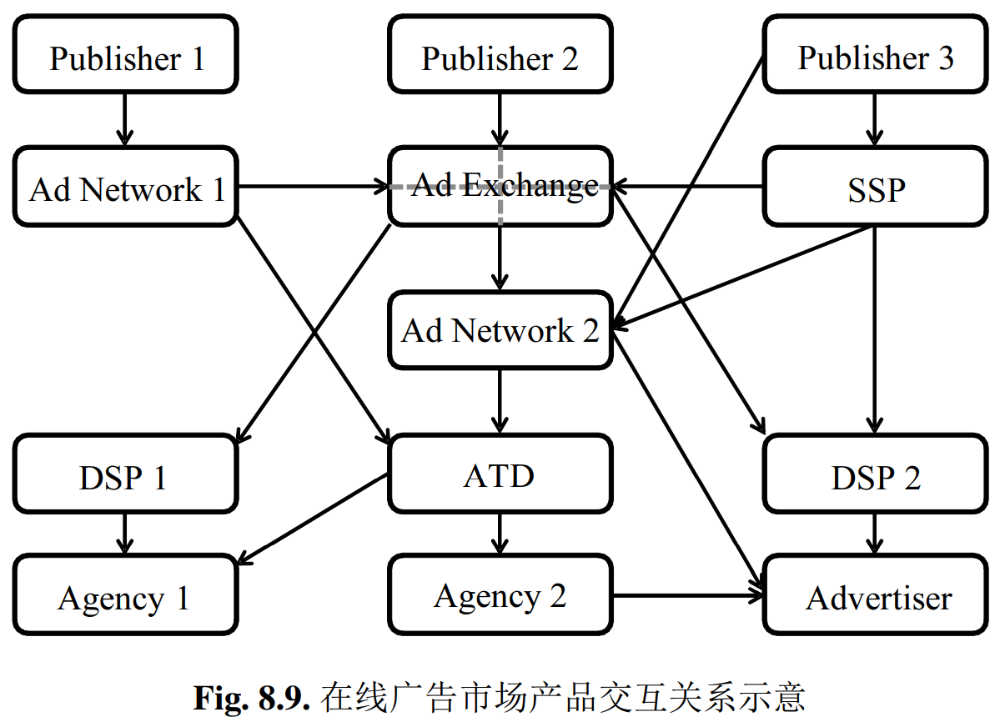
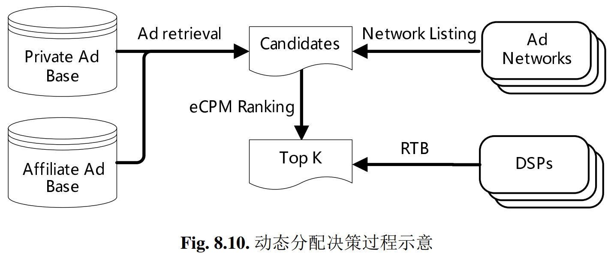

## Computational Advertising

计算广告

### 在线广告综述

计算广告与网页搜索、推荐系统，都是互联网时代具有挑战性的大规模计算问题。由于数据规模的要求，这些系统都较广泛地采用检索(Retrieval)加排序(Ranking)这样类搜索的系统架构，因而有非常多的相似之处。

首先，广告不同于搜索或推荐，它首先是一项商业活动，其次才是一项在互联网环境下需要技术优化的商业活动；其次，这一商业活动中广告主、媒体和用户的利益都需要被认真考虑和满足，才能达到整个市场的平衡和不断发展，在线广告市场所有产品和商业形式的演进，都是在这一主题下发生的。


从两个方面来探讨广告的内在规律，一是它的内涵，即这种商业活动的定义与目的；一是它的外延，即在线广告发展的简要历史和其中产生的关键产品形态。

相比传统的线下广告，在线广告的具体形式由于互联网产品媒体形态、交互方式等方面非常
大的差异性，也呈现出各种各样的表现形式。


传统广告中发展起来的广告有效性理论


把广告产生效果的过程分解为若干阶段，并讨论其中各阶段关键的影响因素，可以对
在线广告情形下受众定向、创意优化及其他计算问题中有价值的技术点有概要性的把握。

广告和在线广告领域中重要的行业协会。了解这些协会在广告业务中代表的利益方，以及他们对整个在线广告市场产品和技术形态的推动作用。

#### 广告的定义
广告是由已确定的出资人通过各种媒介进行的有关产品(商品、服务和观点)的，通常是有偿的、有组织的、综合的、劝服性的非人员的信息传播活动。
William F. Arens 《当代广告学》

首先，它指出了广告活动的两个主动参与方：出资人(sponsor) 和媒体(medium)。在数字广告复杂的市场结构中，我们可以用更一般性的术语来描述它们：需求方(Demand)和供给方(Supply)。

这里的需求方，可以是广告主(advertiser)，代表广告主利益的代理商(agency)或者其它技术形态的采买方；

这里的供给方，可以是媒体，也可以是其他技术形态的变现平台。

当然，广告还有一个被动的参与方，即受众(audience)。

出资人、媒体和受众这三者的利益博奕关系是广告活动永远的主线，这一主线将贯穿于商业和产品形态的整个演化过程中。

其次，该定义阐明了广告必须是有偿的、非人员的信息传播活动，这两点限制，前者使得广告的目
标变得明确，后者使得这一目标可以采用计算的方式来优化，而这些都是计算广告产生的根本基
础。

#### 广告的目的
广告这一商业行为，其本质目的是什么呢？在不同的时代，广告主与媒体对这一问题存在着不同的认知。

在传统媒体时代，供给方与需求方的在市场地位上有着相当的距离。不论你运营的是电视台、机场、或八卦杂志，都与大多数广告主需要的转化行为之间，有相当大的差距。这一阶段广告的目的，是希望借助媒体的力量来快速接触大量用户，以达到宣传品牌形象，提升中长期购买率与利润空间的目的。这种目的的广告，我们称为品牌广告(Brand Awareness)。

当然，也有许多广告商希望能利用广告手段马上带来大量的购买行为，这种目的的广告，我们称为效果广告(Direct Response)。

传统广告市场缺乏大量投送和优化效果广告的能力。这是因为，对短期效果的追求要求广告精准地送达目标人群，而这在传统媒体上缺乏有效地技术手段。这里能提出来的以效果为目的的传统广告，恐怕只有在写字楼下散发的快餐传单。

而数字媒体的出现，使得效果广告空前蓬勃地发展起来，这主要有两方面的原因：一是数字媒体的特点可以让我们低成本地投送个性化广告；二是一些在线服务，比如搜索、电子商务，由于可以更清楚地了解用户的意图，也就使广告效果的优化更加容易。

既然有品牌和效果这两种目标，究竟如何描述广告这种商业活动的根本目的呢，《当代广告学》提出：广告的根本目的，是广告主通过媒体达到低成本的用户接触。

也就是说，按某种市场意图接触相应的人群，进而影响其中的潜在用户，使他们选择广告主
产品的机率增加，或者对产品性价比的苛求程度降低，才是广告的根本目的。

至于短期内的转化效果，由于市场意图或媒体性质的不同，并不是直接可比。换句话说，我们如果仅仅以效果为目的来思考问题，可能会在某种程度上远离广告的本质和正确方法。举个例子，某个感冒药广告商，如果以短期效果为导向，那么最佳的策略是把广告投放给那些现在感冒的人，不过这显然是一个荒谬的决策；再比如，某汽车广告商为了提升自己的品牌形象，希望对自己竞品品牌的用户加强宣传，而在这部分人群上，广告的直接效果甚至不如随机投放。

希望大家认清这一概念，这样在遇到多种广告策略的效果比较时，避免一些偏颇的结论。广告的“低成本”，是与那些“人员”的信息传播活动相对比的，即相比于那些由市场或销售人员完成的劝服活动，广告搭媒体流量的便车理应更加经济有效。要确定是否真的成本较低，需要用到一个“投入产出比(Return over Investment, ROI)”的评价指标，即某次广告活动的总产出与总投入的比例。在实际中，广告活动的总投入容易确定，但总产出的确定却不那么容易，特别是在投放以中长期收益为目标的品牌广告时。因此，绝对的ROI有时难以计算，不过通过比较广告投入与人员性劝服活动的投入，我们仍然可以评估广告的成本是否令人满意。


#### 在线广告类型
在线广告除了商业和产品有诸多形态，其与用户接触的形式也有多种多样的选择，并且随着互联
网产品的发展变得越来越丰富。诸多在线广告的类型，在投送方式和用户交互方式两方面有不同
的选择。

1. 条幅广告(Banner Ad)：这是显示广告中中最传统，也是最典型的形式。这种广告一般是嵌入在页面中相对固定位置的图片，与内容一样需要占据固定的版面，因此，这种广告一般要有底层的备选广告素材，以防没有合适的广告匹配时页面上开天窗。目前，条幅广告大多数也都不再是静止的图片，二是由flash或其他技术方式实现的动态素材。

2. 文字链广告(Textual Ad)：这种广告的素材形式是一段链接到广告主落地页的文字，在搜索广告中为主流形式，同时在媒体广告中也被广泛采用。文字链广告有时像条幅广告那样占据固定的版面，有时也可以穿插在大量内容链接条目中。在后一种情形下，广告投放引擎可以灵活决定是否投出该文字链广告，以及投出的条目数，典型的例子仍然可以比如搜索广告。

3. 富媒体广告(Rich Media Ad)：这类广告往往是利用视觉冲击力较强的表现形式，在不占用固定版面位置的情况下，向用户侵入式地投送广告素材。富媒体广告常见的形式有弹窗、对联、全屏等。它比较适合在高质量的媒体做一些品牌性质比较强的广告投放，但是对用户的使用体验往往影响也较大。富媒体广告与条幅广告不同，没有防天窗的问题，在未售出的情况下可以静默。一些门户网站的首页有时会为某个品牌广告主提供专门定制的、交互形式很复杂的富媒体广告，这样的广告一般不采用受众定向的投送方式，也主要强调创意的冲击力和交互形式的特色。

4. 视频广告(Video Ad)：随着在线视频的快速发展，在视频流播放的间隙插入的广告也成为互联网广告的一种重要形式。根据插入位置的不同，视频广告又可以分为前插片、后插片、暂停等品类。视频广告由于载体的独特性质，其效果和广告创意会比较比较与类似线下的电视广告。相应地，有关视频广告的效果评价，除了计算与条幅广告一样的点击率，还可以采用用户观看时长等更接近于用户印象的指标。

视频广告有两种最主要的形式：在视频内容播放之前的前插片广告，以及视频播放暂停时的
广告。前插片广告一般采用短视频的形式，创意的冲击力和表现力要远远强于普通的显示广告，因此CPM价格往往也比较高；暂停广告则与普通的条幅广告区别不大。

5. 社交广告(Social Ad)：社交网络的兴起给广告的传播渠道和能力都赋予了新的空间。在社交网络环境下嵌入的广告，可以通称为社交广告。社交广告中最典型的形式，是插入在社交网络信息流中的广告，这种方式最早见于Twitter，产品称为“Promoted Tweets”。这种方式力求在用户自然关注的交互过程中尽可能自然地插入广告，也被归于所谓“Native Ad”的范畴中。结合广告有效性原理，其效果可以想见相当不错。

有人认为，“社交广告”与“社交网络中的广告”是两个不同的概念，例如在社交网络页面上竞价售卖的文字链或条幅广告，其本质并不因为处于社交网络中有太大的变化。社交广告希望达到的效果，是通过用户的扩散式传播获得更大的影响力，以及更可信的口碑，从这个意义上讲，在信息流的交互中挖掘价值是一条前途光明的道路。

6. 移动设备广告(Mobile Ad)：移动互联网在近几年得到了爆发式的增长，并且大有快速取代桌面互联网的趋势。严格来说，移动互联网上的广告形与桌面电脑上的广告没有本质的区别，不过由于一定设备上应用的大量普及，广告也由Web访问的页面上被搬进了应用里。于是，也产生了在应用中插入广告的SDK和相应的广告网络。

7. 邮件营销广告(Email Direct Marketing, EDM)：这是通过电子邮件的方式向目标用户传递价值信息的一种网络营销手段。与上面各种广告形式都不同，EDM是一种主动的广告形式，它不需要等到用户接触的机会产生时才被动地提供广告，而是可以随时向认为合适的用户发送推广信息。不过也正因为如此，EDM非常容易变成垃圾邮件的主要来源。因此，对EDM的运营者而言，精准地把握用户兴趣，非常有节制地提供对用户用价值的相关信息是非常关键的。比起显示广告，EDM中受众定向的利用更加直接，从某种意义上说也更为重要。


#### 在线广告简史
上个世纪末，那时在线媒体，例如美国在线(American Online, AOL)、 雅虎(Yahoo!)等网站，刚刚产生不久。他们已经取得了不错的流量规模，可是投资人当然希望这些媒体也能够给他们带来真金白银。

要对这些线上流量进行变现，最直觉的方法，就是把网站的HTML页面当成是杂志的版面，在里面插入广告位，按照杂志的广告那样去售卖。供给方有了，那么需求方呢？线下广告的4A代理公司也就把这些网站当成一本本新的杂志，按原来的思路和逻辑进行采买。这种在互联网上展示条幅(banner)广告创意的产品形式，我们称为显示广告(Display Advertising)。

这一阶段显示广告的售卖模式，我们称为合约式广告(Agreement-based Advertising)：即采用合同约定的方式确定某一广告位在某一时间段为某特定广告主所独占，并且根据双方的要求，确定广告创意的允许范围以及同一页面上的某种广告主排他策略。当然，在这样的采买模式下，还没有上任何对计算的需求，因为此时唯一需要技术支持人员帮忙的，就是把广告主的创意作为一个HTML的片段插入到媒体的页面中。

然而，情况很快发生了变化。互联网媒体大多数是上市公司，为了使得营收的增长达到华尔街的预期，当然希望逐年甚至逐季提高自己的广告位报价。在流量快速增长，或者数字广告逐渐为广告主认知的阶段，这样的提价是比较容易被市场接受的。可是当尘埃落定，媒体的流量和品牌认知度都相对稳定以后，再想向广告主收取更多的费用就不那么容易了。

这是否意味着这一市场将降低发展速度甚至趋近饱和呢？恰恰相反，精彩的故事才刚刚开始！聪明的互联网广告运营者们经过探索，很快就发现了在线广告不同于传统媒体广告的本质特点：我们是可以对不同的受众呈现不同的广告创意的！在今天看来再平常不过的这个观念，在计算广告的整个历史上闪烁着最耀眼的光辉，也是在线广告的效果和市场规模不断发展的核心驱动力。认识到了这一点，媒体马上找到了一条能使得广告位报价继续提高的思路：可以把同一个广告位的男性受众和女性受众卖给不同的广告主，比如对男性受众展示某剃须刀品牌的广告，而对女性受众展示某化妆品品牌的广告。这样的广告投放方式，称为定向广告(Targeted Advertising)。

很显然，这样的广告系统已经对计算技术产生了两个具体需求：一是受众定向(Audience Targeting)，即通过技术手段标定某个用户的性别、年龄或其他标签。二是广告投放机(Ad Server)，它将广告投送由直接嵌入页面变为实时响应前端请求，并根据用户标签自动决策和返回合适的广告创意。

由于从传统的品牌广告市场直接延伸而来，此时的定向广告仍然以合约的方式进行：媒体向广告主保证某个投放量，并在此基础上确定合同的总金额以及量未完成情况下的赔偿方案。这种“担保式投送(Guaranteed Delivery)”的交易方式，逐渐成为互联网合约式广告的主要商业模式。一般来说，这样的广告合约仍然主要面向品牌广告主，并且按照按千次展示付费(Cost Per Mille, CPM)的计费方式。

合约广告系统中有一个重要的计算问题，即在满足各合约目标受众量要求的同时，尽可能为所有广告商分配到质更好的流量。这一问题有两个难点：一是如何有效地将流量分配到各个合约互相交叉的人群覆盖上；二是要在在线的环境下实时且经济地完成每一次展示决策。这个问题，我们称之为在线分配(Online Allocation)。如果将各合约的量看做约束条件，将某种意义下的质看做目标函数，我们可以利用带约束优化(Constrained Optimization)的数学框架来探索这一问题。为了得到在线环境下切实可行的解决方案，学术界和工业界的同仁进行了理论和工程方面大量的研究，有一些高效且简便的实用方案已经为各媒体广泛采用。

大多数广告系统的架构，就其在线部分而言，都非常像一个搜索引擎。具体地说，就是倒排检索加上排序这样的两阶段解决方案。广告的检索技术与搜索虽然有一定的差别，但基本框架非常类似。至于排序的准则，则与搜索有较大的区别：搜索排序以优化相关性为目标，但广告排序是以优化投入产出比为目标。

需要注意，显示广告领域定向投放的最初动机，是供给方为了拆分流量以获得更高的营收。
如果一开始就提供非常精细的定向，反而会造成售卖率的下降，因此，最初的定向标签往往都设置在在较粗的粒度上，最典型的是一些人口属性标签。

不过，开弓没有回头箭！受众定向显然更符合需求方的口味和利益。不要忘了，广告市场的钱是全部是来自需求方的，他们的的利益被满足得越好，市场的规模就会越大。因此，受众定向产生以后，市场向着精细化运作的方向快速发展，主要有两方面的发展趋势：一是定向标签变得越来越精准；二是广告主的数量不断膨胀。

在这些趋势下，仍然按照合约的方式售卖广告会碰到越来越多的麻烦：首先，很难对这些细粒度标签组合的流量做准确预估；其次，当一次展示同时满足多个合约的时候，仅仅按照量约束下的在线分配策略进行决策，有可能浪费掉了很多本来可以卖得更贵的流量。既然量的约束带来了这么大的麻烦，有没有可能大胆一点，抛弃量的保证，而采用最唯利是图的策略来进行广告决策？

这样的思路催生了计算广告历史上革命性的产品模式――竞价广告(Auction-based Advertising)。在这种模式下，供给方只向广告主保证质即单位流量的成本，但不再以合约的方式给出量的保证，换言之，对每一次展示，都基本按照收益最高的原则来决策。

上面是从显示广告规律看竞价产生的原因，实际历史的足迹却并非如此。竞价广告产生的最初场景，是在互联网广告最主要的金矿――搜索广告(Search Ad)中。在上个世纪末，以谷歌(Google)为代表的搜索引擎技术成熟以后，迅速成为互联网新的入口点。与门户网站不同，搜索引擎从一开始就没有被当做媒体来看待，因此搜索流量的变现，也采用了与服务自然结合的付费搜索(Paid Search, Sponsored Search)模式。从广告的视角来看，我们也可以把付费搜索看做一种定向广告，即根据用户的即时兴趣定向投送的广告，而即时兴趣的标签就是关键词。很显然，这种定向广告从一开始就直接达到了非常精准的程度，也就很自然地采用了竞价的方式售卖。当搜索广告产生了巨大的收益以后，搜索引擎开始考虑将这样的变现方式推广到其他互联网媒体上：将用户的即时兴趣标签有搜索词换成正在浏览页面中提取的关键词，可以将这套竞价广告系统从搜索结果页照搬到媒体页面上，这就产生了上下文广告(Contextual Advertising)。

上下文广告的初期，创意的形式也是与搜索广告一样的文字链接，这让许多产品讨论将它与显示广告分开对待。不过当我们把它与上一段中精细化定向的显示广告对比来看时，就知道这样的区分实际
上毫无必要，或许从创意形式上把显示广告和文字链广告(Textual Advertising)区别开更符合分类的逻辑。

从宏观市场上看，竞价广告与合约广告有很大的不同。没有了合约的保证，大量的广告主处在一个多方博弈的环境中。与直觉不同的是，在如何收取广告主费用这一点上，我们并非按照微观上最优的方案实施，就可以达到整个市场最大的收益。关于定价机制的深入研究，产生了广义第二高价(Generalized Second Pricing)这一竞价重要的理论。

基于竞价机制和精准人群定向这两个核心功能，在线广告分化出了广告网络(Ad Network)这种新的市场形态。它批量地运营媒体的广告位资源，按照人群或上下文标签售卖给需求方，在需求发生冲突时用竞价的方式决定流量分配。广告网络的结算，以按点击付费(Cost per Click, CPC)的方式为主，这一点有数据和业务方面多层次的原因。虽然我们不太能指这种方式的千次展示收益(Revenue per Mille, RPM)可以达到合约式品牌广告的水平，但它使得大量中小互联网媒体有了切实可行的变现手段：这些媒体有一定的流量，但还不值得建立自己的销售团队面向品牌广告商售卖，直接把自己的广告库存(Inventory)托管给广告网络，借助广告网络的销售和代理团队为自己的流量变现。当然，作为广告网络的一个特例，搜索广告的变现能力可是一枝独秀的。

我们说过，采买的量和质都是广告商永远存在的需求。广告网络既然只通过出价接口提供质的标准，那么由谁来保证量呢？自然会有需求方的某种产品来完成。当广告网络产生以后，4A代理公司当然也要对自己的广告采买方式做出调整，因为此时的流量采买发生了几点显著变化：一是更多地面向受众而非媒体或广告位进行采买，这当然是与受众定向的流行有直接关系；二是需求方的代理需要采用技术的手段保证广告主量的要求，并在此基础上帮助广告主优化效果。这又是一个受限优化，听起来很像前文提到的在线分配问题。但是实际上，这个问题有着本质的不同：由于只能在广告网络定义好的定向标签组合上预先指定出价，而不能控制每一次展示的出价，因此，市场看起来象一个黑盒子，需求方只能靠选择合适的标签组合，以及阶段性调整出价来间接控制效果。这种面向多个广告网络或媒体按人群一站式采买广告，并优化投入产出比的需求方产品，我们称为自动交易终端(Automatic Trading Desk, ATD)。

可以看出，在广告网络中，核心的竞价逻辑是封闭的。这种封闭的竞价机制，仍然不能完全满足需求方越来越明确的利益要求。试想下面的两个例子：一、某电子商务网站需要通过一次广告投放来向它的忠实用户推广某产品；二、某银行希望通过自己的信用卡用户在网络上找到类似的潜在用户群，并通过广告争取这批潜在用户。很显然，任何广告网络都不可能直接为这两个需求提供人群标签。与其想办法满足这些不断产生的定制化需求，不如干脆设计一种开放的竞价逻辑，让需求方按自己的人群定义来挑选流量！

这样的目标催生了实时竞价(Real Time Bidding)技术。所谓实时竞价，就是把拍卖的过程由广告主预先出价，变成每次展示时实时出价。只要把广告展示的上下文页面url，以及访客的cookie等信息传给需求方，它就有充分的信息来完成定制化的人群选择和出价。需要注意的是，越是定制化的人群选择，往往就越精细，也就意味着单一媒体能达到的reach会相当有限。

于是，市场上产生了大量聚合各媒体的剩余流量，采用实时竞价方式为他们变现的产品形态――广告交易平台(Ad Exchange)。这个名称让我们很容易联想起股票交易所。事实上，如果我们把广告网络的交易方式想象成场外交易市场(Over-the-counter
Market)，那么广告交易平台与股票交易所确实有着类似的作用。

通过实时竞价的方式，按照定制化的人群标签购买广告，这样与广告交易平台接口的产品，我们称为需求方平台(Demand Side Platform, DSP)。由于实时竞价主要采用按展示次数计费的方式，DSP 需要尽可能准确地估计每一次展示带来的期望价值。在这一点上，DSP 比 ATD 要幸运得多了，因为充分的环境信息使得深入的计算和估计成为可能。基于 DSP 的广告采买，非常类似于股票市场上的程序交易，我们把这样的广告采买方式也叫做程序购买(Programmatic Buy)。除了RTB以外，还有其他几种程序购买的交易方式，如优选(Preferred
Match)以及前文提到的ATD 中的自动出价购买。可以预见，与金融市场一样，在线广告中程序购买的作用和地位将会不断加强，这是由数字广告的本质特点以及广告主利益最大化的趋势所决定的。

由于在线广告存在着较为复杂的市场结构，LUMA 将北美市场的主要代表公司作了一次非常著名的总结，并绘制成了“Display Landscape”图谱。这一图谱是从两端向中间逐渐发展和形成的：首先是合约阶段，广告主通过代理公司(Agency)从媒体方采买广告，而媒体方的 Ad Server 则负责完成和优化各个广告主的合约；然后，市场进化出了竞价售卖方式，从而在靠近供给方产生了广告网络(Ad Network)这样的产品形态，而需求方的代理公司为了适应这一市场变化，孵化除了对应的广告采买平台(Media Buying Platform)；最后，当市场产生了实时竞价方式交易时，供给方进化出了广告交易平台(Ad Exchange)，而需求方则需要用需求方平台(DSP)与其对接来出价和投送广告。

#### 广告有效性原理
为了探讨用计算技术优化广告投放的效果，我们还要先看看广告从产生用户接触开始，是如何产
生最终效果的。这一问题是传统广告领域一个重要的研究课题，我们直接借鉴了前人了研究成
果，按照方便计算广告讨论的原则，用一个三段式信息传播模型来解剖广告由物理上产生到最终
产生转化行为的全过程。

这一有效性模型把广告活动的整个信息接收过程分为三个大阶段：选择(Selection)、解释(Interpretation)与态度(Attitude)；或者进一步分解为六个小阶段：曝光、关注、理解、接受、保持与决策，其中每两个小阶段对应一个大阶段。

1. 曝光(Exposure)阶段：这一阶段指的是广告物理上展现出来的过程，此阶段的有效性往往与广告位的物理属性有关，并没有太多可以通过技术优化的空间。实际的广告实践中，曝光的有效性对最终结果的影响往往远远高于其他技术性因素，所以才会有传统广告中“位置为王”的说法。北京的人们一定有直观感受，东三环北端**大厦外立面正对着整条东三环北路的广告牌有多么好的曝光效果。在互联网广告中，位置的影响有时会更加显著，因此如何从算法上消除由此带来的点击率预估偏差，是一个非常重要的实际问题。

2. 关注(Attention)阶段：这一阶段指的是受众从物理上接触到广告到意识上注意到它的过程。对广告而言，这一过程并非那么简单。笔者曾经看到一位好友在浏览某社交网站，他的小儿子在旁边喊：“爸爸，快看网页上的恐龙！”这位朋友找了一分多钟，都没有找到恐龙，而实际上恐龙就在网页上端最醒目的广告位上。那么如何使得关注阶段的效率提高呢？我们介绍几个重要的原则：1. 尽量不要打断用户的任务。这一点是上下文相关的广告投送的原理基础，同时也能说明为什么文字链广告点击率普遍高于条幅广告。上面我举的例子，也可以用这个原则解释来解释，当用户明确辨识出某个固定不变的广告位，并且不再认为它与自己当浏览网页的任务有关联时，他会下意识地屏蔽其中的内容。2. 明确传达向用户推送此广告的原因，这一点是受众定向广告创意优化的重要方向。3. 内容符合用户的兴趣或需求，这是受众定向的原理基础。

3. 理解(Comprehension)阶段：受众意识到了广告的存在，并不意味着他一定能够理解广告传达的信息。再举一个例子，笔者有一次试玩了一款网页游戏，然后被某游戏广告网络定向到，并多次看到某宣传“四维城战新模式”的游戏广告。应该说这样的定向是精准的，我也非常认真地关注了广告的内容，不过这些内容我确实不能直观理解，也就谈不上后续的转化。理解阶段有哪些原则呢？1. 广告内容要在用户能理解的具体兴趣范围内，这就说明了真正精准的受众定向有多么必要。2. 要注意设定与关注程度相匹配的理解门槛。比如在电视广告中，可以用有一定情节的短故事来宣传品牌；在路牌广告中，创意制作原则是将若干主要市场诉求都表达出来；而对于互联网广告，由于用户的关注程度非常低，我们应该集中强调一个主要诉求以吸引用户的注意力。

4. 接受(Acceptance)阶段：受众理解了广告传达的信息，并不一定表示他认可这些信息。广告领域有一句名言：“我知道有一半的广告预算浪费了。”实际的情况还有可能更糟，如果表达的信息不适当，甚至有可能有三分之一的广告展示起到负面效果！在使用幽默、性感这样非常规的广告手段时，要特别注意这一点。广告的上下文环境对于广告的接受程度也有着很大的影响，同一个品牌广告出现在某游戏社区上和门户网站首页上，用户会倾向于认为后者更具说服力，这也就是优质媒体的品牌价值。在定向广告越来越普遍的今天，如何让合适的广告出现在合适的媒体上，即广告安全(Ad Safety)的问题，正在引起大家越来越多的关注。

5. 保持(Retention)阶段：对于不仅仅追求短期转化的广告商，当然希望广告传达的信息给用户留下长久的记忆，以影响他长时间的选择。品牌广告商在创意设计上花了大量的精力提高此阶段效果，我们想想那些充满艺术性或浪漫气质的电视汽车广告，可以对此有直观的认识。

6. 决策(Decision)阶段：成功广告的最终作用是带来用户的转化行为，虽然这一阶段已经离开了广告的业务范围，但好的广告还是能够为转化率的提高做好铺垫。特别是对于电商或团购业务，在创意上强调哪些信息以打动那些价格敏感的消费者，是有相当的学问的。


定性地说，越靠前的阶段，其效果的改善对点击率的贡献越大；而越靠后的阶段，其效果的改善对转化率的贡献越大。但是以上各个阶段的划分，绝非孤立的和绝对的，而某一项具体的广告策略或技术，也往往会对几个阶段的效果同时发生影响。虽然这样的有关广告有效性模型的讨论多见于传统广告的研究中。

#### 在线广告相关行业协会
由于供给方和需求方的博弈关系，需要一些行业协会来约束和规范市场，关注这些行业协会的立
场与使命，对更清晰地认识广告的商业逻辑大有帮助。

以最重要的北美市场为例，主要有以下三个行业协会需要了解：

1. 交互广告局(Interactive Advertising Bureau, IAB)：IAB成立于上个世纪末，是在线广告领域最重要的行业协会，其使命是致力于推动在线广告市场的发展。IAB主要是站在供给方的长远利益上来研究和影响市场。换句话说，IAB主要关注的是在线广告供给方的利益。正如IAB在自己网站标题上声明的那样，这一组织存在使命，是“Dedicated to the Growth of Interactive
Advertising Market”，即致力于交互广告市场的壮大。而这个方向的受益者，主要是各在线媒体与广告技术公司。因此，IAB的典型会员是Google, Facebook, Yahoo!, Microsoft这样的广告供给方，以及和AudienceScience, MediaMath这样的广告技术公司。广告技术公司和产品的发展，是为了更好地服务广告主和提升在线广告效果，以利于更多的预算进入在线广告领域。从具体工作上看，IAB与互联网大量媒体和广告平台合作，制定了一系列意义重大的标准和规范，这些都极大地促进了在线广告行业的健康发展。其中几个重要的规范有：
    1. 条幅广告创意尺寸标准。根据2001年IAB公布的标准仅仅支持7种创意尺寸，即120×600(摩天大楼)、160×600(宽摩天大楼)、180×150(长方形)、300×250(中级长方形)、336×280(大长方形)、240×400(竖长方形)、250×250(正方形弹出)。创意尺寸的统一化，对于在线广告市场淡化广告位概念、推广受众定向有着非常根本的促进作用。中国市场在这方面由于广告位尺寸非常复杂，因而各个网站之间的壁垒较高，非常不利于定向广告和程序采买的发展。
    2. 视频广告标准VAST(Digital Video Ad Serving Template)。由于视频广告创意和展示形式比较复杂，消耗资源也较多，IAB制定了一套统一的XML schema用于向在线视频媒体投放视频流内的广告，并对其用户相应做规范化的描述，这一标准实际上减少了进入视频广告领域的技术障碍，使得视频广告市场规模快速发展成为可能。
    3. 通用实时竞价接口标准OpenRTB。实时竞价的技术我们将在地七章中加以介绍，简单而言，这种采买方式是为了方便需求方按照自己的受众划分高精准地采买流量。假设各个广告交易平台的实时竞价接口不同，则意味着需求方需要付出几倍的技术成本以完成广泛的市场对接。于是，IAB制定了统一的OpenRTB标准，将条幅广告、视频广告、移动广告情形下的实时竞价接口做了统一的规范。
2. 美国广告代理协会(American Association of Advertising Agencies, 4A)：4A并不是一个专门从事互联网广告的组织，而是线上线下各种广告，特别是品牌广告的代理商在美国的行业协会。4A公司向其会员代理公司约定，至少要向广告主收取17.65%的服务费用，这一方面是为了避免行业内的恶性竞争，另一方面也是确保广告代理公司能够站在广告主的利益角度考虑问题，而后一点对于市场的长期健康发展是有很大帮助的。4A公司的典型代表有奥美(Ogilvy & Mather)、智威汤逊(JWT)、麦肯(McCann) 等。值得注意的是，由于4A是一个美国协会，因此严格意义上的4A公司都是美国公司，不过另外一些国际影响力较强、业务方式和准则与其类似的非美国广告代理公司，我们也往往都将其归为广义4A公司的行列，典型的例子如日本的电通(Dentsu)公司。
3. 美国国家广告商协会(Association of National Advertisers, ANA)：ANA是一个广告主的协会，也是最彻底地代表需求方利益的组织。其会员多是AT&T, 宝洁(P&G), NBA这些拥有大量广告预算的广告主。ANA对广告主利益的维护，可以从一件小事中得到体现：在微软宣布考虑在IE10支持限制第三方cookie滥用的“Do Not Track(DNT)”协议时，是ANA明确声明对这样的计划表示反对，因为这样将会使得在线广告市场精确投送广告的能力受到很大影响，而这显然是与广告主的利益相违背的。


### 计算广告基础

在互联网广告中，计算之所以可以发挥巨大的作用，与它的一些根本技术特点有很大关系。总的来说，可衡量的效果以及相应的计算优化，是在线广告区别于线下广告的主要特点。在这些特色的基础上，我们对 Andrei Broder 提出的计算广告核心挑战稍作推广，得到贯穿本书的计算广告核心问题，即ROI优化问题的概念性框架表达。

我们将会看到，在线广告多种多样的计费方式，实际上反映着市场结构的分工不同：具体来
说，与供给方和需求方如何分工估计点击率和点击价值，从而完成整个市场的资源优化配置有
关。对若干常见计费方式的深入理解，对于把握计算广告领域的核心问题，和评估每个问题在特
定情形下的困难程度，有着非常重要的指导意义，也对于各种在线广告产品形态的把握有很大帮
助。

#### 在线广告的技术特点
1. 技术和计算导向。数字媒体的特点使在线广告可以进行精细的受众定向，技术又使得广
告决策和交易朝着计算驱动的方向发展。

实际上，受众定向这一思想在线下广告中也曾经被尝试过，比如试图把信用卡纸质帐单背面的广告按照信用卡用户的年龄和性别做一些定制化，不过由于非数字的媒体上这么做的成本太高，因而无法规模化。

在数字媒体上进行受众定向，其成本可以控制得非常低，这也直接催生了在线广告的计算革命。除了受众定向，由于在线广告中独特拍卖性质的市场的存在，对于广告效果精确的预估和优化能力也是非常重要的。可以说，从来没有任何传统广告形式象在线广告那样，需要大规模地收集并利用数据，而这正是在线广告最吸引人之处。

2. 效果的可衡量性。在线广告刚刚产生的时候，大家对这种广告最多的称道之处，是它可以以展示和点击日志的形式直接记录广告效果。当然，我们也可以利用这些日志优化广告效果，这同样是计算广告非常重要的方法论。

不过，点击率这一指标从是否在绝对意义上能够反映广告效果，尚值得探讨。从98年到今天，条幅显示广告的点击率从10%逐渐降低到降至0.1%，难道这说明广告的效果下降了两个数量级么？快速增长的显示广告市场规模显然给出了否定的回答。我们认为，在同一个时期，点击率的绝对值并没有那么重要，而在一个特定时期不同广告和算法表现出来的差异，才是更有意义的。从这一点来看，可衡量性仍然可以认为是在线广告的一个根本特点。

3. 创意和投放方式的标准化。标准化的驱动力来自于受众定向与程序购买。既然需求方关心的是人群而非广告位，创意尺寸的统一化与一些关键接口的标准化非常关键。这些接口标准中，比较典型的有视频广告的VAST标准和实时竞价的Open RTB标准等。实践表明，有越来越多的广告产品和平台愿意根据这些市场标准来设计自己的规范和接口，因为这样大家可以充分利用整个市场的流动性，更快地创造更多的价值。

4. 媒体概念的多样化。随着Web 2.0的普及，赋予了更多交互功能的互联网媒体与线下媒体有大有不同。随着交互功能的不同，这些媒体与转化行为的距离也就不同。举个例子，对在线购物行业而言，门户网站、垂直网站、搜索引擎、电商网站、返利网，在转化链条上一个比一个更靠近购买行为。我们从直观就可以知道，越接近需求方的媒体上的广告，其带来的流量一定可以达到越高的ROI，不过离“引导潜在用户”这样的广告目的也就越远。因此我们在从需求方看在线广告时，应该注重各种性质媒体的配合关系，并从整合营销的角度去审视和优化整体的效果。试想，如果一家电商只用返利网作为线上广告渠道，ROI一定可以做到很高，可是返利网能给他带来潜在用户么？

5. 数据驱动的投放决策。与工业革命时期机器化的根本驱动力――电力相类比，互联网化的根本驱动力可以认为是数据的深入加工和利用。这一点在大数据概念被广泛认知的今天已经成为老生常谈。前面提到的在线广告的计算技术，在很大程度上也要依赖于对于数据的大规模利用。广泛收集用户的行为数据和广告反馈数据，利用云计算的基础设施对用户打上合适的标签，同样根据数据在多个广告竞争同一次展示时作出决策，再将投放的结果统计数据反馈给广告操作人员以调整投放策略。已经成为在线广告的基本投放逻辑。因此，现代的在线广告系统，可以认为就是一个大数据处理平台，而且其对数据处理的规模和响应速度的要求都相当高。从这个意义上讲，在线广告是互联网业务中技术含量较高的产品之一。


#### 计算广告核心问题
Andrei Broder 在提出计算广告这一概念的时候，同时也给出了该课题的核心研究挑战。他的表述是“Find the best match between a given user, a given context, and a suitable ad”。对此
表述稍做加工如下，给出计算广告的核心问题如下：
>计算广告的核心问题，是为一系列用户与环境的组合，找到最合适的广告投放策略以优化整
体的投入产出比(ROI)。

与 Andrei Broder 的表述相比较，我们主要进行的两方面的微调：一、我们强调广告问题优化的是一组展示上的效果，而非孤立的某一次展示上的效果。这是由于广告活动中普遍存在着量的约束，在这一约束下进行ROI优化，其最优解往往与每次展示独立决策时有很大的不同；二、描述中去掉了“given”的字眼，这是由于在某些广告产品中，系统并不一定能拿到确定的用户或上下文唯一标识，但这并不意味着完全无法进行计算优化。同样地，我们也强调优化的结果是“广告投放策略”而不一定是具体的广告，这也是因为有些产品的策略并不是直接决定最后的展示。

对这一核心挑战，可以概念上表达为下面的最优化问题：
$$
\frac{\max\limits_{a_{1},···,T}\sum\limits_{i=1}^{T}r(a_{i},u_{i},c_{i})}{\sum\limits_{i=1}^{T}p_{i}}\tag {2.1}
$$

表达式中的$a$,$u$,$c$三个变量，分别代表广告、用户与上下文，即广告活动的三个参与主体。$i$代表从第$1$次到第$T$次之间的某一次广告展示。我们优化的目标，就是在这$T$次展示上的总产出($r$)与总投入($p$)的比，即ROI。注意这里有一个隐含的假设，即整体的ROI可以被分解到每次展示上。这一假设显然是不太合理的，但是考虑到实际线上决策时，必须对每个展示马上完成计算，所以从实用出发我们仍然采用这一假设。在实际的系统中，我们会采用频次特征之类的方法解决展示之间相关性的问题。

下面我们再来看看ROI表达式进一步的分解方式，以便引出关于在线广告市场上若干主流计费方式的重要讨论。对一个广告市场中具体的产品形态而言，我们往往能够主动优化的是产出(return)而非投入(investment)的部分，因此，我们主要关注回报的部分。在一次广告展示产生后，有可能发生哪些后续行为呢？首先是点击，这是在媒体网站上发生的；然后是转化，这是在广告主网站上或线下发生的。按照点击和转化两个阶段对回报r进行分解，是实践中比较合理且容易操作的方式：
$$
r(a,u,c) = µ(a,u,c)·ν(a,u)\tag {2.2}
$$

在后文中，我们都沿用这样的符号表示：用$µ$表示点击率(Click through Rate, CTR)，用$ν$表示点击价值(Click Value)，而这两部分的乘积，即定量地表示了某次或若干次展示的期望CPM值，我们称之为expected CPM(eCPM)。eCPM这个指标是计算广告中最常被提及，也最有代表性的定量评估收益的指标。实际上，点击价值是还可以进一步分解的，比如对于在线购物的网站，我们可以将点击价值进一步
分解为到达率、转化率(Conversion Rate)和客单价的乘积。与这里的分析相对应，我们认为点击率是(a, u, c)三者的函数，而转化率可以近似为(a, c)的函数。

注：由于CPM是千次展示的收益，因此eCPM实际上还要乘以1000才能与其相比较，为了表达简单起见，我们在本书中略去1000这一固定系数。

##### 在线广告技术课题
公式2.1描述的计算广告核心问题，从算法优化与系统架构两个角度看，分别面临着不同的挑战，也可以进一步分解成一些相对具体的课题，或者从其他相关的研究和工业实践中寻找解决方案，或者在没有合适的方案时做具体探索。

从算法优化的角度看，该问题的特征提取，即对$a, u, c$打标签以方便挖掘的技术，对应产生了受众定向问题；如果不考虑全局最优，则主要依靠eCPM估计，特别是CTR预测来完成每一次展示时的局部优化；如果考虑到量的限制和投放时即时决策的要求，就产生了在线分配的问题；为了在多方博弈的市场中达到动态平衡时的收益最大化，则需要对定价策略做深入研究；为了更全面地采样整个(a,u,c) 的空间以便更准确地估计点击率，需要用到强化学习(ReinforcementLearning) 中的探索与利用(Explore and Exploit, E&E)算法；而在DSP快速发展的今天，推荐算法也被广泛使用在个性化重定向当中。

从系统架构的角度看，我们需要用到实时索引技术服务于广告候选的检索；用到No-SQL的在线存储技术为投放时提供用户、上下文标签和其他特征；大量使用Hadoop这样的分布式计算平台进行大规模数据挖掘；用到最新的流计算平台实现短时用户行为反馈；以及在广告交易环境下实现高并发、快速响应的的实时竞价接口；还需要许多有关HTML协议和前端展示的技术来完成广告的具体投放。

上述的这些技术，与一般意义下的通用技术即有联系，但也有很多独特之处。我们将会在介绍具体的广告产品时，再结合相应的上下文讨论这些技术。关于在这些技术中经常用到的一些基础知识，我们也将在本章的最后一部分做概要的介绍。


##### 在线广告计费模式
对于大多数广告产品而言，对需要得到给定(a,u,c)三元组的eCPM以便进行决策。可是由于广告市场的协作关系复杂，并非每个广告产品都可以对eCPM中的两部分做出较准确的估计。根据eCPM的分解决定哪部分由谁来估计，是广告市场各种计费模式产生的根本原因。我们来看一下三种主要的计费模式：

1. CPM(Cost per Mille)计费，即按照千次展示计费，这里的“mille”是拉丁文“千次”的意思。这种方式，是供给方与需求方约定好千次展示的计费标准，至于这些展示是否能够带来相应的收益，由需求方来估计和控制其中的风险。

对于品牌广告，由于目标是较长时期内的利益，很难通过对短期数据进行分析的方式直接计算点击价值，而点击率也因为对于用户接触的核心要求变得不是唯一重要的因素。在这种情况下，由需求方自行根据其市场策略与预算控制单位流量的价格并按CPM方式计费，是比较合理的交易模式。

2. CPC(Cost per Click)计费，即按点击计费。这种方式最早产生于搜索广告，并很多为大多数效果广告网络所普遍采用。这种方式是把点击率的估计交给供给方(或者中间市场)，而把点击价值的估计交给需求方，而需求方通过出价的方式向市场通知自己的估价。

这一分解方式的原理在于：我们相信供给方的通过其收集的大量用户数据，可以根准确地估计点击率；而转化效果是广告商站内的行为，当然他们自己的数据分析体系更能够准确地对其作出评估。

3. CPS(Cost per Sale)/CPA(Cost per Action)/ROI计费，即按照销售订单数、转化行为数或投入产出比来计费，而这些都是按照转化付费的一些变种。应该说这是一种极端的情况，即需求方只按照最后的转化收益来结算，从而极大程度上规避了风险。在这种计费方式下，供给方或中间市场除了估计点击率，还要对点击价值作出估计，才能合理地决定流量分配。

这一方式存在两个很明显的问题：一是转化行为并非供给方能够控制，因此也无法进行准确的估计和优化。只有那些转化流程和用户体验相似的广告商组成的广告网络，按转化付费才比较合理，典型的例子比如淘宝直通车；二是存在广告主故意降低转化率，以低成本赚取大量品牌曝光的可能。因此，我们认为这种方式只适合于一些垂直广告网络(Vertical Network)。另外在DSP中，由于需要完全代表广告主利益出价和优化，因此也经常会出现跟广告主之间按照CPS计费的情形。

4. CPT(Cost per Time)计费，这是针对大品牌广告主特定的广告活动，将某个广告位以独占式方式交给某广告主，并按独占的时间段收取费用的方式。严格来说这是一种销售方式，而非一种计价模式，因为价格是双方事先约定，无需计量。这种方式在欧美市场并非经常采用，不过在中国的门户网站广告中是一种主流模式。

CPT还有一种变形，即轮播式CPT，它是将某一广告位的流量按照某一cookie接触到的次数划分成多轮，在其中的若干轮独占式售卖给某广告主，这同样是中国市场很常见的一种售卖方式。CPT这样独占式的售卖虽然有一些额外的品牌效果和橱窗效应产生，但是非常不利于受众定向和程序交易的发展，因而长期看来比例会有下降的趋势。

综合起来看，可以认为对于效果广告，CPC计费方式最有利于发挥供给方和需求方的长处，因而在市场上被广泛接受。而对于品牌广告，由于效果和目的有时不便于直接衡量，可以考虑按照CPM的方式计费。而CPS的计费方式，只在一些特定的环境下才比较合理。


#### 计算广告系统架构
根据上面对广告核心问题的描述，以及主要技术课题的分解，抽象出一个完整的广告系统可能具备的各个模块，以及这些模块之间的协作关系，并将这些用下图中的架构框架来描述。



整体上来看，图中的广告系统由三个主体部分构成：一个是在线的高并发投放引擎(Ad server)，一个是离线的分布式数据处理平台(Grid)，另一个是用于在线实时反馈的流式处理平台(Stream computing)。这三部分各司其职，配合完成整个计算广告的数据挖掘和在线投放任务。下面我们来看看按遵照功能划分，这个系统中都有哪些重要的模块：

1. 广告投放机，即图中的Ad server。这是接受广告前端Web server发来的请求，完成广告投放决策并返回最后页面片段的主逻辑。我们可以将它类比于人体的躯体。广告投放机的主要任务是与其他各个功能性模块打交道，并将他们串联起来完成在线广告投放决策。一般来说，为了扩展性的考虑，我们都采用类搜索的投放机架构，即先通过倒排索引从大量的广告候选中等到少量符合条件的或相关的候选，再在这个小的候选集上应用复杂而精确的排序方法找到综合收益最高的若干个广告。对广告投放机来说，最重要的指标是能同时处理的并发数，以及广告决策的延迟。

2. 广告检索，包括图中的Ad index和Ad retrieval两部分。这部分功能，可以类比于人体的心脏，它主要的功能，是实时接受广告投放信息，建立倒排索引，以及在线时根据用户与上下文标签从索引中查找广告候选。实际上，检索技术的重要性体现在所有Web-scale的技术挑战上，也同样是大规模计算广告系统的基础。

3. 广告排序，包括图中的Ad ranking和Click modeling两部分。这部分可以类比于人体的大脑，因为它是广告效果优化的关键。其关键技术，在于离线分布式计算平台上的海量数据支持的点击率预测模型的训练。当然线上如何高查询模型需要的特征并进行高效计算，也是非常关键的。另外，在需要估计点击价值的广告产品中，我们还需要一个点击价值估计的模型，或者一些简单的规则，但是不像点击率预测那样有较为稳定统一的建模方法，因此我们在这里主要强调Click modeling。

4. 数据高速公路，即图中的Data highway。这部分完成的功能，是将在线投放的数据准实时传输到离线分布式计算平台与流式计算平台上，供后续处理和建模使用，它可以类比于人体的循环系统。由于在进行受众定向建模时，需要用到广告系统以外的其他用户日志数据或第三方合作数据，因此数据高速公路也担负着收集这些数据源的任务。

5. 用户日志生成，即图中的Session log generation。从各个渠道收集来日志，需要先整理成以用户ID为key的统一存储格式，我们把这样的日志称为用户日志(Session log)。这样整理的目的。是为了让后续的受众定向过与程更加简单高效。

6. 商业智能(Business Intelligence，BI)系统，包括ETL(Extract-Transform-Load)过程, Dashboard 和 Cube。这些是所有以人为最终接口的数据处理和分析流程的总括。因为它担负着对外信息交流的任务，可以类比于人的嘴。由于实际的广告运营不可能完全通过机器的决策来进行，其间必然需要有经验的操作者根据数据反馈对一些系统设置做及时调整。因此，实现一个功能强大，交互便利的BI系统是非常重要的。

7. 行为定向，包括结构化标签库(Structural label base), Audience targeting, 以及 User attributes 的 cache：这部分完成的是挖掘用户日志，根据日志中的行为给用户打上结构化标签库中某些标签的过程。这部分是计算广告的原材料加工厂，相当于人体的胃，也因此在整个系统中具有非常关键的地位。

8. 上下文定向，包括半在线页面抓取(Near-line page fetcher)和Page attributes的cache：这部分与行为定向互相配合，负责给上下文页面打上标签，用于在线的广告投放中。

9. 定制化用户划分，即图中的Customized audience segmentation：由于广告是媒体替广告主完成用户接触，那么有时需要根据广告主的逻辑来划分用户群，这部分也是具有鲜明广告特色的模块。这个部分指的是从广告主处收集用户信息的产品接口，而收集到的数据如果需要较复杂的加工，也将经过数据高速公路导入受众定向模块来完成。这这是广告独特的功能模块，推荐系统和搜索系统是不需要这一功能的。

10. 在线行为反馈：这部分指的是一些需要准实时完成的一些任务，包括短时的用户行为标签和短时用户点击反馈等。当然，在利用日志完成这些逻辑之前，必须要进行的步骤是反作弊(Anti-spam)与计价(Billing)。为了组织这样一些前后有依赖关系的数据流加工过程，我们经常选用流式管理平台作为基础设施。需要特别指出，这一部分对于在线广告系统的效果提升意义重大：在很多情形下，把系统信息反馈调整做得更快，比把模型预测做得更准确效果更加显著。

11. 广告管理系统：这部分是广告操作者，即客户执行(Account execute, AE)与广告系统的接口，AE通过广告管理系统定制和调整广告投放，并且与数据仓库交互，获得投放统计数据以支持决策。一般来说，广告系统中只有这部分是面向用户的产品。根据对操作对象开放程度的不同，这一系统有时又有开放自助的需求，在这种情况下，还需要包含相应的财务结算功能。对这部分，可以从很多自助式广告产品，比如Adsense，的投放界面中了解这部分的功能。

12. 实时竞价接口：这是广告交易市场实时向DSP发起广告询价请求，并根据竞价结果胜出DSP的程序交易接口。它包括作为需求方时使用的RTBS(RTB for Supply)，以及作为供给方时使用的RTBD(RTB for Demand)。这也是一个广告系统特有的功能模块，在程序化交易原来越流行的今天是广告系统很重要的功能之一。

实际上，并不是每一个广告系统都需要以上所有的功能模块。这样的架构图和模块划分，是为了下文比较容易在各种类型的广告系统之间做架构上的对比。另外需要说明，这样一架构描述，主要是根据竞价广告系统的骨架来进行的，对于其他类型的广告系统，虽然概念上也可以套用，可以术语和习惯上并不直接。


#### 基础知识准备
主要有三方面最相关的内容。即信息检索、最优化方法和统计机器学习。信息检索对于任何一个类搜索的应用来说都是非常核心的基础技术，这里简要介绍其中最基本的概念和方法。另外，由于计算
广告将会用到相当多的机器学习算法，先系统性地了解一下工业界统计建模方法的条理，对深入快速理解后面的具体建模问题作用非常大。至于非统计的机器学习，由于方法较为繁多，且不具有统计方法那样简明的体系，在碰到具体需要时再讨论。另外，不论是机器学习问题，还是计算广告中的其他课题，都会遇到大量的目标函数优化问题，因而这部分的基础知识对于广告技术的实用化尤为关键。因此，我们在介绍统计机器学习之前，也概要介绍了对工业界解不同优化问题的一般思路和方法。

##### 信息检索
从上面的计算广告系统架构可以看出，广告也采用的是类似搜索的技术框架以获得良好的扩展性。所以我们有必要对信息检索和搜索引擎的基本技术有所了解。不过广告相关的搜索技术范畴远远小于完整的网页搜索引擎，特别是不需要全网爬虫和Page Rank算法的部分。因此，我们重点介绍与广告相关的一些搜索基础技术，包括倒排索引和向量空间模型。

**倒排索引**

倒排索引是现代搜索引擎的核心技术之一，其核心目的，是将从大量文档中查找包含某些词的文档集合这一任务，用O(1)的时间复杂度完成。此处的O(1)是相对文档的数目而言的。也就是说，利用倒排索引技术，可以实现与文档集大小无关的检索复杂度，这一点对于海量内容的搜索来说，是至关重要的。

假设我们有如下的几篇文档：
```
D0 =“谷歌地图之父跳槽Facebook”
D1 =“谷歌地图之父加盟Facebook”
D2 =“谷歌地图创始人拉斯离开谷歌加盟Facebook”
D3 =“谷歌地图创始人跳槽Facebook与Wave项目取消有关”
D4 =“谷歌地图创始人拉斯加盟社交网站Facebook”
```
对每篇文档都进行分词以后，可知这些文档中包含的关键词(term)有：{谷歌，地图，之父，跳槽，Facebook，加盟，创始人，拉斯，离开，与，Wave，项目，取消，有关，社交，网站}。首先，去掉“与”这样的没有实际表意作用的停止词(stop word)，我们对每一个建立一个链表，表中的每个元素都是包含该词的某篇文档的标识。于是，与上面的文档集对应的倒排索引，也就是所有关键词的倒排链集合，可以表示如下：
```
谷歌→ {D1,D2,D3,D4,D5}，地图→ {D1,D2,D3,D4,D5}，之父→ {D1,D2,D4,D5}，
跳槽→ {D1,D4}，Facebook→ {D1,D2,D3,D4,D5}，创始人→ {D3}，
加盟→ {D2,D3,D5}，拉斯→ {D3,D5}，离开→ {D3}，Wave→ {D4}，
取消→ {D4}，项目→ {D4}，有关→ {D4}，社交→ {D4}，网站→ {D4}。
```

倒排索引最基本的操作有两项：一是向索引中加入一个新文档，二是给定一个由多个关键词组成的查询(query)时，返回对应的文档集合。需要注意的是：在倒排索引中，由于文档ID是在加入倒排索引时被在线分配的，因此每个倒排链都可以确保是有序的。

倒排索引其主要工程难点有很多，比如如何设计精简的数据结构以节省对内存的使用，以及如何准实时地将新的文档加入倒排索引。这些问题由于是信息检索领域专门的研究课题，又非广告的特殊需求。需要自行实现广告检索部分时，可以深入学习开源的倒排索引工具Lucene，或者参考这方面专门的文献。

**向量空间模型**

如果说倒排索引技术是大规模信息检索的基石，那么向量空间模型(Vector Space Model, VSM)则是信息检索中最基础且最重要的文档相似度度量方法之一。VSM的核心有两点，文档的表示方法和相似度计算方法。

首先，对每个文档采用“bag of words”假设，即用各个关键词(term)在文档中强度组成的矢量来表示该文档：
$$
D=(x_{1}, x_{2},···,x_{M})^\top
$$
其中$x_{m}$一般采用词表中第$m$个词在D中对应的TFIDF(Term frequency - Inverse Document Frequency)值，这是一种信息检索中最常见的词强度度量，它可以分解为两个量的乘积：这两个量是词频(Term Frerquency, TF)，即某文档中该词出现的次数；和倒数文档频率(Inverse Document Frequency, IDF)，即该词在所有文档中出现的频繁程度的倒数。IDF的引入，是考虑对那些广泛出现在各个文档中的常用词对主题的鉴别力并不强，因而需要降低其权重。IDF的计算方法有若干种，最常用的形式为：
$$
IDF(m) = log(N/DF(m)) 
$$
其中$DF(m)$为词$m$在其中出现的文档的总数目，N为总文档数目。在广告应用中如何计算IDF值，在某些情形下需要不同的处理：例如在处理对广告主有价值的竞价标的词时，可以采用所有广告描述，而不是互联网上的网页作为文档集合。相应地，在根据关键词进行广告检索时，也应该使
用这种方法得到的TFIDF。

这样的bag of words文档表示方法，是对自然语言最简单粗略的一种近似表示。它完全忽略了词的前后接续关系，以及更高阶的语法因素的影响，因而并不太可能具有精细的文档描述能力。不过，这种方法在信息检索中的作用无疑是巨大的，因为它通过极为简单经济的操作对文档进行了简化，同时又比较好地保留了文档的概貌，这对于海量文档数据的处理和索引非常有利。时至今日，虽然学术家在自然语言处理方面取得了许多进展，这种简单的方法，仍然是工程实践中信息检索和文档主题挖掘的最常用文档表示。如果我们考虑更精细的文档描述，可以进一步加入文档的 n-gram信息，但是也会带来数据的爆炸式增长和模型估计稳健性上极大的挑战。

采用baog of words的文档表示方法，在计算两个文档的相似度时，我们一般是用其对应矢量
的余弦距离：
$$
\cos(D1,D2) = \frac{D_{1}^\top D_{2}}{∥D_{1}∥· ∥D_{2}∥}
$$

余弦距离的最显著好处，是当两个矢量归一化不好时，仍然可以得到比较稳健的比较结果。比如有两篇一样的文档，将其中的一篇内容重复一遍，再去计算余弦距离仍然是0，而如果采用其他方式比如欧氏距离，结果就不再是0了。再比如两个人对各种电影打分，甲倾向于给较高的分数，乙倾向于给较低的分数，那么在一组三部电影上，甲给出的分数{3.6,3.6,4.8}，和乙给出的分数{3.0,3.0,4.0}，实际上一致程度相当高，这也可以被余弦距离比较公允地度量出来。

了解了上面的这些内容，读者应该可以建立起对海量文档进行检索的基线方案了：在检索引阶段，需要对文档集合分词，并按照bag of words表示得到每个文档的TDIDF矢量，对分词后的文档集合建立倒排索引。当在线的查询到来时，也进行分词，并从倒排索引中查出所有符合要求的文档候选，并对其中的每个候选评价其与查询的余弦距离，按距离由小到大进行排序。这样的一个基本框架，也同样适用于广告这一大估摸数据挖掘问题，也是上图的骨干性原理。不过，实际的搜索系统也好，广告系统也好，都不是简单地采用这样的基线系统，而是在检索、排序甚至分词等各个部分都有着更具体深入的算法，这些构成了该框架的血肉。总之，在充分理解这样的类搜索式的骨干架构的基础上，再去深入挖掘各部分的算法和技术，方能举一反三，万变不离其宗。


##### 最优化方法
为了探索比上面的极限系统更加有效的计算广告方案，我们必然会碰到大量的与数据挖掘和机器学习相关的算法问题。在这些与数据相关的问题中，最重要的基础技能，是最优化(Optimization)的理论和方法。这个主题讨论的是在给定一个数学上可以明确表达的优化目标以后，如何用系统性的方法和思路找到该目标的最优解。认清“模型”和“优化”这两个概念的联系与区别。

最优化问题讨论的是，给定某个确定的目标函数(Objective Function)，以及该函数自变量的一些约束条件，求解该函数的最大或最小值的问题。这样的问题可以表示为下面的一般形式：
$$
\min f(x)\\
s.t. g(x) ≼ 0\\
h(x) = 0\\
$$
这里f(x)是一个关于自变量x的目标函数，而g(x)和h(x)为x的矢量函数，对应着一组不等式和等式约束约束条件，其中$g(x) ≺ 0$表示矢量g(x)的每一个元素都小于或等于0。根据约束条件以及目标函数的性质不同，最优化问题求解的思路也有很大的不同。我们先从没有约束条件的情形开始，这方面的方法是大多数最优化算法的基础。我们首先根据目标函数 f 是否可导，可以把相应的优化问题分成两类，这两类问题的工程解决方案有比较大的差别。

**下降单纯型法**

有些问题中，f不可导或者工程上求导代价极大。这种情形下，假设函数值是连续的，我们有一种自然的思路，那就是采用不断试探的方法：在自变量为一维的情况下，给定一个初始区间，假设区间内有唯一的最小值，可以按照黄金分割的方法不断缩小区间以得到最小值。

上面的方法也可以被推广到自变量是高维的情形，对应的算法我们称为下降单纯型法(Downhill Simplex Method)。这一方法有一个更直观的称呼，即阿米巴(Ameoba)变形虫法。

简单地讲，将一维空间上用两个点限制的区间不断变形的思路加以推广，在N维空间中，我们也可以选择一个N +1 个点张成的超多面体，或称为单纯型(Simplex)，然后对这一单纯型不断变形以收敛到函数值的最小点。

**梯度方法**

当f可以比较容易地求导时，基于梯度的方法是首要选择，这也是我们将要讨论的重点类型。我
们先来看一下梯度的定义。假设自变量$x=(x_{1},x_{2},···,x_{N})^\top∈\Re^N$，那么函数f(x) 在x点的梯度可以写成：
$$
∇f(x)=(\frac{∂f}{∂x_{1}},\frac{∂f}{∂x_{2}},···,\frac{∂f}{∂x_{N}})^\top
$$
梯度的几何意义，是f在x点函数值下降最快的方向，因此它是一个与x维数相等的矢量。而利用梯度的优化方法，概念上就是每次都沿着梯度方向按某步长前进一小步，这样的方法称为梯度下降法(Gradient Descent)。其更新公式为：
$$
x←x+ε∇f(x)
$$
其中参数$ε$控制着沿梯度方向下降的速度，称为学习率(Learning Rate)。很多工程上的目标函数，都具有可分解的特性，即整个训练集上的梯度可以表示为各个训练样本梯度的和。在这种情况下，一个可行但效率并不太高的并行实现就是将计算梯度的过程分解到各个数据划分上分别完成，然后将各部分的梯度相加并更新参数。显然，这样的计算过程非常容易在map/reduce框架下实现。

在在线学习(Online Learning)中，梯度下降的方法还有另外一种变形，也就是随机梯度下降(Stochastic Gradient Descent, SGD)的方法。

**拟牛顿方法**

在实际的工程问题中，简单地采用梯度下降法有时会遇到一个麻烦：当函数值对各个自变量归一化不够好时，优化过程会陷入Zig-Zag折线更新的困境，这一现象我们可以用下图中的例子来形象地说明。在自变量维数很高时，这一问题尤为严重，因为我们无法一一检查各个自变量的意义，因此在某些维度上缩放尺度不一样是无法避免的。如何避免这一问题呢？我们假设函数值呈现象下图中那样呈近似的二次曲面状，那么很自然的思路就是引入二阶导数信息，以迅速探索到函数值的谷底。f(x)的的二阶导数是一个N ×N 的矩阵，其定义为：
$$
∇^2f(x) = \begin{Bmatrix}
\frac{∂^2f}{∂x_{i}∂x_{j}}
\end{Bmatrix}
_{N×N}
$$
这是一个 N×N 的矩阵，我们称之为Hession矩阵。同时利用梯度和二阶导数做优化，相当于在当前点处进行二阶的泰勒展开，并找到此二次曲面的极小值点，向图中示意的那样。这样的方法称为牛顿法，其更新公式为：
$$
x ← x+ε[∇^2f(x)]^{−1}\Delta f(x)
$$
当$ε=1$时，牛顿法的每一步，都是在求一个二次曲面的极小值。显然，只有当Hession阵正定时，极小值才存在。不过在实际的优化问题中，即使目标函数存在唯一的极小值，也不能保证每一点的Hession都正定，因此一般来说，牛顿法是并不是想象中那样可行。

解决上面问题的方法其实也很简单：我们可以构造一个不太精确，但是可以保证正定的伪Hession矩阵，用它来代替实际的Hession阵更新参数，这样的方法，就是工程上真正实用的拟牛顿(Quasi-Newton)法。直观上来看，利用前面几次迭代的函数值和梯度，可以近似地拟合出Hession阵，而随着拟合公式的不同，也就产生了不同的拟牛顿方法。拟牛顿的一种常见方法，是由Broyden, Fletcher, Goldfarb, Shanno四位学者创造的方法，称为BFGS方法。在BFGS方法中，Hession 矩阵的逆是迭代更新的，其更新公式如下：
$$
H_{i+1}=H_{i}−\frac{H_{i}y_{i}y^\top_{i}H_{i}}{y^\top_{i}H_{i}y_{i}}+\frac{s_{i}s^\top_{i}}{y^\top_{i}s_{i}}
$$
其中$y_{i}=∇_{i+1}−∇_{i}$为前后两次的梯度差，而$s_{i}=f_{i+1}−f_{i}$为前后两次的自变量差。这里这所以要直接操作Hession矩阵的逆，是因为在牛顿法的更新中，给定Hession的逆和梯度矢量，可以通过简单的矩阵乘法得到更新方向，从而避免了复杂的求逆过程。

我们再来看看如何确定公式2.10中的$ε$。牛顿法是在当前自变量点进行泰勒展开，因此拟合出来的二次曲面严格来说只在很小的邻域内是有效的，因此我们完全无法保证按公式2.10 或得到更好的函数值。但是，有一点是肯定的，那就是当$ε$足够小时，我们必然可以找到一个比现有函数值更优的点。至于如何找到这样一个合适的$ε$，则需要根据所谓的Wolfe条件，即要求$ε$满足如下的不等式：
$$
f(x_{i}+εp_{i})≤f(x_{i})+c_1ε∇f^\top_{i}p_{i}\\
∇f(x_i+εp_i)^\top p_i≥c_2∇f^\top_ip_i\\
$$
其中$p_i$为迭代第$i$步时找到的下降方向，在拟牛顿法中即为$H_i∇f_i(x)$，而$0≤c_1≤c_2≤1$为两个常数。因此，在实际的拟牛顿法中，我们在得到下降方向后，需要在下降方向上进行一维搜索(line search)，以找到满足Wolfe条件的ε用以更新参数。

需要特别强调，拟牛顿法是连续优化问题中最为基础的优化方法，它作为原子操作大量地被使用在其他更为复杂的优化方法当中。

**Trust-Region 方法**

拟牛顿法是对目标函数做正定化的二阶近似，而对于自变量不加约束的优化方法。与此思路相对照，存在一种对自变量加一个超球约束，但不对函数曲面做正定化近似的优化方法，这就是所谓的Trust-Region方法。通过引入约束，我们可以避免Hession不正定是优化过程的不可控，其每一步优化的目标为解下面的子优化问题：
$$
\min x^\top Hx+b^\top x\\
s.t. x^\top x≤δ\\
$$
显然，通过牛顿法中的梯度和Hession阵，再引入一个超球的约束，一般的目标函数可以在当前参数点上化成这一形式。由于没有对目标函数的一阶和二阶导做近似，这一方法往往能够更准确地把握下降方向，因此有时能表现出比拟牛顿法更好的收敛性能。虽然目的是为了求解费约束优化问题，Trust-Region方法中每一步的解法，要用到带约束优化问题的技术了，这一点我们在下面介绍。

**带约束优化和拉格朗日法**

带约束优化在工程中非常常见，例如后文中的广告合约量约束下的广告效果优化问题。有关带约束优化最重要的方法论，就是拉格朗日法。具体来说，对公式那样的带约束优化问题，我们可以引入一个拉格朗日对偶函数(Lagrange Dual Function)，或简称对偶函数：
$$
L(λ,ν) = \inf\limits_x[f(x)+λg(x)+νh(x)]
$$
这里引入的矢量变量$λ$和$ν$称为拉格朗日乘子，对偶函数是一个关于拉格朗日乘子的函数，对应地，我们有下面的拉格朗日对偶问题(Lagrange Dual Problem)：
$$
\max L(λ,ν) s.t. λ ≽ 0
$$
可以证明，对偶问题的最优值是原问题最优质的下界，而当这两者完全一致时，我们称所谓强对偶(Strong Duality)得到满足。可以证明，当原问题是凸优化问题，即目标函数为凸函数，并且由各项约束得到的可行解域(Feasible Region)也是凸的话，强对偶总是被满足的。但需要特别说明，并不是只有凸优化问题才是强对偶的，例如上面一部分提到的Trust-region问题，虽然其目标函数不能保证为凸，于是，凸优化问题在带约束优化中具体非常重要的核心地位――――因为我们可以通过转而优化对偶问题求得同样的解，这为优化过程提供了极大的方便性。另外有趣的是，不论原问题是否为凸优化，这一对偶问题都是一个凸优化问题，因此往往在求解上有一定的便利性。

进一步，当原目标函数和所有的约束函数都可导时，强对偶问题最重要的性质，是使得Karush-Kuhn-Tucker(KKT)条件成立的点可以同时满足原问题和对偶问题最优化的要求。KKT条件是一组关于x,λ,ν的等式和不等式方程，它为很多带约束优化问题提供了求得解析解的思路，这里我们略去其具体形式。

拉格朗日乘子法和KKT条件为带约束优化问题提供了标准思路。而当我们遇到的带约束优化问题为凸优化时，完全可以沿着这一标准思路来解决；当问题不是凸优化时，需要具体分析强对偶是否成立，再决定求解的思路。

##### 统计机器学习
机器学习(Machine Learning)是近年来得到快速发展和广泛应用的研究领域，它研究的是用数据或以往的经验优化计算机程序或算法的性能。从机器学习的方法论来看，可以大致分为统计的方法和非统计的方法。非统计的方法种类非常多，并且往往最后都归结于一个具体的优化问题，因此笔者认为可以通过深入掌握优化理论和算法，更加有效地把握各种非统计类方法。而统计类机器学习方法，虽然一般性的优化方法也广泛用到，三是也产生了一些在概率模型框架下系统性的方法和思路，下面我们把这一类的方法脉络稍加整理，供大家深入学习时做个简要纲领。

**最大熵原理**

统计机器学习中，指数族形式的分布由于求解的方便性，有非常重要的工程地位，我们先来看一下这一族分布形式产生的原因。要了解指数族形式产生的原因，需要先了解最大熵(Maximum Entropy)的原理。最大熵原理告诉我们，当我们在某些约束条件下选择统计模型时，需要尽可能选择满足这些条件的模型中不确定性最大的那个。如果采用熵作为统计不确定性的度量，这个问题就变成一个在这些约束下优化熵的问题。

**指数族分布**

出于上面对最大熵原理和求解过程的讨论，我们可以了解到指数形式的分布在统计机器学习中的重要地位。实际上，这一族分布是大多数模型在设计时的基本构件，也是我们学习统计机器学习必须掌握的基础。指数族分布的归一化形式(Canonical Form)可以表示为：
$$
p(x|θ) = h(x)g(θ)\exp\lbraceθ^\top u(x)\rbrace
$$
在这一形式中，$u(x)$是对变量x的某个固定的矢量变换函数，θ即为指数族分布的参数，而g(θ)为使得概率密度曲线下面积为一的归一化项。

指数族分布在建模上被广泛采用的，是因为一个重要的特性。这一特性是，指数族分布参数的最大似然估计，可以完全由其充分统计量(Sufficient Statistics)得到。这里的充分统计量，指的是训练集上变换函数u(x)的统计量，即$\sum^N_{i=1}u(x_i)$。在给定了充分统计量以后，θ的最大似然解可以通过解下式求得：
$$
−∇\ln g(θ_{ML}) = \frac{1}{N}∑\limits_{i=1}^Nu(x_i)
$$
这一概念强调的是，在给定充分统计量以后，最大似然估计过程与数据无关。根据充分统计量的形式，我们很容易得出，无论什么样的指数族分布，我们都只需要遍历一遍数据，就可以得到最大似然解，这一点实际上对应了一个非常简便的map/reduce实现。这也是指数族分布在大数据运算上带给我们的最大便利性，请大家细心体会。由于指数族的分布形式与最大熵原理的本质联系，这一族的许多重要分布都可以从最大熵的角度加以解释。我们在下表中列举了几种重要的指数族分布形式，以及其主要用于描述的变量类型，希望对大家有所帮助。

| 分布        | $u(x)$                                        | 解释                                        | 使用场景         |
| ----------- | --------------------------------------------- | ------------------------------------------- | ---------------- |
| Gaussian    | $\begin{bmatrix}x\\x^2\end{bmatrix}$          | 给定均值方差情形下熵最大的分布              | 一般实变量       |
| Gamma       | $\begin{bmatrix}x\\ \ln x\end{bmatrix}$       | 给定均值方差，且x > 0情形下熵最大的分布     | 非负实变量       |
| Beta        | $\begin{bmatrix}\ln x\\\ln(1−x)\end{bmatrix}$ | 给定均值方差，且x ∈ (0,1)情形下熵最大的分布 | 某区间内的实变量 |
| Multinomial | $\ln x$                                       | 给定均值方差，且x ∈ (0,1)情形下熵最大的分布 | 离散变量         |

从上面的示例中，还可以发现指数族分布的另一个重要特点，那就是这些分布都是单模态(Uni-modal)的。所谓单模态，可以理解为分布从几何形态上来看只有一个峰或者一个谷，这实际上说明了指数族分布虽然数学上使用方便，但其实际上的描述能力是有限的，并不适合于表达多种因素并存的随机变量。

**混合模型和EM算法**

由于指数族分布是单模态的，因而不适用于存在比较复杂的数据分布。为了解决这个问题，同时又能充分利用到指数族分布的一些方便的性质，工程领域产生了采用多个指数族分布叠加的部分来建模的实用方法，即混合模型(Mixture Model)。如果我们用q(x)来表示某种指数族分布形式，那么其相应的混合模型为：
$$
p(x|w,Θ)=∑\limits_{k=1}^kw_kh(x)g(θ_k)exp\{θ^\top_ku(x)\} 
$$
其中$w=(w_1,···,w_K)$为各个组成分布先验概率，而$Θ=(θ_1,···,θ_K)$表示各个组成分布的参数。

在许多常见的机器学习模型当中，根据多个变量的条件依赖关系，可以用有向图模型来比较清晰地表达整体的联合分布。有向图模型表达的信息是：图中的每一个节点代表一个随机变量，而给定了该变量所有入边对应的起始节点后，该变量的分布与其他所有变量都条件无关。需要指出，有向图模型本身只给出了条件依赖关系，并没有明确各条件分布的形式。一般来说，我们在工程中的思路中用图模型来表达我们先验的变量结构关系，然后对每个条件分布选取合适的指数族分布来建模，而混合分布模型就是了解这种工程思路的最典型例子。按照上面的有向图模型表示，我们引入了Multinomial变量$z=(z_1,···,z_K)^\top$来明确表示状态，可以把混合分布改写成结构更清晰的表达式：
$$
p(x|w,Θ)=∑\limits_z∏\limits_kw^{zk}_k\{h(x)g(θ_k)exp\{θ^\top_ku(x)\}\}^{zk}
$$

在混合模型的最大似然求解过程中，EM(Expectation-Maximization)算法起着非常重要的作用。从上面的概率图模型例子可以看出，除了要求解的参数w,Θ 和观测到的变量x，还存在一个变量z，我们把这样的变量称为隐变量(Hidden Variable)。EM算法就是为了解决有隐变量存在时的最大似然估计问题的。这是一种迭代的算法，每个迭代又可以分为E-step和M-step，在E-step阶段，我们将参数变量和观测变量都固定，得到隐变量的后验分布；而在M-step，我们将用得到的隐变量的后验分布和观测变量再去更新参数变量。以上面的混合分布问题为例，我们在EM算法的每一步迭代当中，都转而求解下面的辅助函数优化问题：
$$
\max_{w,θ}Q(w,θ;w^{old},θ^{old})=\max_{w,θ}∑\limits_zp(z|X,w^{old},θ^{old})\ln p(X,w,θ|z) 
$$

由于此时的隐变量z是离散的，因此等式右边为求和的形式，如果在其他问题中遇到的隐变量是连续的，那么只需要将求和号换成积分号即可。

对应于公式2.27，指数族混合分布EM算法的E-step和M-step可以很容易求出，其结果如下式：
$$
E-step: γ_i(k)\triangleq p(z_k=1|Θ^{old},w^{old},x_i)=\frac{w^{old}_kg(θ^{old}_k)exp\{u^\top(x_i)θ^{old}_k\}}{∑_lw^{old}_lg(θ^{old}_l)exp\{u^\top(x_i)θ^{old}_l\}}\\
M-step: −∇\ln g(θ^{new}_k)=\frac1N∑^N_{i=1}γ_i(k)u(x_i)\\
w^{new}_k=\frac1N∑^N_{i=1}γ_i(k) 
$$
在混合分布的情形下，这样的一种分解使得许多非指数族分布的模型再进行最大似然估计时，其M-step形式上与简单的指数族分布是一致的，这也使得指数族分布工程上的便利性得以继续发挥。虽然M-step的形势与指数族最大似然估计的形式2.17非常相近，我们却不宜将等式右边的部分也称为充分统计量，因为这一过程是迭代进行的，需要多次访问数据才能完成最大似然估计，因此，简单地称其为统计量更为准确。

指数族分布的混合模型在工程中的应用同样很广泛，只要是单模态分布不易刻划的数据分布，都可以考虑用某种指数族分布叠加的方式来更精确地建模。常见的混合模型，例如高斯混合模型(Mixture of Gaussians, MoG)，以及PLSI(Probabilistic Latent Semantic Index)，后者可以认为是建立在Multinomial分布基础上的混合模型，在文本主题分析中有着广泛的应用。

需要注意的是，指数族混合分布的EM算法只是EM算法的一种较简单的特殊情况，这一算法广泛应用于各种隐变量存在的统计模型训练中。

**贝叶斯学习**

以上讨论的模型参数估计方法，都是在最大似然准则下进行的。最大似然准则，是把模型的参数看成固定的，然后找到使得训练数据上似然值最大的参数，这是一种参数点估计(Point Estimation)的方法。这样的点估计方法，在实际中如果遇到数据样本不足的情形，往往会产生比较大的估计偏差。对此，工程上常常用到贝叶斯学习(Beyes Learning)的方法论。为了介绍贝叶斯学习的基本概念，我们先从下面的贝叶斯公式入手了解一下其中的关键概念：
$$
\underbrace{P(θ|D)}\limits_{posterior}=\frac{\overbrace{p(D|θ)}\limits^{likelihood}\overbrace{p(θ)}\limits^{prior}}{\underbrace{P(D)}\limits_{evidence}}
$$

在贝叶斯体系下，模型参数θ不再被认为是固定不变的量，而是服从一定分布的随机变量。在没有数据支持的情况下，我们对其有一个假设性的分布p(θ)，这称为先验分布(Prior)，而在观测到数据集$D={x_1,···,x_N}$以后，根据数据集上表现出来的似然值(Likelihood)$p(D|θ)$，我们可以得到调整后的后验分布$p(θ|D)$。先验分布、后验分布和似然值之间的变换关系，就通过上面的贝叶斯公式表达出来。等式右侧的分母项，也是贝叶斯学习中的一个重要概念，称为Evidence，它可以展开表示为$p(D)=\int p(D|θ)p(θ)dθ$。由贝叶斯公式和这些重要概念出发，我们将三种常见的模型估计方法对比在下面的表中：

|       | 参数估计                      | 预测                          |
| ----- | ----------------------------- | ----------------------------- |
| ML    | $θˆ^{ML}_D=\arg\max_θp(D|θ)$  | $p(o|D)=p(o|\thetaˆ^{ML}_D)$ |
| Bayes | $p(θ|D)=p(D|θ)p(θ)$           | $p(o|D)=∫p(o|θ)p(θ|D)dθ$      |
| MAP   | $θˆ^{MAP}_D=\arg\max_θp(θ|D)$ | $p(o|D)=p(o|θˆ^{MAP}_D)$      |

概率统计模型有两个主要任务：一是参数估计(Parameter Estimation)，二是预测(Prediction)。其中第二项任务指的是给定一组训练数据D，评估某新的观测数据o的概率。在最大似然体系中，参数估计是根据似然值最大化得到的点估计，而预测过程就直接利用估计出来的参数计算新的似然值即可。而在贝叶斯体系中，参数的点估计为其后验分布所代替，也就意味着参数在估计结果中具有不确定性(Uncertainty)，于是，在预测过程中，需要用积分的方式将不同参数的可能性都加以考虑，这是两者非常本质的差别。还有一种常见的参数估计方法，称为最大后验概率(Maximum a Posterior, MAP)方法，本质上也是点估计方法，只不过同样引入了先验部分来对参数作规范化，因此，其参数估计形式上是对贝叶斯后验概率求极值，而预测过程则与最大似然情形一样。

**共轭先验**

贝叶斯方法的关键问题，是如何选择公式2.23中的先验分布p(θ)，这一点两层含义：一是如何选择先验分布的形式，而是如何确定先验分布中的参数。之所以要讨论这个问题，是因为虽然先验分布的形式是我们选择的，但后验分布p(D|θ)的形式却无法选择，而后验分布才是在使用中关键的分布，其形式如果过于复杂，会给实际应用带来很大困难。如果我们能够找到一种先验分布，使得相应的后验分布也具有同样的形式，无疑是最方便的。满足这种条件的先验分布，我们就称为共轭先验(Conjugate Prior)。

对于指数族分布的似然函数而言，可以很容易地发现共轭先验总是存在的，这又一次证明了指数族分布在工程上带来的便捷性。对于公式2.16给出的指数族分布形式，其共轭先验分布可以一般性地写成：
$$
p(θ|η)=exp\{χ^\top θ−νg(θ)−b(χ,ν)\}
$$

**经验贝叶斯**

**变分法**


### 合约广告

互联网广告业务开始阶段，拥有流量的媒体与需要广告资源的代理商是市场的主要参与者。线下广告的商业逻辑也被照搬到了线上，由广告代理公司和媒体签订协议，确保某些广告位在某时间段为制定的广告商所占有，同时广告商一次性支付广告费用。这种方式与技术的关系并不大，唯一需要用到的系统就是广告排期系统。

合约式广告的重点，是按CPM计费、担保式投送的受众定向广告。这种售卖方式切合了在线广告的关键优势，又兼顾了线下品牌广告商的传统习惯，因此比较早地产生且被市场接受。面向合约式CPM广告的投放系统，需要解决受众定向、流量预测、点击率预测这三个基本问题，并采用在线分配的方式完成实时决策。

担保式投送的决策逻辑比较复杂，而且在目前竞价广告越来越重要的市场环境中显得有些古怪，因此有时会被技术人员和产品忽视。然而，此问题的研究却对广告中广泛存在的“量的约束下优化质”这一根本诉求给出了重要的框架，并在各种市场形态中都有变形后的具体表现形式，比如下面Ad Exchange中的询价优化问题。对此问题的一般性思路：一是在未来流量的情况未知的情形下，如果估计在线分配算法的最差性能；二是在根据历史数据能进行相对合理的流量预测的情形下，如果利用这一信息搭建实用的在线分配系统。

按CPM售卖的合约广告，除了上述的核心算法，还有两项广泛应用的支持技术，即流量预测和频次控制。其中流量预测是在线分配的基础，也是后面竞价广告系统中广泛使用到的功能。流量预测的方法有多种类型，我们将介绍一种基于信息检索技术的基本方案。而频次控制则是广告主为了展示的有效性提出的控制性要求。

合约广告阶段，需求方的技术并没有得以充分发展。这是由于所有广告投放的执行要求都以合约的形式交由供给方来完成了，需求方并没有技术上优化的空间。随着需求方对深入优化效果的需求进一步发展，才产生了按照竞价方式来售卖的广告系统。

#### 广告位售卖和排期系统
最早产生的广告售卖方式，是媒体和广告主约定在某一时间段内，用某些广告位的流量为该广告主投送广告，相应的结算方式为CPT方式。这是一种典型的线下媒体广告投放模式，因而在互联网广告产生的早期也自然地被采用。这种方式的缺点，是基本无法做到按受众类型投放广告，因而也无法进行深入的效果优化。不过这种方式也存在一些现实的好处：首先，广告素材可以直接插入媒体页面，并通过CDN加速访问，因而使得广告投放延迟做得到很小；另外，在一些有价值媒体上广告位中长期独占式的购买，有利用形成“橱窗效应”，塑造不断攀升的品牌价值和转化效果；还有一点，这种销售由于可以向广告主提供一些额外的附加服务，比如同一个页面上的竞品互斥，使得高溢价的流量变现成为可能。

CPT售卖还有一种变形的形式，即按照轮播售卖。在这种方式中，同一个用户对同一个广告位的访问，被依次标上一组循环的轮播顺序号，比如{1,2,3}。将其中具有同样顺序号的展示作为一个虚拟的广告位，售卖给广告主。需要注意的是，对某一个用户而言，第一次展示的顺序号不应该设为1，而是应该按相等概率从所有轮播顺序号中随机选取一个，并从此开始累加和循环。这样做是为了保证各个轮播分配到的流量一致。这种轮播的售卖方式，在广告位独占式售卖库存不够，而广告主又需要确定的展现规则保证时，被较广泛地采用，特别是在中国门户网站的品牌广告中。

当然，随着受众定向技术的发展，广告位独占式售卖的执行方式也发生了很大的变化。即使某个广告位在某个时间段内全部投放一个广告主的创意，也并不意味着一定要投放同样的一款创意，而受众定向在其中也可以起到很重要的作用。比如某汽车生产商广告主，旗下可能有多个系列的产品，例如小型车、紧凑型车、豪华车、SUV等，而这些车型的潜在购买人群其实也有很大的区别，如果能够对这些系列的受众分别投送相应的创意，可以取得更好的效果。另外，即使在受众上无法区分的情形下，也可以利用频次控制的方式向同一用户递进式地展示一系列创意以达到更好的效果。这些与受众定向结合的广告位独占式售卖，实际上与其他非独占式的售卖在系统实现上没有本质区别了。

广告排期系统的代表性产品，有 Doubleclick 的DFP，以及中国市场上好耶(Allyes)的类似产品。当然，这些都是这些产品早期的形态，随着按受众售卖广告的方式越来越普及，这些产品的功能也都逐渐演进，从广告排期管理逐渐拓展出其他售卖方式下媒体需要的功能，如果结合了 Dynamic Allocation 和 RTB 等功能，也就接近于供应方平台产品了。


#### 担保式投送
担保式投送(guaranteed delivery, GD)是另一种常见的合约广告形式。一般来说，GD采用的是CPM结算方式，在合约中明确保证分配给广告主的流量下限。

我们从供给方和需求方两方面来看这种售卖方式出现的合理性。媒体从按固定广告位售卖变为按CPM售卖，初衷是为了在受众定向的基础上提高单位流量的变现能力，可是面向的仍然是原来的品牌广告主。广告主按广告位采买时，比较容易预估自己拿到的流量，可是按照人群定向的方式采买，流量有诸多不确定的因素。因此，需求方希望在合约中加入对量的保证，才能放心地采买。

从计算的角度来看，GD中量的要求，实际上对应了我们优化的一组约束条件。因此，合约式广告中最重要的计算问题，是讨论这一在量约束情况下的在线分配问题。这一量约束下只得优化问题，从侧面反映了广告三方博弈的本质：广告主是通过媒体来完成自己的市场目标，因此一般会有某种协议来约束媒体方。在上面的GD问题中，这一约束是固定合约的总金额时对量的下限的要求，而在竞价的环境中，则往往会有为了控制花费的预算上限要求。这些问题虽然市场逻辑有很大不同，都可以表示成为类似的数学优化形式。

广告主对量的要求是切实存在的，而且在某种意义上并不比对质的要求低。GD的这种合约方式，是在供给方完全控制投放过程的情况下，相当合理的一种市场规范。随着在线广告产品的发展，和市场分工的不断细化，媒体直接向广告主以合约的方式保证流量成为诸多选择中的一种。不过可以肯定的是，对大多数广告主，特别是有一定品牌诉求的广告主，一定有某一个市场环节会向其提供保证量的服务。这一点贯穿于在线广告的发展逻辑，也是广告业务的重要特点。

在GD这种合约广告系统中，除了在线分配，还有几个基础性的支持技术。一是受众定向，其作用不言而喻；二是流量预测(Traffic Forecasting)，对历史上各种人群的流量部分的了解对于做好在线分配十分关键；三是点击率预测，这在优化目标的计算时经常用的上。受众定向和点击率预测的问题由于贯穿于计算广告的整个历史进程。

需要说明的是，GD这个说法，是Yahoo!在其显示广告优质客户市场上的一个具体的产品名称，并非市场上通用的术语。我们认为这个词比较准确地描述了合约广告中量的约束与质的优化的关系，因而用它来代表这一类合约广告。当然，这里的担保并不一定是展示量上的担保，也可以是点击数或者到达数等指标上的担保。只要是在某个量上有下界式的约束，就可以认为是GD一类的问题。


#### 在线分配问题
在线分配问题，指的是在通过对每一次广告展示进行实时在线决策，从而达到在一定的时间范围内，满足某些量的约束条件的前提下，尽可能地优化广告市场整体收益的过程。大家很容易理解，这个问题计算上最困难的地方在于“在线”，也就是信息尚不全面的时候作出决策；而系统上最困难的地方在于分配策略需要是弱状态的，同时各广告服务器之间耦合程度也要尽量低。


##### 在线分配问题表达
**供给与需求二部图**

**需求约束**

**供给约束**

**问题框架**

在广告投放实际环境中，不可能达到全局最优，而是必须对每次广告展示马上做出决策，这就要求在整体流量情况尚不明朗时，仍然可以相对合理地作出决策，而最终目的是全部流量上的分配结果与离线最优化的结果尽量接近。

在线分配问题研究的主要方向有两个，一是尽可能充分地利用历史上的投放数据来指导分配过程，以得到实用高效的分配方案；二是从理论角度研究当未来的流量有很大不确定向的情况下，如何设计分配策略才能获得最差情况下尽可能好的效果。


##### 在线分配问题举例

**GD问题**

在线分配的最重要应用，就是上面的GD分配问题。这里主要考虑按CPM结算的市场。在GD合约的情形下，在线分配的目标函数实际上是由合约的具体约定来定义的。这里的具体约定，主要指的是指的是当合约未完成(under delivery)时的惩罚。

**MRA问题**

GD的分配方式在实际的品牌广告市场上存在一定的问题，其原因可以这样来说明：假设广告主甲在合约中要求地域为北京的人群，其实有一层潜在的含义，那就是得到的流量尽可能符合北京人群的自然分布。假设在另一个合约中，广告主乙要的是北京的男性人群，那么为了同时满足两个合约，那么 Ad Server 会倾向于将北京的男性人群分配给乙。这样一来，甲得到的流量中，女性的比例就会显著高于自然分布，这并不是广告主想要的。

为了尽可能缓解上述问题，可以对在线分配的目标函数做一些加工，使得系统在完成合约的同时，尽可能给每个广告主以代表性的流量分布。这样的分配目标，我们称为最大代表性分配(Maximally Representative Allocation, MRA)问题。如何对“代表性”进行定量的描述，是此问题的关键，采用实际分配流量分布与目标流量分布的举例来表示这一差异。

**Ad words问题**

Ad words问题，也被称为Budgeted bidder问题，讨论的是在竞价广告环境下，给定各个广告主预
算的预算，整体优化市场营收的问题。

##### 最差性能研究
对在线分配问题的最差性能，即对未来流量完全没有假设的前提下分配的效率。

最差性能研究的指标，主要是某种在线分配策略的有效性。有效性可以如下定义：如果我们能够预知所有的流量情况，那么可以根据全局的信息求得一个分配的最优解；但是由于分配是在线执行，最优解并不一定达到，如果某种在线分配策略在最差情形下能够达到上述最优解目标函数的ε倍，那么我们就说这一分配方案是ε-competitive的。显然，这里的ε是一个[0, 1]之间的数，也就是该分配方案有效性的度量。既然是讨论最差情形下的有效性，那么流量预测是可以被忽略的部分，因为我们需要同时考虑哪些预测完全不准确的极端情形。

虽然在实际的工程系统中，不可能不利用历史流量数据，按照全盲的方式来进行在线分配，然而在研究中，可以帮助对在线分配问题的合理策略的把握。

##### 基于流量预测的方案
虽然即时决策的限制给分配问题带来了很大的麻烦，好在历史数据对于投放决策可以起到非常强的指导作用。因此，实用的在线分配算法，都需要在根据历史数据的流量预测基础上展开。如果广告流量的分布在各个循环周期内是近似一致的，那么在线分配的问题就可以转变为离线计算的问题：只需要把根据现有合约生成 Demand constraints，在上一个流量周期内离线完成带约束优化，再将优化的结果作为下一个周期内的分配策略在线执行即可。实际的 Ad server 中，还需要考虑的一个问题是这一分配策略不能过于庞大以至于给 server 带来内存和计算上的很大负担，因此，我们往往需要一个紧凑分配方案(Compact allocation plan)。

**HWM算法**

上述的根据历史流量数据来构造紧凑分配方案的方法原理上可行，但在实际的工程应用中仍然显得有些复杂。只要大体确定好每个合约在分配中的相对优先级，以及分配时得到某次展示的概率，就可以构造出一种直觉上可行的在线分配方案。HWM(High Water Mark)算法就是这样一种方案，虽然其数学上不是完全严谨，但是由于根据历史数据来制定分配方案本身就具有相当程度的近似，因此其实际效果也相当不错，又加上工程上的便利性，在使用的在线分配方案中可以考虑采用。

HWM算法的关键有两点，一是根据历史流量确定每个广告合约资源的紧缺程度，并进而得到分配优先级；二是根据优先级

根据分配顺序依次检查各个符合条件的候选，然后按照他们分配率对应的概率来随机选择一个合约投放。


#### 流量预测

在线分配实用算法对流量预测功能有明确的需求。在后文讨论的广告网络中，一般来说也需要对广告主的定向条件和出价估计能够得到的流量，以辅助广告主进行决策。因此，这是一项在在线广告系统中非常常用的技术。流量预测是一种对广告市场宏观上量的把握。

流量预测的问题可以这样描述，给定某广告的一组受众标签和其他条件，以及一个eCPM的阈值，估算在将来某个时间段内能够得到的在该eCPM阈值以下的流量。其中eCPM阈值主要是用于竞价广告系统中，目的是了解在一个某一个出价水平下能够得到的流量。对于合约式广告来说，这个阈值是不需要的，或者为了工程上一致起见，将该阈值设为一个很大的数。

对于流量预测问题，基本的思路，是尽可能找到相对可比较的历史流量，根据历史数据来预测未来的流量。

#### 频次控制
关于频次的影响，Herbert E. Krugman 博士在1972年提出了著名的的三打理论：第一次刺激消费者试着了解信息，去问“这个广告是什么”；第二次刺激消费者去评量，去问“广告内容是什么”、“我曾经看过这个广告吗”；第三次接触时，回忆并开始逃离广告。三次，足以对消费者产生作用。这个理论原理上合理，但是主要适用于传统广告，并且是假设用户已经顺利通过了关注阶段。对于互联网广告，技术手段能够记录到的展示离这种意义下的有效展示有相当大的距离，因此无法直接套用三打理论。不过，一般来说，随着某个用户看到同一个创意频次的逐渐上升，点击率呈逐渐下降的趋势这一点是可以被验证的。因此，在按照CPM采买流量时，广告主有时会要求根据频次控制某个用户接触到某创意的次数，以达到提高性价比的目的。

频次控制有客户端和服务器端两种解决方案。客户端的方案，就是把某个用户对某个广告创意的频次值记录在浏览器cookie里，投放决策是再把这个值传给server来决策创意。这一方案好处是简单易行，可且服务成本低。缺点是扩展性不够好，当同时跟踪多个广告的频次时，cookie可能会变得很重，从而影响响应时间。服务器端的方案，是在后台设置一个专门用于频次记录和更新的cache，当广告请求到来时，在cache中查询候选广告的频次，并最最后实际投放的广告更新频次。

频次的cache，同时存在高并发读和高并发写的要求。而且随着频次控制粒度要求的不同，需要记录的频次数目也变化很大。频次cache的规模有一个上界，即一段时间内的展示总数，这使得cache的实际规模没有我们想象的那么大。频次控制高并发读写的要求，大多数通用型的No-SQL存储方案并不能很好地用于频次控制的cache 服务，因此我们很可能需要自行实现一个非常轻量级的内存(key, value)方案来满足需求。


#### 合约广告投放系统
广告系统接受用户访问页面是产生的广告请求，根据用户和上下文标签从索引中找到符合投放条件的广告合约，然后根据预先计算好的在线分配方案决定返回哪个广告。

在线投放的展示和点击日志经过Data highway，一方面进入离线分布式计算平台以后，通过日志的整理，完成Planning计算，即制定在线分配策略的算法，再将分配方案送给线上投放机使用。另一方面，日志也送到流式计算平台，在反作弊和计价的基础上，再对索引进行尽可能快速调整。

##### Ad server 基本架构
Ad server并非专门应用于合约广告系统，而是在各种广告系统中都非常常见的核心模块之一。Ad server本身并没有太复杂的计算逻辑，他所要做的，是将若干关键计算过程平滑地连接起来以满足广告请求，而其优化的目标也是整个系统的平均延时和吞吐率。

#### 合约广告的优缺点

从供给方或广告市场方来看，合约广告和竞价广告的对比，可以类比于计划经济和市场经济的区别。在合约广告的情况下，所有的量的保证和质的优化，都是由媒体方的 Ad Server 来统一完成，这也直观地反应在GD合约广告比较复杂的 planning 和 allocation 过程。而在竞价广告的情况下，市场只负责制定竞价和收费的规则，而各广告主量的保证完全采用市场竞争的方式来完成。在这种情况下，市场方需要仔细设计宏观竞争机制，但是不一定需要实现象合约广告那样的 allocation 功能。

从需求端来看，合约广告的采买方式对广告主来说缺乏透明性，唯一能做的就是在合约的层面预先约定好一些最关心的利益条款，但是很难做深入的优化。不过，合约的采买方式也有一定的好处，特别是可以对量的保证可以有预先的约定，这对于品牌性质较强的广告活动来说比较有意义的。


### 受众定向
对于在线媒体上的显示广告和文字链广告，要提高其回报，受众定向是其最重要的核心技术。从计算广告的核心，即优化一组流量上的ROI这一问题的角度来看，受众定向技术即是对广告(a)、用户(u)、上下文(c) 这三个维度提取有意义的特征(这些特征也称为标签)的过程。上下文标签可以认为是即时的用户兴趣，因此我们把他们统称为受众定向。受众定向虽然不见得是计算广告中最困难的技术，但是确实是在线广告、特别是显示广告最核心的驱动力。

一般来说，对于某一种定向技术，我们需要同时关注其效果和量两方面的指标，同时提供覆盖率较高但精准程度有限的标签，和那些非常精准但量相对较小的标签，有利于市场形成竞争的环境。

从技术框架的角度看，受众定向标签可以分成用户标签、上下文标签和广告主定制标签三种类型，其实现方案也有较大的不同。

上下文定向需要对广告所在的页面进行分析，然而这一分析过程与搜索引擎的爬虫有很大的不同。结合广告对上下文信息的需求特点，一般可以采用一种半在线的方式抓取和分析页面。

行为定向是根据用户历史上的网络访问行为对用户打标签的过程。哪些网络行为会有价值，是我们在挖掘行为数据来源时需要考虑的问题。我们将列举一些业界公认的有价值的行为数据类型，并给出使用多种数据类型进行行为定向的基本框架。由于海量用户的原始网络行为的数据量一般来说特别巨大，如何设计非常高效的的数据组织方式，以及其访问流程，对于行为定向的实用化是非常关键的。行
为定向一般采用 reach-ctr 曲线进行半定量的评价。

可以注意到，无论是上下文定向，以及在此基础上的行为定向，都广泛使用到文本分类和主题挖掘的技术。而在广告业务中，我们往往要选择那些有监督的主题挖掘方法，将页面内容映射到预先定义好的标签体系上，而不是无监督地自动聚类产生标签。这是由于广告中的标签体系要向广告主售卖，因此必须是可解释的。

广告业务中数据的核心作用，以及相应的产品和商业模式。
受众定向的的本质，是将用户在网络上的一些行为可以售卖的人群属性。这同时也揭示了精准广告业务的本质：将原材料，即用户行为数据，加工成标签，再将标签售卖给需要的广告主。而广告投放过程已经变成了交付这些标签的载体而已。既然数据加工本身如此重要，这足以成为互联网广告中相对独立的一项业务。于是，数据加工与交易的产品化和规模化，成为在线广告区别于传统广告的一项重要市场特点。在这样的环境下，数据管理平台(DMP)这样面向数据收集、加工和交易的产品也应运而生。

#### 定向方法综述

在考察某种定向方法时，主要有两个方面的性能需要关注：一是定向的效果，即符合该定向方式的流量上高出平均eCPM的水平；二是定向的规模，即这部分流量占整体广告库存流量的比例。当然，效果好、覆盖率又高的定向方法使我们追求的目标，不过往往难以两全。因此，广告系统有必要同时提供多种定向方法的支持，以达到整体流量上质的最优化。

这些受众定向的技术可以分为三种类型：

1. 用户标签，即可以表示成t(u)形式的标签，或者说是以用户历史行为数据为依据，为用户打上的标签；
2. 上下文标签，即可以表示成t(c) 形式的标签，或者说是根据用户当前的访问行为得到的即时标签；
3. 定制化标签，即可以表示成t(a,u)形式的标签，这这是一种用户标签，不同之处在于是针对某一特定广告主而言的，因而必须根据广告主的某些属性或数据来加工。

对受众定向的一些典型方法：

1. 地域定向(Geo-targeting)。这是一种很直觉、也很早就被广泛使用的定向方式。由于很多广告主的业务有区域特性，这种定向方式的作用相当重要，也是所有在线广告系统都必须支持的定向方式。地域定向也可以认为是一种上下文定向，不过由于其计算简单，仅仅需要简单的查表就可以完成，因而我们往往对其单列为一种定向方式。地域定向虽然一般来说效果有限，却是一种不可或缺的流量选择手段。

举个例子，假设某电商网站只在北京运营和送货，那么其效果广告一般来说应该定向在北京的区域内，否则一个其他省的顾客点击广告进入购物环节后，如果发现无法结算，将会是非常差的用户体验。

2. 人口属性定向(Demographical targeting)。人口属性定向虽然在普遍意义上效果并不算特别突出，但是由于这是线下传统广告比较常用的分析维度，因而在互联网品牌广告中比较早地被采用。人口属性的主要标签，包括年龄、性别、收入水平等。

需要说明的是，除非有特别的专门数据来源，例如实名制SNS的注册信息或在线购物的消费记录等，一般情况下要进行准确的人口属性定向并不容易。在人口属性数据覆盖率不足的情况下，如果要按照这种定向进行CPM售卖，我们可以用已知人口属性的用户作为训练集，构造分类器对人口属性进行自动标注。一般来说，采用分类器的方法确定人口属性准确程度有限。在效果广告应用中，一般不需要这样做，因为预测出来的人口属性也是根据用户其他行为得到，因此对eCPM预测并不能提供额外的信息量。

3. 频道定向(Channel targeting)。频道定向是完全按照供应方的内容分类体系，将库存按照频道作为划分依据，对各频道的流量投送不同的广告。这种定向方式比较适用于那些离转化需求比较近的垂直类媒体，比如汽车、母婴、购物导航等。

对于内容覆盖面比较宽的媒体，这种方式很难取得的效果是有限的。举一个极端的例子，如果我们把某网站的军事频道作为一个定向标签，那么很难找到直接匹配的广告需求。

4. 上下文定向(Contextual targeting)。将频道定向这种方法加以推广，可以根据网页的具体内容来匹配相关的广告，这就是上下文定向。上下文定向的粒度，可以是关键词、主题，也可以是根据广告主需求确定的分类。上下文定向的效果在不同类别的内容上有很大的区别，但是这种方式有一个非常大的好处，那就是覆盖率比较高：对大多数广告展示，不论对当前访问用户的信息了解有多少，往往都可以根据当前浏览的页面推测用户的即时兴趣，从而推送相关广告。由于覆盖率高，上下文定向也是广告网络中首选的定向方法。

5. 行为定向(Behaviorial targeting)。行为定向是显示广告中非常重要的一种定向方式，其框架是根据用户的历史访问行为，了解用户兴趣，从而投送相关广告。行为定向之所以重要，是因为它提供了一种一般性的思路，使得我们在互联网上收集到的用户日志可以产生变现的价值。因此，行为定向的框架、算法和评价指标，也就奠定了了在线广告数据驱动的本质特征，并催生了相关的数据加工和交易的衍生业务。如果我们把上下文定向看成是根据用户单次访问行为的定向，那么行为定向可以认为是一系列上下文定向的融合结果。因此，上下文定向是行为定向的基础，而且对各种类型的上下文定向，都可以有相对应的行为定向方式。

例如，地域定向是根据用户当前访问的IP来确定地理区域，相应地，我们也可以根据用户过去一段时间内的访问中最频繁的地理位置来定向，这种方式实际上得到的跟接近于用户的经常居住地，业界有人称其为“Where-on-earth”定向。

6. 精确位置定向(Hyper-local Targeting)。在移动设备上投放广告时，我们有可能获得非常精准的地理位置。比如利用蜂窝信息或者GPS，地理定位的精度完全可以达到街区的粒度。这就使得基于精确地理位置的广告成为可能，也使得大量区域性非常强的小广告主，比如餐饮、美容等有机会投放精准定位的广告，这已经与传统意义上的地域定向有了质的变化，也成为移动广告最重要的机会之一。在桌面环境中，也有的数据提供商，例如Experian，可以提供根据IP信息做的电脑精确定位，在这样数据的支持下，桌面在线广告也可以进行精确位置定向。

7. 重定向(Retargeting)。这是一种最简单的定制化标签，其原理是对某个广告主过去一段时间的访客投放广告以提升效果。显然，某个广告主的访客是其独有的信息，因此这属于定制化标签。重定向各种定向方式中被公认精准程度最高、效果最突出的，不过其人群覆盖量往往也较小。这是因为，重定向的覆盖投放量是由广告主固有用户的量和与媒体的重合比例共同决定的。

8. 新客推荐(Look-alike)。由于重定向的量太小，而且无法满足广告主接触潜在用户的需求，因此不能仅仅依靠它来投送广告。Look-alike定向的思路，是根据广告主提供的种子访客信息，结合广告平台更丰富的数据，为广告主找到行为上相似的潜在客户。

这一方法的目的，是希望在同等用户覆盖比率的情况下，达到比一些通用的兴趣标签更好的效果，是Look-alike 所希望达到的，这也从实质上体现了广告主数据的核心价值。新客推荐只能说是一种大致的思路，而非具体的方法。

9. 团购(Group Purchase)。这并不是一种定向广告技术，却与其有一定的关联，团购也是一种变相的广告形式，这种广告有两个显著的特点：首先是一般都针对区域性的广告主，因此地域定向，或者直接按照地域分类组织，是必要的功能；另外，团购主要是利用价格工具，直接降低用户在决策阶段的门槛，使得价格敏感的用户转化效果有明显的提升，当然，这一手段也是要付出成本的。用类似的手段在创意上直接显示打折或降价的促销信息，也被其他的电商类广告广泛使用。

以上各种定向中，地域定向、频道定向和上下文定向属于t(c)的定向方式；人口属性定向、行为定向属于t(u)的定向方式；而重定向和Look-alike则是t(a,u)的定向方式。各种定向的标签被应用于根据用户和环境信息选取广告候选的过程，因而对广告投送的结果会有比较显著的影响。t(c)和t(u)两种定向方式，一个根据的是当前页面信息，一个根据的是历史日志数据，因而在系统框架上有比较大的区别。下面我们将对这两种方式的典型代表，即上下文定向和行为定向的实现进行讨论。值得注意，定向技术并非按照上述的分类严格区分，或者一成不变的。各个广告网络或定向技术提供商，能够接触到的数据类型和规模都各不相同，基于这些数据本身进行深入挖掘，并找到对广告投放有意义的信号，才是受众定向在实用中的重点。


#### 上下文定向

有一些根据广告请求中的参数信息经过简单运算就可以得到，比如频道/URL定向，操作系统定向等；另外一类则是根据上下文页面的一些特征标签，比如关键词、主题、分类等进行定向。

仅仅从打标签的方法上来看，上下文定向主要可以有如下的几种思路：

1. 用规则将页面归类到一些频道或主题分类，这种方法相对简单；
2. 提取页面中的关键词，这种方法是将搜索引擎的关键词匹配技术推广到媒体广告上时自然产生的，也是上下文定向的基本方法；
3. 提取页面入链锚文本中的关键词，这种方法需要一个全网的爬虫作支持；
4. 提取页面流量来源中的搜索关键词，这种方法除了页面内容，也需要页面访问的历史记录作支持，从技术方案上来看更接近后面介绍的行为定向；
5. 用主题模型将页面内容映射到语义空间的一组主题上，这样做的目的是为了泛化广告主的需求，提高市场的流动性。

关键词提取是一项基础技术。上下文定向中的关键词提取，可以按照信息检索中的一般方法，即选取页面内容中TF-IDF较高的词作为关键词；也可以采用需求方驱动的思路，从广告商相关描述中得到商业价值高的关键词表和IDF，再与页面内容中关键词的TF一起计算TF-IDF，来选取关键词。当能够得到比较丰富的广告信息时，比如运营 Adsense 那样的文本广告，或者可以拿到广告主SEM(Search Engine Marketing)词表时，后一种方法往往更加有效。

确定了对上下文页面打标签的方法以后，在在线广告投放时，页面标签系统需要对 Ad Server 查询的某一个URL快速返回其对应的标签。复杂的打标签计算是不可能马上完成的，不过在广告的问题中，某一次展示时标签的缺失并不是致命性的。根据广告的这一特点，可以用一种半在线的方式来实现页面抓取和打标签的逻辑。

##### 半在线抓取系统
上下文页面的有关信息显然不可能在广告请求发生时实时分析得到。页面信息对搜索引擎而言，是服务的主体内容，而对广告系统而言，只是锦上添花的补充信息，完全可以设计一个轻量级，效率更高的页面抓取服务。这种页面抓取服务的关键，是不作任何离线抓取，而在在线服务时产生了实际需求后才尽快抓取，我们把它叫做半在线(near-line)的抓取系统。

半在线抓取系统的工作原理：系统用一个cache服务来保存每个URL对应的标签，当在线的广告请求到来时：一、如果该请求的上下文URL在cache中存在，那么直接返回其对应的标签；二、如果该URL在服务中不存在，为了广告请求能及时得到处理，我们就马上返回空的标签集合，同时马上往后台的抓取队列中加入此URL，这样在较短的一段时间(通常为秒至分钟量级)之后，该URL就被抓取下来，并打上标签存入cache中。考虑到页面内容可能会不定期更新，我们可以设置cache合适的TTL(Time To Live)以做到自动更新标签。

这样的方案，有以下的两点好处：首先是在线cache的使用效率非常高，仅仅那些最近有广告请求的发生的URL才会被抓取，这样我们不需要耗费大量的爬虫资源去抓取可能根本用不到的页面。其次，因为我们只抓取需要的页面，并且可以在该页面第一次广告请求后很快得到页面标签，页面的信息覆盖率也很高。

#### 行为定向
那些归类为t(u)的受众定向方式可以分为两类：一类也是根据广告请求中的某些信息经过简单运算就可以得到，比如地域定向；另外一类则需要大量的历史数据挖掘才能得到。

第二类的定向问题包括从用户网上浏览记录加工得到的兴趣定向，以及根绝用户历史所在的地域得到的用户主要居住地的”where on earth”定向等。由于这种定向都是根据用户的历史行为进行挖掘的问题，我们把它们统一称为行为定向(behaviorial targeting)。

行为定向是精准广告业务中对数据利用和变现最重要的问题，这一问题可以描述为，根据某用户一段时期内的各种网络行为，将该用户映射到某个定向标签上。

##### 受众定向标签体系

行为定向的目的，是把用户的线上或线下行为映射到对广告主有意义的标签体系上。行为定向的标签体系有两种组织方式：一种是按照某个分类法(Taxonomy)制定一个层次标签体系，其中上层的标签是下一层的父节点，在人群覆盖上是包含关系。一些面向品牌广告的受众定向，往往采用这种结构化较强的标签体系，比如Yahoo!的GD广告体系中的行为定向体系，其标签分为多个层次，其中前两层的一部分标签如下所示：

- Finance - Bank Accounts, Credit Cards, Investiment, Insurance, Loans, Real Estate, ...
- Service - Local, Wireless, Gas & Electric, ...
- Travel - Europe, Americas, Air, Lodging, Rail, ...
- Tech - Hardware, Software, Consumer, Mobile, ...
- Entertainment - Games, Movies, Television, Gambling, ...
- Autos - Econ/Mid/Luxury, Salon/Coupe/SUV, ...
- FMCG - Personal care, ...
- Retail - Apparel, Gifts, Home, ...
- ...
- Other - Health, Parenting, Moving, ...

需要指出，这一体系中的标签，是根据需求方的逻辑而制定，某些在媒体方意义很大的分类标签，比如军事等，由于没有明确的需求对应，不宜直接出现在标签体系中。对这样的媒体上的用户，应该用受众定向的方法根据其用户的细分特征映射到上面需求方的标签体系中。

另外一种标签的组织方式，是根据广告主某类特点的定向需求设置相应的标签，所有的标签并不能为同一个分类体系中所描述，也不存在明确的父子关系。这种半结构化的标签体系，往往包含一些比较精准的标签的集合，因而主要适用于多种目标、特别是效果目标并存的广告主的精准流量选择要求。关于这种标签体系，比较典型的是Bluekai采用的标签体系。


#### 行为定向数据来源
互联网广告业界经过探索，对此问题有一些共同的认识。一般来说，有九种行为是确定对行为定向的建模有意义的。在评价某种行为的作用时，主要关注两个因素，一是质，就是上面所说的信息强度，二是量，就是该行为的频繁程度。

按照这些行为的信息强度和性质，将这些行为分为四组排列如下：

1. 决策行为：转化(Conversion)、预转化(Pre-conversion)。这些指的是在广告主的网站中发生的行为，往往对应着非常明确的用户兴趣。比如在电商网站上，转化就对应着最后的下单，而预转化对应下单前的搜索、浏览、比价、加入购物车等多种准备工作。这类行为的价值是最高的，但是也是供给方最难得到的。根据广告主端的数据来进行重定向或者个性化重定向是对此类行为最直接的利用，当然，在行为定向中，这类数据虽然量不大，但却不能忽视。

2. 主动行为：搜索广告点击(Sponsored search click)、广告点击(Ad click)、搜索点击(Search click)、搜索(Search)。这一组行为都是用户在网络上在明确意图支配下主动产生的行为，因而也有比较丰富的信息量。其中的几种广告点击行为一般来说量不大，并不能作为定向的主要数据来源。而搜索行为是能够大量获得的最主要的主动行为，需要特别注意挖掘利用。

3. 半主动行为：分享(Share)、网页浏览(Page View)。这两类行为都是用户在目的比较弱的网上冲浪过程中产生的。因此，其所设计的兴趣领域对把握用户信息有价值，但是非常细节的内容则精准程度有限。半主动行为的指导意义虽然有限，但是其数据量却是各种行为中最大的。

4. 被动行为：广告浏览(Ad view)。广告浏览严格来说不能算作定向的行为依据，但是由于其频次与相应类别的广告点击负相关，因而在行为定向的建模中也可以使用。

关于以上各类行为数据对广告效果的意义，有两条基本的规律：1. 随着用户主动意图的提升，相应的行为数据信息价值也随之增大；2. 越接近转化的行为，对效果广告的精准指导作用越强。把握这两条规律，有助于大家判断各种各样的行为数据的价值。广告的根本
目的是“低成本地接触潜在用户”。从这一点上判断行为数据的作用，会发现更靠近转化的行为更精准，实际上是因为这部分人群已经更加接近于决策的最终阶段，也就是说越发不是“潜在用户”。因此，在行为定向这个问题上，不能单纯追求ROI或者转化效果，而是要根据广告主的具体的人群接触目标来平衡效果和覆盖率。


##### 行为定向建模问题
从目标的角度来看，行为定向问题的目标是找出在某个类型的广告上eCPM相对较高的人群。如果进一步假设在该类型的广告上点击价值近似一致，那么问题就转化为找出在在该类型广告上点击率较高的人群。虽然我们说过，对品牌广告而言，点击率未必总是合理的评价指标，然而当我们认为在该类型上的各种广告目的均衡存在时，点击率仍然具有相对的衡量意义。因此，我们可以把某个用户在某类广告上的点击数目作为建模的对象。

由于点击行为是离散到达的随机变量，对其数目最自然的概率描述是泊松(Poisson)分布。泊松分布的形式如下：
$$
p(h)=\frac{λ^h\exp(−λ)}{h!} \tag{4.1}
$$
其中h为某个用户在某个定向类别广告上的点击数目，而λ即位控制点击行为到达频繁性的参数，我们的模型应该做的就是把用户的行为与此参数联系起来。如果我们利用线性模型联系用户行为和λ，则有：
$$
λ=\sum\limits_iw_ix_i(b) \tag{4.2}
$$
这里的w即为受众定向模型的需要优化的参数矢量。这里我们将原始行为b先经过一个与标签l相关的特征选择函数，以得到与此类别相关的evidence，再将此evidence作为特征用在上述模型中。
将式4.2代入式4.1，就得到行为定向的整体模型。

上面是一种非常典型的工程建模思路：当我们面对一个多自变量的回归问题时，可以现根据目标值的特性选择合适的指数族分布来描述，并用线性模型将多个自变量和指数族分布的参数联系起来。这样做，可以利用线性模型更新简单和可解释性强的特点，同时又对目标变量的类型有较强的适应性。这种建模方法，称为广义线性模型(Generalized Linear Model, GLM)。当目标是Binomial变量时，将线性函数输出用Logistic sigmoid 函数扭曲到(0,1)即可。当目标是R+上的变量，或者Multinomial变量时，可以从GLM的理论中得到答案。

公式4.1的行为定向模型，有几点需要注意：首先，w可以是与标签l相关的，即对不同的定向标签训练不同的线性函数。这样做的优点是可以更准确地对每个类别进行建模，但缺点是当有些类别数据不足时估计偏差较大。当w与标签相关时，原始行为也可以不经过特征选择函数，或者经过一个与标签无关的选择函数，这是因为类的本质特征已经反映在了对行为进行映射的参数矢量上。其次，就这种建模方法来说，主要适用于有明确需求方意义的标签体系。因此只有广告上有这些标签，才能根据其点击行为来建模。就模型的线性形式来说，在一些按供给方逻辑定义的标签体系上，也可以用类似的行为加权和的形式来进行定向。然而，此时其权重参数的确定无法利用相应的广告点击作指导，不过仍然可以借用其他需求方标签体系的训练结果。

上面的行为定向模型特征生成的过程，由于样本量比较大，需要有一个比较高效的方法来简省计算量，如果行为定向的模型属于指数族分布的范畴，比如线性回归(Linear Regression)模型，那么只需要对数据遍历一次，就可以得到最大似然解。不过对于公式4.1中的模型形式，则需要多次访
问数据迭代求解。由于上面介绍的特征生成过程是on-the-fly生成特征，我们需要给出在生成了特
征后需要累积的统计量，以及在统计量收集完成后模型参数更新的公式。


##### 行为定向特征生成
行为定向特征的生成过程有两点需要讨论，一是特征选择函数$x_l$的确定；二是模型4.1训练集的组织和生成方式，这两方面都对计算性能有着巨大的影响。由于行为定向是在线广告计算问题中数据规模最大的，处理的高效性是我们在工程中主要考虑的问题。

我们常用的特征选择函数，是将每一类用户用户行为先分别映射到标签体系上，再计算出各个行为在某个标签上累积的强度作为模型的特征输入。

例如，对于页面浏览行为，将页面内容转换为标签，作为此次行为的标签；而对于搜索行为，我们可以根据查询词将其映射到某些标签上，在将某个用户在一段时间内在标签l的查询词总数，作为$x_l$里的一维。这里要注意的关键，是“一段时间内的行为”，因为过于久远的行为对于用户兴趣的贡献是很小的。如何将行为累计控制在一段时间以内，工程上有两种常用的方法，分别是滑动窗法和时间衰减法。

在滑动窗法中，我们设定一个窗长T，然后将从当前时间倒推再此窗长内所有属于l的行为强度累加起来；而在时间衰减法中，我们并不明确设定窗长，而是转而设定一个衰减因子$α_l$，然后用累积到上一个时间片的特征$x^t_i$与本时间片的行为强度$b^t_i$递归地得到今天的特征$x^{t+1}_i$，其递归更新公式为：
$$
x^{t+1}_i=αx^t_i+(1−α)b^t_i
$$
这两种方式并无本质上的区别，其实际对原始行为过滤的窗型，前者为矩形，后者为指数形，并且形状都由唯一的参数来控制。但是从工程角度，推荐第二种方案，在这种方法中，只需要保存累积到前一个时间片的特征和当前时间片的行为强度，空间和时间复杂度都较低。

行为定向的训练过程，实际上就是调整各个标签类别上各种特征权重的过程。影响训练结果的有两个主要的因素：一是训练集的长度。由于上述的时间因素的影响，我们准备的训练集需要横跨若干天的范围，一般来说，为了消除星期这一显而易见的周期性影响，这一天数可以选择为7的整数倍。对一个用户来说，他前一天的行为特征$x_l(t)$，和当天的该标签广告点击次数$h_l(t)$，对应于4.1的一个训练样本。因此，每个用户实际上会生成多个训练样本。二是时间片的大小。这实际上反映了我们对定向的时效性的要求：如果我们希望更快地利用行为信息对定向标签做出调整，必然要缩小这一时间片大小。可以想见，训练集的样本数目，正比于训练集长度，且反比于滑动时间片长度。当用户数目较多、训练集长度较长、而滑动时间片又较短时，总的训练样本数目是很大的。

为了避免计算冗余，使得训练时的空间代价尽可能地小，这里给出一个复杂度为O(1n)的训练样本生成算法，该算法的关键点，是将同一个u的所有行为都一次性加载到内存中，并按时间顺序排列成一个事件流。通过在此事件流上向前滑动，依次得到各个(u,t)对应的训练样本。另外，在一个滑动时间片内的事件，已经预先按照我们需要的粒度聚合成一些计数，这些计数是生成特征的基础。如果我们采用上文中滑动窗法的特征选择函数，那么需要保留前T个时间片的行为事件，并生成相应的训练样本。这一方法看起来非常普通，确实在大规模用户行为分析时必须要注意的，也是我们在计算广告架构(图2.1)中Session Log部分设计的原则，即一定要将所有用户日志预先组织成以用户ID为key的统一格式。

如果采用衰减因子的特征选择函数，则程序将更加简单，并且可以改成串行处理方式，即每次输入一个时间片的行为事件，同时输出当前的特征。

采用这种方案，我们只需要将各个时间片的原始行为和target值保存在持久化存储中，而在训练过程中on-the-fly生成实际的训练样本。由于考虑到用户的上网行为从时间段上来说一般具有很强的局部性，这样的做法可以避免为了生成训练样本而带来的冗余存储，同时引入的额外计算量也很少。


##### 行为定向计算过程
虽然公式4.1的行为定向模型看起来稍有点复杂，其核心目的无非是为了得到通过数据建模得到4.3中的行为系数$w_l$。在实际行为定向的计算过程中，我们不需要考虑公式4.1的形式，只需要计算线性函数4.3的值，然后根据某个预先确定的阈值来决策某个用户是否应该被打上某个定向标签。

定向的计算过程比训练过程的数据准备要简单，因为不再需要准备目标值，只需要按照滑动窗法或者时间衰减法得到原始的行为特征$x^t_i$，再根据$w_i$加权求和的到得分λ。由于这一评价函数也是线性，当特征累积采用时间衰减法时，得分也可以通过昨天的得分衰减后累积上今天得分的方式得到，即：
$$
λ^{t+1}=\sum\limits_iw_iαx^t_i+\sum\limits_iw_i(1−α)b^t_i
\\=αλ^t+(1−α)\sum\limits_iw_ib^t_i
$$
这一公式揭示了工程中的受众定向系统实现的一个关键点，那就是在线上存储各用户的定向标签
得分的cache中，在每个新的时间周期对得分进行乘以α进行衰减，再将上一个时间周期收集到的
原始行为$b^t_i$加权求和后累加上去即可。这样的线上计算过程，更加体现了时间衰减法的优势，特别是当需要对用户的短时行为进行快速反馈时，这样简便的递归式计算方法非常有效。


##### 行为定向的评测
对于上面讨论的行为定向模型，其效果并非是一个确定不变的值，这是因为我们可以通过调整线性函数输出λ的阈值来控制某个标签人群的量，当然在量扩大的情况下一般来说精准性也会降低。对其他形式的行为定向模型，也都具有类似的特点。因此，行为定向模型的评测，需要考虑到量的影响。一般来说，我们可以通过Reach-CTR 曲线来进行半定量的评测。在正常情况下，较小的人群规模应该较为精准，也即对该类型广告的CTR较高，而随着人群规模的扩大，该CTR也会逐渐走低。我们把标签接触到的人群规模称为reach，而这一reach 和CTR 构成的曲线，是评价该标签上的定向是否合理，以及效果如何的重要依据。

reach-CTR曲线应该大体上呈下降的趋势，如果数据质量或定向建模有一些问题，有时会出现非下降的趋势，或者头部较低的情况，这意味着调低用户规模反而使得点击率下降，这显然是不正常的。如果出现这种情形，则需要特别引起注意，认真检查定向流程，或者判断是否已有的数据无法支持该定向标签。

其次，reach-CTR曲线最右端一个点的CTR水平是固定的，既无法通过改善数据和模型来提高的，因此这是reach达到100%，也即全部用户的情形下的CTR水平。而该曲线的斜率越大，往往表示定向模型的鉴别力越强。由于实际中一般会将阈值设定得较高，从而达到较好的定向效果，因此我们往往只需要关注该曲线头部的部分即可。

工程中需要注意的是，生成reach-ctr曲线的过程，需要仅仅访问一遍数据就能够完成。因此，在受众定向的过程中，需要保留的是每个用户在各个标签上的得分值，而不是最后二员的判断结果。


#### 文本主题挖掘
对页面的分析和标签化是一项基础工作。页面打标签的粒度，可以精细到关键词，也可以粗略到页面的类型。除了这两种极端情况，我们也可以考虑将页面内容直接映射到一组有概括性意义的主题上，比如将一个讲编程语言的博客页面映射到“IT技术”这样的主题上。

如果把页面视为一个文档，这就对应于主题模型(Topic model)的研究问题。总体上看，主题模型有两大类别：一种是预先定义好主题的集合，用监督学习的方法将文档映射到这一集合的元素上；一种是不预先定义主题集合，而是仅仅控制主题的总个数或聚类程度，用非监督学习的方法自动学习出主题集合，以及文档到这些主体的映射函数。

广告中的主题挖掘有两种用途：如果仅仅用于广告效果优化的特征提取，那么监督或非监督的方法都可以；如果是用于建设对广告主售卖的标签体系，那么应该优先考虑采用监督学习的方法，因为这样可以预先定义好对广告主有意义且可解释的标签体系，对后续售卖会有很大帮助。


##### 无监督主题模型
假设我们有一个由M个词组成的词表，以及一组文档$\{d_1,d_2,···,d_N\}$，采用“bag of words”表示，文档$d_n={x_{n,1},x_{n,2},···,x_{n,M}(1≤n≤N)}$的形式，其中$x_{n,m}$为词表中第m个词在$D_n$中对应的词频或TFIDF值。显然，一般情况下，矩阵$X={x_{nm}}_{N×M}$是非常稀疏的。假设这一文档集合主题模型对应着{1,2,···,T}这一组主题，我们的目的就是对每个文档得到其在这些主题上的强度$Tn={z_{n,1},z_{n,2},···,z_{n,T}}(1≤n≤N)$。

**LSA模型**

这一问题最对文档和词组成的矩阵进行奇异值分解(Singular Value Decomposition, SVD)，找到这一矩阵的主要模式，这一方法称为潜在语义分析(Latent Semantic Analysis, LSA)。LSA的方法可以表示如下：
$$
\{X\}_{N×M}=(α_1···α_K)·diag(s_1,···,s_K)·(β_1···β_K)^\top
$$

其中K为矩阵X的秩，$s_1≥s_2···≥s_K$为X的K个奇异值。左侧的矩阵就是将潜在语义空间中的主题映射到某个文档的变换矩阵，而右侧的矩阵则是主题映射到某个文档词表中某个词的变换矩阵。

我们最多可以得到的潜在语义主题数目，等于矩阵X的秩K，不过一般情况下，我们都会选择一个远小于K的主题数目用来描述整个语义空间。当我们选择的主题数目为K时，实际上是用下式对X进行了近似：
$$
\{X\}_{N×M}≈(α_1··α_T)·diag(s_1,···,s_T)·(β_1···β_T)^\top
$$
这等价于我们令所有的$s_t(T<t≤K)$都等于0，换句话说，通过这种方式去掉了大多数非主要因素的影响，从而得到了整个语义空间比较平滑的描述，相应得到的文档主题，比起关键词特征来，也就具有更好的的泛化能力。

根据奇异值的特性，我们知道所有的奇异值都是非负的，但是LSA得到的两个变换矩阵，不能保证每个元素都为非负值。这一点对应的直觉意义是：如果一篇有某个主题的话，可能该文档中出现某些词的频次的期望值为负。这一点，直观上并不十分容易理解，是LSA模型与后面几种概率文档主题模型不太一样的地方。

**PLSI模型和GaP模型**

LSA方法的物理意义清楚，也有成熟的数学工具可以利用，因而在信息检索中得到了比较早的应用。类似的思想也可以用概率建模的方式来表达。概率的方法，是通过对文档生成的过程进行建模，来进行主题分析。这一生成过程可以表达为：

1. 每个文档d对应一个topic的Multinomial分布p(z|d)，据此生成一个主题zi；
2. 给定主题，对应一个词的Multinomial分布p(wn|zn,β)，据此生成一个词wi；

其中的参数$β=(θ_1,···,β_K)^\top$，而βk即为P(w|zk)对应的Multinomial分布的参数。这一模型称为PLSI(Probabilistic Latent Semantic Indexing)。对应于上面的生成过程，矩阵Z的生成似然值可以表达为：
$$
\log P(Z) = ∏\limits_nP(d_n)∏\limits_m∑\limits_zP(z|d_n)P(w_m|z)^x_{nm} = ∏\limits_n∏\limits_m∑\limits_zP(z)P(d_n|z)P(w_m|z)^x_{nm}
$$
PLSI从字面上看，是概率化了的LSA模型，我们可以将$P(d_n|z)$和$P(w_m|z)$分别对应于LSA中的两个变换矩阵。不过这两个模型的物理意义也有所不同：在PLSI中，由Multinomial分布的定义我们知道，变换矩阵即两个条件分布的元素都大于0，也就是说给定一个主体的情况下，某个词的词频的期望值不可能为负，这一点与直觉更为吻合，也是此概率框架合理性的表现。当然，实用中的效果根据数据集特性的不同，PLSI和LSA各有长处。

概率模型的另一个好处，是我们可以直接套用概率模型典型更新方法，并很容易地实现分布式求解。很容易看出，PLSI模型实际上是前文介绍的指数族混合分布的特例，其中的component为Multinomial 分布。因此，可以直接套用EM算法，以及其对应的map/reduce或MPI迭代解法来解此问题。而前面的LSA模型用到的SVD分解，则需要一定的技巧才能变成分布式实现的版本，并且远没有EM算法的概念清晰和实现简单。因此，在实际的海量数据上的文档主题模型，PLSI比LSA有一定的实用优势。

PLSI模型用Multinomial分布来描述主题的分布和每个主题中的词分布，而Multinomial分布的特点是只考虑各个变量的相对比例，而不考虑其绝对数值。如果我们采用Gamma-Poisson过程来建模，即假设每个主题生成的概率用独立的Gamma分布来描述，而每个主题中某个词的产生服从Poisson分布，这就对应了Gamma-Poisson(GaP)模型。GaP模型与PLSI模型，如果从变量的依赖关系上看，是非常相似的，只不过两者具体条件分布的形式是不同的，而这种不同也是在通过在指数族中选取不同的分布而得到的。认真比较这两种文本主体模型的联系和区别，对于理解图模型表达的变量依赖关系和分布的具体形式在建模中的作用，有很大的帮助。GaP与PLSI 相比，由于没有将每个文档中各个主题变量的强度进行归一化3，因而对内容相似的长文本和短文本的概率描述是不同的，而后续的Poisson词产生概率也更加适合离散到达时事件的描述，因而在文本主题建模上有一定的合理性。不过，GaP 模型的EM最大似然解法不像PLSI那样有简单的闭式更新公式。这一模型在工程中的实用性受到了一定的限制。

**LDA模型**

贝叶斯方法，也可以应用于PLSI模型。这样做的动机，是在当文档信息不足或者噪声较大时，能够利用贝叶斯的框架对结果做有效的平滑。在贝叶斯框架下，我们视为上述PLSI模型的参数θ为随机变量。对于某一篇文档，其生成过程可以描述为先验分布：

1. 根据分布选择文档长度N；
2. 根据w的先验分布Dir(α)生成w；
3. 对每个文档中的词$n∈{1,···,N}$：(a) 根据Multi(w)分布选择一个主题zn；(b) 2. 给定主题，对应一个词的Multinomial分布$p(w_n|z_n,β)$，据此生成一个词wn；

把这一生成过程与PLSI相对比可以知道，这相当于PLSI的贝叶斯版本，即给topic的分布w加上了先验分布，而先验分布采用的是共轭形式即 Dirichlet 分布。其对应的图模型见4.5。可以采用经验贝叶斯的方案来确定这两个先验分布，这样的模型就是LDA。

由PLSI模型到LDA 模型，对文档生成过程的描述更为清晰，而根据贝叶斯学习的一般目的我们可知，LDA模型在数据噪声较大，或者每个文档内容较少时可以达到比较稳健估计的效果。

如果采用经验贝叶斯的方法来确定超参数α，那么此时原来的参数w就变成了隐变量，优化的参数除了α，还包括β，优化的目标函数可以写成：
$$
p(w|α,β) = ∫p(w|α)\left(∏\limits_{n=1}^N∑\limits_{z_n}p(z_n|w)p(w_n|z_n,β)\right)
$$
由于PLSI 模型不是指数族分布，因而其对应经验贝叶斯模型的解不能通过*的EM 方法得到，而是需要采用变分法近似求解。不过在实际的工程实践中，LDA 模型更为常用的更新方法是吉布斯采样(Gibbs Sampling)法。


##### 有监督主题模型
由于售卖的需求，广告中的受众定向标签体系有时是预先定义好的，有监督的主题模型对于广告问题来说更加适用。它可以是一组非结构化的标签集合，也可以是一个结构化的层次标签体系。因此，有两种思路来解决此问题：一是采用 Multi-label Classification 的方法，二是沿用主题模型方法，将其变成有监督主题模型。

结合广告定向的情景，有两种有监督主题模型可以关注：一、sLDA(Supervised LDA)，这是在某种标签监督下进行主体挖掘的通用模型，适用于标签为各种分布的情形。当标签为离散值时，就对应于根据某种分类进行主题挖掘。二、HSLDA(Hierarchically Supervised LDA)。在此模型中，标注的类型是一个Hierarchy上的层次标签，这非常切合于广告中的需求。

值得注意的是，在文档主题挖掘领域，还有一类方法也与Hierarchy有关，比如HLDA或HDP，但是其问题定义是在某个数据集上学习得到一个Hierarchy结构，而不是根据一个给定的Hierarchy上的标准挖掘潜在主题。因此，这类工作不属于有监督主题模型的范畴。


#### 数据加工与交易

要提高定向的精准程度与人群覆盖率，技术并不是最重要的因素。那么什么才是决定性的呢？其实是数据的来源与质量。

在石油工业中，从油田挖掘出的原油是整个行业的原材料，炼油厂的作用是把这一原材料加工成能直接做燃料用的汽油等商品，再输送给加油站这样的销售终端。在精准广告中，可以把用户的行为类比于石油工业中的原材料，而日志收集和清洗系统的作用就相当于油田的挖掘设备。而受众定向的平台，就可以类比于炼油厂，它把原油，即清洗过的日志，加工成用户标签，而这些用户标签就像汽油一样，是可以被销售和使用的了。而传统广告中起关键作用的广告位，在这里仅仅变成了加油站，负责完成产品消费的过程而已。

巧妇难为无米之炊，没有了高质量的原材料，即用户数据，再高明的技术也是没有用武之地的。既然数据本身有这么根本性的作用，从某种意义上实际上是精准广告市场的核心，那么围绕数据本身的加工与交易，就与广告的投放技术一样令人瞩目。有哪些数据是对精准广告业务有直接贡献的呢，我们可以按照下面的分类来总结：

1. 用户标识。对广告而言，如果标定哪些行为来自于同一个用户，是非常关键的问题。不管你能拿到多少访问日志，如果没有办法把它们跟你的投放系统联系起来，这些数据都没有办法发挥作用。对于浏览器行为，我们最常使用的用户标识是cookie，但是由于存在同时使用多个浏览器，cookie过期，或用户主动清除cookie的情况，这种用户标识的长期一致性并不算太好。

    不过好在对广告来说，起关键作用的还是用户近期内的行为，所以用cookie作用户标识还是有效且为业界广泛采用的基础方案。如果运营广告业务的域名同时提供其他有永久身份的服务，比如email、SNS等，那么可以用这一永久身份找回过期或被清除的cookie，这样用户身份的上一致性就会有所改善。当然，如果广告业务域名和用永久身份服务的域名不同，也不是完全没有办法，在后者同意的前提下，可以采用一种cookie映射的方法来对应彼此的用户身份。因此，高质量的用户标识，本身就是一种非常有价值的数据，也是可以在市场交换和售卖的。

2. 用户行为。业内通常认为，主要有以下几种类型的在线行为是可以被广泛采集，且对于受众定向或广告决策有明确作用的：转化(transaction)、预转化(pre-transaction)、搜索广告点击(sponsored search click)、显示广告点击(ad click)、搜索点击(search click)、搜索(search)、分享(share)、页面浏览(page view)、广告浏览(ad view)。

    按照对效果广告的有效性，这些行为可以分为三档：

    1. 第一档是转化与预转化行为，转化指的是在需求方网站上的具体决策步骤(例如电商的购物行为，游戏的充值等)，预转化指的是以及转化前的一些准备动作，比如浏览、搜索等。这两种行为由于直接明确反映了用户兴趣，因此信息有效性远远高于其余行为。
    2. 第二档是搜索广告点击、显示广告点击、搜索点击和搜索，这些行为虽然离转化稍远一些，但是也基本属于用户主动行为，有效性也较高。
    3. 最后一档是分享、页面浏览和广告浏览，这些行为往往都产生于用户在网上无目的浏览时，因此有时不能代表其真正意图，其中分享的有效性好一些，而广告浏览则是与效果负相关的――看得次数越多，效果越差。一般而言，越靠近转化的行为，越主动的行为，对受众定向的指导性越强。

3. 人口属性。人口属性本身是常用的一种定向标签，因此其数据来源很重要。一般来说，只有一些能够与用户实名身份绑定的服务可以得到此信息。我们也可以利用网络行为数据来进行人口属性标签的预测，但是这样做的准确程度一般来说很有限，而且这仍然需要一些标定的数据用于训练。对于某些人口属性，可能一些特别的信息比较容易给出准确的判定，比如用语音服务记录的声音信号，可以将男女区分得相当准确。

4. 地理位置。地理位置信息随着能获得的精度不同，其用途也会有相当大的差异。如果只能根据IP进行映射，我们往往只能拿到精确到城市级别的地理位置，当然这对于很多广告投放来说，已经有有相当的价值。而在移动互联环境下，GPS或蜂窝可以提供的定位往往可以准确到几百米的范围，这就使得Hyper-local的区域广告商投放定向广告成为可能。这样的广告定向，对于餐饮等受地理位置限制极大的线下业务广告商是非常有价值的。

5. 社交关系。社交关系数据的主要意义，在于为用户属性和行为标签提供了平滑的可能性。这一方法的假设是同一个小圈子的用户可能在某些方面有相同的兴趣，因此受众定向可以转化为对这个小圈子共性的挖掘。从这个意义上来看，强关系类型的SNS比弱关系的有优势，关注人群比被关注人群的信息意义更大。


#### 数据管理平台
既然数据的收集和加工是广告市场上非常重要的环节，也就产生了专从事这方面业务的产品，称为数据管理平台(Data Management Platform, DMP)。它的主要功能，是逻辑聚合各种来源的在线的用户行为数据，按照需要方需要的加工成有价值的用户标签，然后在广告市场上使用这些标签来变现。

DMP有几个核心功能：

1. 它可以为网站(可以是媒体、也可以是广告主网站)提供受众定向功能，并将得到的用户标签应用于网站业务。在这一过程中，除了加工一些通用标签，DMP还需要能够比较灵活地按照网站定义的用户标签来加工受众人群；
2. 如果媒体网站授权，DMP可以提供接口对加工出来的用户标签进行变现，并与网站进行分成；
3. 广告主网站可以通过DMP与广告采买渠道进行更方便地数据对接。

    这一点可以从一个典型的应用来理解：假如某广告主需要通过外部广告平台做重定向，那么需要将自己的用户集合通过某种技术方式通知广告平台。如果每个广告平台都采用在广告主网站上加跟踪代码的方式来收集用户，有两个的弊端，一是多个广告平台同时加代码，有可能使页面变得太重；二是访客的积累需要可能长达数周的时间，这使得广告平台重定向的效率降低。如果由DMP唯一负责广告主网站的用户积累和划分，并通过数据接口的方式传送给广告平台，那么可以极大程度上解决上述问题。

#####  DMP架构
DMP系统的架构可以示意性地表示如下图：通过Data Highway收集各合作媒体或广告主的访问日志，然后把这些日志中的用户信息映射到按照结构化或非结构化的标签体系上。这一架构的核心，是同时对接第三方数据和第一方数据，并根据这些数据对受众群体做灵活的、自定义的划分。虽然这些功能并不直接包括在广告交易环节中，却是数据驱动的在线广告市场中越来越重要的一环。



除了需要用到上面讨论的受众定向技术，DMP还有一个技术问题，就是如何将加工好的用户标签传送给其他标签的购买方，比如某DSP。虽然在图中我们的示意是直接通过在线cache的形式访问，实际上由于DMP与DSP之间跨域且物理上分开的原因，这样的方案并不实际。因此，在DMP中，往往需要提供数据交换(Data Exchange) 的产品功能，来进行在线或离线的数据对接。


#####  DMP案例
在北美的在线广告市场上，有不少以DMP类似业务为主要方向的公司。在这里我们介绍两家比较有代表性的：一家是 Bluekai，一家是 AudienceScience。

**Bluekai**

Bluekai的主要业务模式，是聚合大量中小媒体的有价值行为数据，使用受众定向技术为用户打上标签，并对外售卖标签以获取收入。Bluekai同时提供面向媒体、数据提供商和广告主的一系列产品：包括一个DMP、一个数据交换平台(Bluekai Exchange)、以及一个数据分析系统。这几项产品都围绕一个商业目标展开：那就是帮助有数据变现需求的参与者能够自由、灵活地通过技术对接的方式与广告主进行交易。对于媒体或者其他拥有数据者，可以通过Bluekai Exchange将自己的数据公开式地出售给市场上的需求方，同时可以比较自主地控制定价；对于广告主，可以通过Bluekai提供的DMP产品和第三方数据标签，与自己的第一方数据结合起来，对自己的人群进行更灵活的划分，并按此购买广告。Bluekai通过数据交易获得的收入，其中很大比例还将返还给数据提供方。

通过这种数据交换方式，广告市场上最有价值的数据资源被盘活利用了：数据拥有者不需要直接涉足复杂的广告业务，也可以对数据进行变现；而数据需求者也可以方便地找到数据购买来源，以快速提高自己广告投放的效果。

Bluekai有着比较开放的标签体系，根据广告主使用目的和数据来源的不同，这些标签又分成如下的几种：Intent、B2B、Past Purchases、Geo/Demo、Interest/Lifestyle、Branded、Estimated Financial/Economic。

这是一个比较典型的半开放的标签体系，其中的Intent部分，非常类似于前文中的兴趣定向体系，这部分是由Bluekai根据通过Data Exchange收集的用户行为加工的。而其他的部分，有的是由其它数据提供商直接提供，比如由Bizo提供的B2B标签；也有的是根据多家的数据融合决策而成，比如Demo/Geo标签，实际上融合了Bizo、Datalogix、Expedia等多家数据提供商的数据源。

之所以说Bluekai的标签体系是开放式的，是因为它会根据数据的的来源和市场需求不断拓展和调整标签的类别和内容，力求能够满足尽可能多的广告主的特质化需求。Bluekai主要的几种标签、覆盖用户量和主要数据来源，我们列在下表中。

| 类别                | 描述                                              | 数据来源                 | 规模(用户数) |
| ------------------- | ------------------------------------------------- | ------------------------ | ------------ |
| Intent              | 最近输入词表现出某种产品或服务需求的用户          | Bluekai Intent           | 160+MM       |
| B2B                 | 职业上接近某种需求的用户                          | Bizo                     | 12+MM        |
| Past                | Purchase 根据以往消费习惯判断可能购买某产品的用户 | Addthis, Alliant         | 65+MM        |
| Geo/Demo            | 地理上或人口属性上接近某标签的用户                | Bizo, Datalogix, Expedia |              |
| Interest/LifeStyle  | 可能喜欢某种商品，或某种生活风格的用户            | Forbes, i360, IXI, ...   | 103+MM       |
| Estimated Financial | 根据对用户财务状况的估计做的分类                  | V12                      |              |


**AudienceScience**

AudienceScience是广告市场上首先明确提出“Audience Targeting”这一概念的公司，并且长期专注于这方面的数据加工和算法建设。

就其数据聚合和收入分成的模式来说，AudienceScience与Bluekai有很多相似之处。两者主要的一个区别，是AudienceScience并不是通过售卖标签来获得收入，而是通过运营一个自有的广告网络来变现。这样做的原因，是AudienceScience认为数据加工业务在扣除媒体分成以后利润空间
太小，而自营广告网络有可能获得更大的套利空间。


### 竞价广告

随着受众定向技术的发展，以及搜索业务变现的要求，在显示广告和搜索广告中都产生了竞价这种新的交易模式。如果我们对比前面的合约广告，竞价交易模式的本质，是将量的约束从交易过程中去除，仅仅采用“价值高者得”的决策方案来投放广告。竞价顺应了定向广告向精细化发展的趋势要求，也为大量无法用合约形式售卖的剩余流量找到了可能的变现渠道，使得大量中小广告主的参与在线广告的可能性和积极性大大增强，也使得在线广告的商业环境与线下广告产生了本质的区别。

在竞价的市场环境中，产生了广告网络这种批量采购各种媒体剩余流量，然后主要按照点击付费的方式售卖给需求方的产品形式。这种产品形态对于提高整个在线广告市场的流动性发挥了很大作用。如何设计合理的市场规则和定价策略，使得整个市场的竞争更加充分，对于广告网络运营者的收益有相当大的影响。这方面有关宏观市场上的讨论，在竞价时代显得非常重要，也成为在线广告领域得到充分重视和深入研究的问题，我们在本章中会对这方面的理论和实用方法做适当的回顾。这也是合约广告系统中不存在的问题，充分认识定价策略背后的意义，对于把握竞价广告系统的本质非常关键。

竞价广告中，计算的作用更加突出，这一方面是因为竞价本身需要对eCPM做尽可能准确的估计，也是因为中小广告主的规模使得计算的效率要求很高。具体而言，有两项技术非常关键：一是当大量中小广告主参与市场后，如何根据广告的一些业务要求设计更高效合理的索引和检索技术；二是为了完成eCPM估计，对给定(a,u, c)组合上的点击率预测技术。另外，由于大量中小广告主的参与，竞价广告系统中对eCPM的估计往往面临统计不足的情形。如何设计有效的策略探索未知领域，并利用探索的结果更好的估计eCPM，也是一个非常有趣的问题。由于eCPM估计本身是整个广告生态系统中非常核心的计算问题之一。

对应于广告网络的产生，需求方的产品和技术也在发生变化。关键的变化有两点：一是由面向广告位采买变成面向人群的跨网络采买；二是帮助广告主在竞价环境中完成量的要求，这一点是竞价市场不再直接保证的。能达到这些需求方目的的产品，我们叫做交易终端。在交易终端里，在量的约束下完成ROI的优化的问题依然存在，并且变得比在线分配问题更加困难，这也成为高端的采买平台提供的服务之一。

搜索广告的商业形态，与显示广告网络本质上是一样的，都是按照点击结算的竞价广告市场。不过由于搜索问题的特殊性，以及搜索广告重要的商业地位，对它的技术探索有很多深入定制化的部分。


#### 位置拍卖市场
竞价广告是象拍卖那样销售广告。也就是根据广告主的出价，以及由此计算出的期望收益，决定谁可以得到某次展示的广告位。在竞价广告产生的开始阶段，出价是广告主阶段性调整的，而到了广告交易市场阶段，广告主可以对每次展示实时调整出价，这两种方式从拍卖市场的宏观角度看，没有本质差别。

让我们先来看看怎么具体描述竞价广告问题，并从宏观市场的角度了解一些非常重要的结论。假设有一组广告位可以被占用，将这些广告位按照其经验价值排名，分别记为s = 1,2,···,S，对Banner广告而言，这里的S一般为1。在某次广告请求中，有一组广告a = 1,2,···,A出价参与拍卖，每个广告的出价记为ba，系统将前S 个高出家的广告依次放到前面排序好的S个广告位上，这样的问题称为位置拍卖(Position Auction)。根据前文的讨论，当某个广告a 被放在s 位置上时，其期望收益即即eCPM为$r_{as}=µ_sν_a$。这里我们做了一些假设，比如点击率µ仅与位置s有关，而点击价值ν仅与广告a 有关，这些假设在搜索广告给定某具体关键词的情形下，可以说基本合理，对于显示广告的情形虽然非常粗略，但并不太影响对竞价问题宏观市场的讨论。

围绕位置拍卖最重要的研究，是广告的定价(Pricing)问题。定价问题探讨的是在一次具体的拍卖交易中，给定各参与者的出价，以及他们的期望收益，如何对最后获得某个位置的广告商收取合适的费用。乍听起来，讨论这个问题有点多余，按照广告主自己的出价收取不就可以了么？为了阐释清楚此项研究的动机，我们先来看看下面的例子：假设有某个单位置(S=1)的广告机会在竞拍，开始有两个广告主参与，甲出价1元，乙出价2元，当然甲赢得了此次竞价，如果按照其出价来收费，市场就向他收取2元的费用。在广告市场里，这一拍卖机会还会重复出现(对应于不断产生的展示)，因此广告主可以也存在调整出价的机会，假设乙在发现自己2元钱能拿到流量以后，自然就会想到，是不是可以调低出价，用更低的成本拿到流量？乙将一直不断尝试，知道把出价调低到1.01元，发现继续调低就拿不到位置了。于是系统稳定在甲出价1元，乙出价1.01元。此时假设又有一个广告主丙加入竞争，并希望赢下此广告位，那么以此类推，他在不断调整后将会出价1.02元，市场的收入也就是1.02 元。我们有可能通过调整定价策略来影像系统的总收益么？这样的机会显然存在。比如我们在甲出2元，乙出1元参与竞价时，并不对获胜的甲收2元，而是收取其下一名即乙的出价1元，那么甲就没有动力调低其出价了。那么当丙加入时，就需要出价2元以上才可以赢得竞价，市场的收入也就变成了2元(不论丙出价多少，我们都按其下一位即甲的出价来收费)。这个简单的例子告诉我们，在广告这样的参与者可以针对同一个标的物不断调整出价的拍卖环境中，通过聪明的定价策略，完全可能为整个市场创造更高的收益以及其他好处。

在定价问题上，我们在微观上的直觉未必可以推广到宏观市场。让我们来看看如何对上面的位置拍卖问题作进一步探讨。从整个市场的角度来看，我们重点需要研究的是市场处于稳定状态下的收益和其他情况。而所谓稳定，指的是整个竞价系统处于纳什均衡(Nash Equilibrium)状态，也即每个广告商都通过出价得到了最符合自己利益的位置。对某一次位置竞价来说，其对称纳什均衡(Symmetric Nash Equilibrium)状态可以表示为下式：
$$
µ_s(ν_s − p_s) ≥ µ_t(ν_s − p_t),∀t > s\\
µ_s(ν_s − p_s) ≥ µ_t(ν_s − p_{t−1}),∀t < s\\
$$

注意这里的下标意义有所调整，这里的$ν_s$指的是排在s位置上的广告上的点击价值，并非s位置带来的点击价值；而$p_s$指的是市场向排在s位置上的广告收取的费用，即定价。这一均衡状态的意义很容易理解：对于最终位置排名竞价结果中的每一条广告，其收益都比排在其他位置上要高。显然，在这样的状态下，每个广告商都达到了自己最优的状态，整个系统也就随之稳定下来。

在上面的公式中，市场方能够调整的策略，只有$p_s$的确定方式，也就是定价策略。随着定价策略的不同，市场达到稳定状态时的宏观收益情况和稳定的程度都有所不同。因此，有关竞价市场宏观性质的研究，主要目的是寻找更好的定价策略以优化整体收益。


##### 定价策略
在线广告竞价市场最常见的定价策略，是广义第二高价(Generalized Second Pricing, GSP)策略；另外有一种VCG(Vickrey–Clarke–Groves)定价策略，虽然理论上比GSP更好，但是由于原理较复杂，向广告主解释起来有难度，因此在实用系统中采用的并不多。

**广义第二高价**

所谓第二高价(Second Pricing)，指的是在位置拍卖中，向赢得某个位置的广告商收取其下一位广告主的出价。如果是按照CPM结算，那么第二高价就可以直接应用了。需要考虑的问题是，在CPC计算的竞价广告系统中，广告主的出价是针对点击的，而竞价是针对eCPM的，因此要对两者做一下换算以实现公平的第二高价，这就是所谓的广义第二高价，其定价公式为：
$$
p_s = µ_{s+1}b_{s+1}/µ_s +∆
$$
如果将等式两边同时乘以$µ_s$，可以看出广义第二高价实际上仍然是eCPM上的第二高价。在广义第二高价情形下，对某广告主的定价是一定不会大于其出价的。实际上，这种定价策略也同样适用于CPS结算的竞价市场，并且只需要将公式中的µ换成µν即可。公式最后的∆，一般为广告系统结算货币的最小单位，比如1美分，这是一种历史惯例，也在某种程度上让广告主心理上感觉更加公平。

对比上面提到的竞价广告的例子，可以直觉地知道，广义第二高价可以基本上满足市场稳定情形下收益优化的需求。不过需要说明的是，这种满足只是直觉上的而非理论意义下最优的，这一点可以对比VCG定价策略来理解。虽然并非理论上最优，广义第二高价却有着实现简单、容易向广告主解释等诸多操作中的优点，因此在实际的竞价广告系统中是最主流的定价策略。

**VCG定价**

VCG定价是Vickrey, Clarke和Groves在研究竞价系统均衡状态时得到的一种理论上较为优越的定价策略。其基本思想是：对于赢得了某个位置的广告主，其所付出的成本应该等于他占据这个位置给其他市场参与者带来的价值损害。在这一原则下，VCG的定价策略可以表示为：
$$
p_s = ∑\limits_{t>s}(µ_{t−1} − µ_t)ν_t
$$
这种定价策略直觉上的合理性很容易理解。实际上，理论分析表明，VCG定价策略的优越性体现在如下几个方面：首先，在这种定价策略的稳定状态下，整个市场是truth-telling的。所谓truth-telling，可以理解为每个广告主都找到了自己的最优状态。其次，相对于其他的定价策略，这种定价向广告主收取的费用是最少的。

虽然有以上诸多的有点，VCG定价在在线竞价广告中却并不是一种主流的方式。究其原因，主要是由于这种定价方式的逻辑过于复杂，比较难以向广告主解释清楚；另外在广告主和媒体存在博弈关系的情形下，媒体是否正确地计算了“给其他市场参与者带来的价值损害”也很难验证。不过这种定价方法也有其市场空间，有的广告厂家，比如Facebook，在实际的系统中采用了这一定价方法。


##### 市场保留价
为了控制广告的质量和保持一定的出售单价，竞价广告市场往往要设置一个能够赢得某个拍卖位置的最低价格，这一价格我们称之为市场保留价(Market Reserve Price, MRP)。广告主的出价只有在高于市场保留价时，才能获得竞价机会，同时在赢得某个拍卖位置后，如果根据定价策略算出的付费低于市场保留价，也需要调整到市场保留价的水平上。

市场保留价有两种设置方法，一是对整个竞价市场采用同样的保留价格；二是根据不同标的物(例如搜索广告里的关键词)的特性设置不同的保留价格。


##### 价格挤压
在CPC广告网络中，eCPM可以表示成点击率和出价的乘积。即r = µ · ν。但是在有的情况下，我们有动机对此公式做一些微调，把它变成下面的形式：
$$
r=µ^κ·ν
$$
其中的κ为一个大于0的实数。我们可以考虑两种极端情况来理解κ的作用：当κ → ∞时，相当于只根据点击率来排序，而不考虑出价的作用；反之，当κ → 0时，则相当于只根据出价来排序。因此，随着κ的增大，相当于我们在挤压出价在整个竞价体系中的作用，因此我们把这个因子叫做价格积压(Squashing)因子。价格积压因子的作用，主要是为了能够根据市场情况，更主动地影响竞价体系向着需要的方向发展。比如说，如果发现市场上存在大量的出价较高但品质不高的广告主，则可以通过调高κ来强调质量和用户反馈的影响；如果发现市场的竞价激烈程度不够，则可以通过降低κ来鼓励竞争；如果存在短期的财务压力，则需要将κ调整到接近于1的范围，往往就可以使得整体营收有所上升。


##### 整体竞价和计价过程
综合考虑上述几种竞价广告中常见的决策逻辑，在一次展示到来以后，实际的竞价决策过程可以用下面的代码来概要描述：
```java
int auction(vector<int> & candidates, vector<float> & bids,
            float MRP, float squash, int slotNum,
            vector<int> & results, vector<float> & prices) {
    int candNum = candidates.size();
    // 遍历各个候选得到eCPM
    vector <float> eCPMs;
    eCPMs.resize(candNum, 1e-10f);
    for (int c = 0; c < candNum; c ++)
        if (bids[c] >= MRP) // 跳过那些出价小于市场保留价的候选
            eCPMs[c] = calcu_eCPM();

    // 将所有候选按照eCPM排序
    for (int c1 = 0; c1 < candNum; c1 ++)
        for (int c2 = c1 + 1; c2 < candNum; c2 ++)
            if (eCPMs[c1] < eCPMs[c2]) {
                SWAP(candidates[c1],candidates[c2]);
                SWAP(eCPMs[c1], eCPMs[c2]);
            }
    // 得到各竞价结果并计算定价
    results.clear();prices.clear();
    for (int r = 0; r < slotNum; r ++) {
        if (eCPMs[r] <= 1e-10f)
            break;

        // 按照GSP计算定价
    }
}
```
我们用一个例子来直观地说明上述的综合竞价和定价过程：假设有一组广告竞争一个有多个slot的搜索广告展示机会，其出价和系统对其对其点击率的预估如下表中的第二行和第三行所示，那么计算出的eCPM，以及在点击发生时按照GSP和VCG定价策略向每个广告主收取的费用，如下表的后两行所示：

| 排序 | 出价 | 点击率 | eCPM | GSP定价 | VCG定价 |
| ---- | ---- | ------ | ---- | ------- | ------- |
| 1    | 1    | 2      | 3    |         |         |
| 2    | 1    | 2      | 3    |         |         |
| 3    | 1    | 2 3    |      |         |         |
| 4    | 1    | 2      | 3    |         |         |
| 5    | 1    | 2      | 3    |         |         |
| 6    | 1    | 2      | 3    |         |         |


#### 广告网络
对显示广告而言，合约式的售卖方式必然无法消耗所有的库存，实际中由于为了控制售卖比例已获得更高的品牌溢价空间，这样卖不出去的广告流量可能比我们想象得更多，这部分流量，我们称为剩余流量(Remnant Inventory)。竞价交易模式的产生，为这部分流量提供了变现的机会，于是产生了广告网络这一产品形态。

广告网络的基本业务，是批量聚合各媒体的剩余流量，按照人群或上下文标签的流量切割方式售卖给广告主。由于是按人群售卖，广告网络会极力淡化广告位的概念。另外，广告网络一般不会向广告主约定或保证能够买到的量，而只是根据变现能力来决定每次展示分配给哪个广告主。与合约式的广告系统不同，广告网络使得为了保证合约而设计的复杂的在线分配算法必要性大大降低(在优化的意义上，在线分配技术对于广告网络依然很有价值，但已不再是必需的技术)，使得其中的计算技术可以把精力集中在对eCPM 的估计上。从商业角度来看，广告网络的销售模式与合约的方式相比，也有两点优势：首先是无需再满足广告主品牌独占的要求，这使得让国美和苏宁同时参与同一个人群的竞价，提高市场流动性成为可能，而在合约广告中，这一点是很难做到的。其次，由于广告网络不再保证量，二是根据实际消耗来结算，一般来说财务上采用广告主先充值的方式，这区别于合约广告投放结束后计算的方式，结果使得广告网络运营方的现金流状况大为改善。

广告网络的存在CPM、CPC和CPS等不同的结算方式，不过最主流的方式是CPC。从计算的角度，我们非常有必要分析一下为什么CPC是最合适的。首先从Demand来看，既然是各种媒体的不同广告位聚合在一起售卖，广告主无法知道每个媒体上广告的具体位置。而根据我们前面的讨论，位置对于广告的曝光效果影响巨大，因此实际上广告主根本无法评估每次展示的出价，而在点击上出价，这个问题就没那么严重了。另外从Supply来看，由于淡化广告位的概念，并且聚合了多个媒体的流量，广告网络可以接触到同一个用户比较丰富的网络行为，并且知道每次展示所在的媒体与广告位位置，所以比广告主更容易估计点击率。根据第一章中的讨论，由广告网络负责估计点击率，需求方根据对点击价值的估计来出价，是最合理的市场分工。


##### 广告网络架构


其中广告投放的决策流程为：服务器接收前端用户访问触发的广告请求，首先根据上下文url和用户cookie从Page Attributes 和User Attributes系统中查出相应的上下文标签和用户标签；然后用这些标签，以及其他一些广告请求条件从广告索引中找到符合要求的广告候选集合；最后，利用CTR预估模型计算所有的广告候选的eCPM，再根据eCPM排序选出赢得竞价的广告，并返回给前端完成投放。

从离线计算的流程来看，广告网络需要根据广告投放的历史展示和点击数据，对点击率预测进行建模。当然，实际的广告网络也往往需要同时提供受众定向的功能，因此这部分离线计算也需要进行。

由于广告网络广泛采用点击计费，准实时的计费和点击反作弊功能是必不可少的。可以采用流式计算平台来完成这些准实时功能，并且将这些结果及时反馈到事实建索引的模块来保证广告的及时上下线。计费问题计算相对简单。


##### 联盟(Affiliate)模式
一般来说，广告网络中的投放决策过程对媒体而言都类似于一个黑盒子：媒体只需要在广告位上加上广告网络的JS代码，而无需也无法关心每次展示的投放结果。但是对于一些有特殊业务需求，或者特殊数据来源的媒体或媒体组合来说，有时候希望能够直接从广告网络的广告库中挑选广告，并能够创造比广告网络自动挑选更多的价值。因此，某些广告网络也会对一部分合作供给方开放广告库供其自行挑选，广告网络的这种运营模式，我们可以称为联盟(Affiliate)模式。


##### 广告网络案例

实际的广告网络有两种不同的业务方向，一中是广泛承接各种广告库存，并面向所有品类的广告主进行服务，我们称之为水平广告网络；另一种则专门服务于某一种类型的广告主，例如电商、游戏等，并寻找相关的媒体资源来搭建网络，我们称之为垂直广告网络。

**Google Display Network(GDN)**

Google自从Adsense进入上下文广告领域后，又于2008年收购了显示广告领域的巨头Doubleclick。在整合旗下Utunbe、Google Finance、以及Adsense等一些广告资源基础上，退出了Google Display Network这一显示广告领域最重要的广告网络之一。

由原来Adsense这种为搜索广告的衍生产品存在的地位，进化到独立的GDN，表现出Google对显示广告领域的重视和独立发展的决心。

除了GDN，Google还通过收购等方式，在显示广告领域从供给端到需求端进行了全系列的布局。从LUMA的显示广告市场图中，我们把Google的部分产品和子公司标示出来，可以更清晰地了解这一布局：



**阿里妈妈联盟**

阿里妈妈是阿里巴巴集团旗下的广告产品之一，目的是为了利用淘宝和天猫网以外的网站为阿里巴巴平台上的卖家带来流量和转化，并且根据转化的比例给网站一定的佣金。由于阿里妈妈平台上的广告主基本上都是淘宝和天猫的网店，因此可以把它看成是一个面向电商类型广告主的垂直广告网络。

加入阿里妈妈网络的媒体，主要是为淘宝等商家带来流量，因此阿里妈妈把它们称为“淘宝客”。淘宝客网站有两种方式利用阿里妈妈联盟中的广告需求变现：一种方式是像普通的广告网络那样，直接在广告位上加一段阿里妈妈的广告投放代码，由阿里妈妈的广告服务器来进行广告决策；另一种方式，是淘宝客网站通过API拿到相关的广告，并自行决定在某个页面、或对某种用户展示的什么样的商品=，这种方式是其他的广告网络没有的。乍看起来，由于阿里妈妈掌握的用户数据和运算能力远远超过一个个孤立的淘宝客网站，让阿里妈妈负责广告决策，应该可以达到更好的eCPM，不过由于电商广告网络特殊的性质，一些购物导航或购物分享类型的个人博客或网站，可以通过后一种手段，利用软文的形式非常有针对性和全面地介绍和宣传某种产品，而这种软文广告能达到的效果远远高于普通的在线广告。因此，这种将广告库开放，由淘宝客网站自行选择广告的方式，其变现能力在充分优化后也相当可观。不过由于后一种方式无法规模化，并且通常只在转化流程相当完善的情形下才有意义，因此并不见得适用于一般的广告网络，但在电商垂直广告网络中是不错的方式。

由于在阿里巴巴的生态系统中大量天然广告需求的存在，并且可以收集到用户非常接近于转化的高价值行为数据，阿里妈妈的精准广告投放能力和市场竞争程度，都是非常高的。


#### 广告检索
竞价广告市场中，大量中小广告主的参与，以及复杂的定向条件，对检索技术提出了更高的要求。倒排索引是搜索引擎的关键技术，而广告的检索上也采用这样的框架。但是广告的检索问题也有一些自身的特点和需求，我们需要讨论一下这些需求下一些专用的检索技术。在合约式广告系统中，广告主数目一般来说不算太大，因而采用一般的检索方案完全可以满足要求；然而在服务大量中小广告主的广告网络中，探讨高效且精准的检索技术，有非常切实的产品意义。

基本倒排索引技术在广告问题上遇到了两个挑战：一是广告指定的定向条件组合，可以看成是一个由与或关系连接的布尔表达式，这样的布尔表达式的检索，很显然与上面搜索引擎对文本的“bag of words”假设不太一样；二是在上下文和用户兴趣信号比较丰富时，广告检索中的查询可能相当长，甚至会由上百个关键词组成，这种情况下的检索，也与搜索引擎之中主要由1-4个term 组成的query情形有区别：试想你把100个关键词同时输入到搜索框中，返回的结果会是你想要的么？

##### 布尔表达式的检索
广告检索与普通搜索引擎检索第一个不同，是布尔表达式的检索问题。在受众定向的售卖方式下，一条广告对象不能再被看成是a bag of words，他们应该是一些定向条件组合成的布尔表达式，如下面给出的一些例子：
$$
\begin{align*}
a1 &= (age ∈ {3} ∩geo ∈ {北京})∪(geo ∈ {广东} ∩gender ∈ {男}) \\
a2 &= (age ∈ {3} ∩gender ∈ {女})∪(geo \not∈ {北京,广东}) \\
a3 &= (age ∈ {3} ∩gender ∈ {男} ∩geo \not∈ {广东})∪(state ∈ {广东} ∩gender ∈ {女})\\
a4 &= (age ∈ {3,4})∪(geo ∈ {广东} ∩gender ∈ {男})\\
a5 &= (state \not∈ {北京,广东})∪(age ∈ {3,4})\\
a6 &= (state \not∈ {北京,广东})∪(age ∈ {3} ∩state ∈ {北京})∪(state ∈ {广东} ∩gender ∈ {男})\\
a7 &= (age ∈ {3} ∩state ∈ {北京})∪(state ∈ {广东} ∩gender ∈ {女})\\
\end{align*}
$$
在这些例子中，我们用布尔表达式来表示广告的定向人群，并且写成析取范式(Disjunctive Normal Form, DNF)的形式。在这样的表达形式中，有两个概念要先做一下解释：一是每个DNF都可以分解成一个或多个conjunction的并，如$a_1$可以分解成$j_1=(age∈{3}∩geo∈{北京})$和$k_2=(geo∈{广东}∩gender∈{男})$这两个conjunction；二是每个conjunction又可以进一步分解为一个或多个assignment的交，以$c_1$为例，可以分解为$age∈{3}$和$geo∈{北京}$这样两个assignment。

布尔表达式检索的问题有如下的两个特点，是我们设计算法的重要依据：首先，当某次广告请求的定向标签满足某个conjunction时，一定满足包含该conjunction的所有广告，这说明我们只要对conjunction建立倒排索引，并加上一层conjunction → ad的辅助索引即可。其次，在conjunction的倒排索引中，有一项显而易见的直觉可以帮助我们减少计算。这一直觉即是：因此，令sizeof(query)表示广告请求中的定向标签个数，而sizeof(conjunction)表示某conjunction中的含有“∈”的assignment 数目，当sizeof(query) < sizeof(conjunction)时，该conjunction一定不满足该次请求。

根据上述两个重要特点，我们可以设计出一个为布尔表达式检索定制的算法。该算法维护一个两层的倒排索引，即上面所说的conjunction和ad两层索引，后一个索引按照或的关系进行检索，而前一个索引有不太一样的结构，我们重点来看一下。在conjunction的索引中，我们把每个conjuction 分解成一组(key, value) 对，例如将age ∈ {3,4}分解成age ∈ {3}和age ∈ {4}两个term，这些term即是倒排索引的key，而“∈”和“∈/”操作符则放在倒排链表的具体元素上。利用到上文所说的assignment个数的约束，我们可以做的优化是将这一倒排索引按照sizeof(conjunction)分成若干部分，以提高检索效率。我们仍然以上文的一组广告为例来解释一下。这组广告的DNF可以按如下的方式分解成一些conjuctions：
$$
\begin{align*}
a_1 &= j_1 ∪ j_4,a_2 = j_2 ∪ j_6,a_3 = j_3 ∪ j_7,a_4 = j_5 ∪ j_4,\\
a_5 &= j_6 ∪ j_5,a_6 = j_6 ∪ j_1 ∪ j_7,a_7 = j_1 ∪ j_7
\end{align*}
$$
其对应的倒排索引，也可以很容易地写成下面的形式：
$$
\begin{align*}
j_1 &→ \{a_1,a_6,a_7\}, j_2 → \{a_2\}, j_3 → \{a_3\}, j_4 → \{a_1,a_4,a_7\},\\
j_5 &→ \{a_4,a_5\}, j_6 → \{a_2,a_5,a_7\}, j_7 → \{a_3,a_6\}
\end{align*}
$$
而conjunction的倒排索引，注意到所有conjunction中最大的size为2，我们可以将倒排索引分成
三部分，每部分中所有的conjunction其size都一样，按照这样的准则，最终形成的conjunction倒排
索引应为下面的形式：
$$
\begin{align*}
size = 0&: (geo, 北京) → \{(j_6, \not∈)\}, (geo, 广东) → \{(j_6, \not∈)\}, Z → \{(j_6,∈)\}\\
size = 1&: (age, 3) → \{(j_5,∈)\}, (age, 4) → \{(j_5,∈)\}\\
size = 2&: (age, 3) → \{(j_1,∈),(j_2,∈),(j_3,∈)\}, (geo, 北京) → \{(j_1,∈)\}, \\&
(gender, 女) → \{(j_2,∈),(j_7,∈)\}, (gender, 男) → \{(j_3,∈),(j_4,∈)\},  \\&
(geo, 广东) → \{(j_3, \not∈),(j_4,∈),(j_7,∈)\}
\end{align*}
$$
其中size为零的部分，包含哪些所有只有“$\not∈$”操作符的conjunctions。为了保证给定一个assignment，size为零的conjunctions至少出现在一个倒排表中，算法引入Z为一个特殊的term，并且将所有size为零的conjunctions都放在其倒排表中，并赋以一个“∈”操作符。

我们在第二章的标准倒排索引类基础上加以改进，将这样的DNF索引类的代码列在下面，方便大家参考。在这段代码中，indexDNF对应上面提到的DNF的倒排索引，而indexConj对应于conjunction的一组倒排索引，其中每一个倒排索引中所有的conjunction都具有相同的size。需要注意的是，在查询函数当中，实际上的输入概念上应该是一个标签列表，而不是conjucntion，不过由于conjunction也可以用来表示一个标签列表，为了接口的一致性，我们还是用conjucntion来作为输入参数。


##### 长查询的相关性检索
媒体广告与搜索的检索技术，还有一点不太一样的地方，即在处理很多个term组成的query时的处理办法。我们考虑上下文定向的情形，当通过网页内容的关键词来匹配广告候选时，往往需要用十多个甚至几十个关键词去查询广告，再进行后续精细的排序。在这一情形下，如果仍然采用一般搜索引擎对query的处理办法，则会陷入两难的境地：如果假设各个term之间是与的关系，基本上不可能得到任何匹配的结果；如果假设各个term之间是或的关系，那么在检索阶段就会返回大量相关性很差的候选，为后续排序制造极大的麻烦。

解决这一问题的基本思路，是在检索阶段就引入某种评价函数，并按这一函数的评价结果来决定返回哪些候选。这一评价函数的设计有两个要求：一是合理性，即对最终排序的评价函数有直觉上合理的近似；二是高效性，即需要存在与倒排索引数据结构相契合的快速评价算法，否则就与在排序阶段展开计算没有差别了。简单来说，前人的研究发现，当我们选用一个线性函数(变量为各term)，且各变量的权重为正式，是可以构造出这样的快速评价检索算法的。我们将这样的线性函数定义为：
$$
score(a,c) = ∑\limits_{f∈Ω(a)∩Ω(c)}α_fv_f(a)
$$
其中Ω(a)和Ω(c)分别表示a和c上不为零的特征集合，而$v_f(a)$表示f这一特征在a广告上的贡献值。虽然常用的向量空间模型(Vector Space Model, VSM)不符合这一要求，但是如果不考虑余弦距离中的归一化分母，那么可以用这一线性函数在检索阶段做近似的预评估。这种情况下，$α_f$即为关键词f在上下文中的TFTDF，而$v_f(a)$即为f在某广告a中的TFIDF。虽然$α_f$在不同的查询中取值不同，但在一次查询中是一组常数。


##### WAND算法
将线性评价函数计算过程加快的关键，在于使用两个上界：一是某个关键词f在所有文档上贡献值的上界，我们记为$ub_f$；二是某个文档中所有关键词的上界的和，也就是某篇文档对所有不同query的评价函数的上界，我们记为$UB_a$。巧妙地利用这两个上界，可以在检索过程中排除掉大量不可能胜出的候选，从而达到快速评价的目的。这一方法，即为Andrei Broder等人提出的WAND(Weight AND)算法，也是上下文定向广告和内容推荐产品中非常实用的快速检索算法。

WAND检索算法用到的数据结构，除了一个标准的倒排索引，还有一个用于保存检索过程中Top-K结果的堆，基于这两个数据结构，以及在建索引过程中生成的$ub_f$和$UB_a$。

**线性评价函数的意义**

考虑到广告的排序模型经常采用广义线性模型的建模方法，线性评价函数的适用范围就会大大扩展。基于广义线性模型的CTR预侧模型，同样可以套用此框架。


#### 智能频次控制
在广告网络环境下，频次控制的问题有相当大的变化。我们考虑在合约式广告的情形下，由于广告主对于位置可以由合约控制，因而可以在某个特定的位置上设定展示频次，这一点在按GD方式售卖的视频前贴片广告中应用最为广泛。但是在广告网络情形下，由于广告主的创意可能出现在各种媒体的各种位置上，而不同位置的有效展示有相当大的差别。因此，简单设定一个展示数目上的频次来控制用户的接触次数虽然大体也会起到一些作用，但是从本质上说是不太合理的。

在这种情况下，我们需要一个更智能的频次控制方案。最直接的思路，是利用CoEC概念。由于EC从某种程度上更接近于有效展示数目，我们可以采用EC上的累积计数代替频次来控制用户接触次数。在品牌广告和效果广告两种情况下，智能频次控制的做法也有所不同：在品牌广告中，可以通过EC计数上的直接控制来达到一定用户接触程度的目的，由广告主来直接设定；在效果广告中，则可以将EC的计数，或者频次的计数，作为点击率预测模型的特征直接加入训练，靠点击率模型的作用降低出现频次过高的创意的竞争力。

换句话说，在精细的效果要求下，我们实际上更加认清了频次的本质：它与其他影响点击率的特征是平等的，并且应该放在统一的、数据驱动的计算框架下加以利用。而究竟对某个创意应该将频次控制在几，也不应该是根据经验设定，而是应该放在竞价的环境中自行决定。对于传统广告或者在线合约广告中表现出来的其他类似的经验总结，在竞价广告的环境里，也应该以这种态度去对待。


#### 媒体采买平台
竞价广告市场的产生，对需求方的技术也提出了新的要求：原来通过直接与媒体签订保量合约的采买方式，需要让位于通过参与竞价帮助广告主完成量与质需求的采买产品。具体地说，这样的产品需要具备一项基本功能：即按照广告主预算跨媒体和广告网络一站式采买某种人群的广告投放机会。另外，还可以具备一项高级功能，即机器驱动的自动ROI优化功能。这样的产品形态，我们称为媒体采买平台(Media Buying Platform, MBP)，与之类似的概念，还有所谓交易终端(Trading Desk)，可以认为是同一类的产品。

从市场发展来看，许多媒体采买平台都是4A或其他代理公司为了适应市场技术形态的变化，收购或者孵化出来的子公司。值得注意，在竞价广告市场上，广告主量的需求仍然是存在的，因此保量的合约并不是消失了，而是由代理与媒体之间下沉到了广告主与媒体采买平台之间。

媒体采买平台的技术挑战主要在于ROI的优化部分，要合理地选择需要的受众定向条件，并在每个人群上优化出价，以保证量的要求和优化收益，是一个复杂的组合优化问题。由于无法具体控制每一次展示，其困难程度要高于后文实时竞价的情况下的DSP优化。这方面的市场需求，以搜索广告网络中的优化问题最为突出。


### eCPM估计
eCPM这一指标在在线广告系统中的核心地位。无论是广告市场各种产品形态的产生，还是某种广告产品中效果的优化，都离不开对这个问题的深入分析和研究。从合约广告阶段开始，就对eCPM的估计和优化产生了要求，这也反映了在线广告可优化的本质特点。而随着竞价广告的产生，基于eCPM的竞价系统成为整个市场利益的核心驱动力。

按照转化过程的自然划分，eCPM可以分解成点击率和点击价值的乘积。在不同的市场环境下，对这两部分估计的要求也有所不同。一般来说，相对于点击价值的预测，点击率的预测由于训练数据充分一些，而且主要描述的是媒体上发生的行为，其建模的难度要小一些。因此，点击率预测的问题在计算广告领域有着深入的研究和讨论。

点击率预测核心的挑战是动态信息的捕捉，一般可以从模型和特征两个方面来研究这一问题，我们将在本章中对工业界使用的典型方法做剖析。另外，由于点击数据的稀疏性，在实用中还需要考虑模型的校准以及动态特征的平滑。由于点击率的预估严重依赖历史数据的反馈，如何更全面的探索建模的整个空间以获得充分的统计数据，同时又不损失短期的收益，产生了对于“探索与利用”问题的研究。虽然这一问题在大规模广告系统上的实用研究还并不充分，我们还是对目前主要的思路和方法做初步介绍。

点击价值的估计虽然要困难得多，在很多广告产品中却是不可缺少的，比如按照CPS结算的广告网络，或者参与实时竞价的DSP。对这个问题，由于行业的区别和数据完整性的不同，并不存在象点击率预测那样相对成熟的一致方法。


#### eCPM的分解与估计问题
按照点击和转化两个发生在不同阶段的行为，eCPM可以分解成点击率和点击价值的乘积：
$$
r(a,u,c) = µ(a,u,c)·ν(a,u) 
$$
点击率µ是广告三个行为主体的函数，而点击价值则是用户u和广告商a的函数。后一点的假设有近似之处，因为实际上媒体的来源会影响用户对广告信息的信任程度。

从这个分解可以看出，eCPM的估计，主要就是点击率预测和点击价值估计两个任务。在不同的市场环境下，具体的广告产品可能不需要对这两个量决都进行估计，而且估计要求的准确程度也有所区别：对于按CPC结算的广告网络，需要尽可能准确地估计µ，和粗略地估计ν；对于在广告网络中采买的交易终端，主要需要估计ν；而对于DSP，则需要对两个都有较强的估计能力。我们将分别对这两部分估计的建模思路和方法做探讨，但是请大家注意，务必要根据实际的产品需求选择合适的建模方法。

在实际的广告产品中，有可能同时存在若干种计费方式，因此其eCPM估算过程也不尽相同，我们用下面的一小段代码来说明在各种计费方式并存的情况下完整的eCPM计算逻辑。
```java
enum BidMode{CPM, CPC, CPS};
float calcu_eCPM(float bid, BidMode mode) {
    switch (mode) {
        case CPM:
            return bid;
        case CPC:
            return predict_ctr() * bid;
        case CPC:
            return predict_ctr() * predict_click_value();
    }
}
```

#### 点击率预测
计算广告中一项非常重要的技术是点击率的预测。在竞价广告的环境下，估计点击率的目的是与点击价值(对广告网络而言即是CPC计费时的bid)相乘得到eCPM，再根据eCPM 对广告进行排序。从这里可以看出，广告的点击率估计与搜索里的排序问题有关联，但又有明显的不同：点击率估计不能像像搜索排序那样只要求结果排序的正确性。这一是因为点击率需要乘以bid才得到最后的排序，二是因为对一些需求方技术平台而言，需要尽可能准确地eCPM用于出价。因此，作为各种广告系统中通用的一项技术，点击率预测更适合被建模成回归(Regression)问题而不是排序问题。

点击率预测问题的挑战主要在于如何使模型能捕捉高度动态的市场信号，以达到更准确的预测。这一挑战可以用在线的模型学习算法，或者用快速更新的动态特征来解决，从方法论上说，这两种思路是对偶的，但第二种思路其工程扩展性更强。从计算角度来说，另一个挑战是如何在海量的日志数据上快速有效地完成训练迭代。


##### 点击率预测模型
把点击事件(h)看成一个二元取值的随机变量，那么其取值为真(click = 1)的概率就是点击率。因此，点击事件的分布可以写成以点击率µ为参数的二项(Binomial) 分布：
$$
p(h) = µ^h(1− µ)^{1−h}
$$
点击率预测的目的，是在(a,u,c)组合与点击的概率之间建立函数关系，因此可以概念性地表示成下面的概率估计问题：
$$
µ(a,u,c) = p(h = 1|a,u,c)
$$
由于h是个取值于{0,1}的二元变量，我们很自然想到的基础方法是逻辑回归(Logistic Regression,LR)，即：
$$
p(h = 1|a,u, c) = σ(w^\top x(a,u, c))
$$
其中x表示(a,u,c)组合上的特征矢量，即前文所谈的受众定向的输出及其派生的其他特征；w为各特征的的加权系数，也就是此模型需要优化的参数；$w^\top x$ 这一线性模型的输出经过Logistic sigmoid函数映射到(0,1)之间，此映射函数形式为：
$$
σ(z) = \frac1{1+e^−z}
$$
从方法上看，LR是利用也是利用线性函数来解决非线性目标，它也是广义线性模型的一种，是广义线性模型在Binomial error情形下的特例。因此，有关广义线性模型的性质和结论，也可以直接适用于LR模型。

对LR模型的另一种解读，是把它看做最大熵模型在二分类问题下的特例。因此，我们在文献中看到用最大熵模型来预测点击率，与LR模型指的是同一类方法。

LR模型在广告实践中的关键是优化算法，我们需要一个能够方便地在分布式计算框架下实现，在海量用户日志上完成训练的方法。由于LR模型不存在闭式解，其优化方法必然需要迭代进行。在典型的map/reduce分布式计算框架下，由于磁盘被用作迭代之间的数据交换手段，迭代的次数直接决定着训练算法的效率。因此，在每个迭代中尽可能完成更复杂深入的运算，减少迭代次数，是此处的关键。这样的思路适用于LR模型训练，也适用于许多map/reduce下的需要迭代求解的机器学习算法。

**基本优化方法**

LR模型的基本优化方法，Limited-memory BFGS(L-BFGS)方法。

由于LR模型可以视为最大熵模型的特例，最大熵模型的典型优化方法，比如IIS(Improved Iterative Scaling)也曾经被用于LR的更新。这种方法虽然物理意义明确，计算简单，缺有着收敛速度慢的致命弱点。在目标函数可导的一般优化问题中，拟牛顿法是一族最常用的方法，因此也可以直接应用于LR问题的求解。

虽然BFGS方法可以用近似Hession的方案来解决更新稳定性问题，在实际的高维空间建模中，Hession矩阵的尺寸过大，以至于根本无法在内存中存放。解决这一问题的思路，是仅仅保留最近几次更新的一些状态矢量，然后利用这些状态矢量和当前的梯度，直接计算出更新方向，这种方法，我们称之为L-BFGS(Limited-memory BFGS)。L-BFGS 的核心思想，是根据前几次的函数值变化和梯度变化来近似地拟合Hession矩阵的逆。

每一步迭代的空间和时间复杂度都降低到了m×N，如果我们选择一个比较小的m，就可以认为其复杂度接近线性，这在大多数应用中就可以达到实用了。在迭代的前m−1步，L-BFGS和BFGS是没有区别的。

除了L-BFGS，Trust-region方法也被证明对解LR问题很有效，而且往往可以更快地收敛。

**ADMM方法**

是否存在一种普适性的思路，使得我们可以对一般的迭代求解问题减少其迭代次数呢？在互联网大规模数据处理的挑战诞生以后，学术界对这个问题也进行了深入的研究，产生了一些颇具启发意义得方法。这里我们介绍一种称为Alternative Directional Method of Multipliers (ADMM)的计算框架。

从方法论上说，要降低迭代数目，必然要求在一个迭代内部完成更复杂的计算。要了解ADMM，需要先了解一下扩展拉格朗日(Augmented Lagrangian)的方法。

在map/reduce的分布式计算框架下，ADMM方法对于效率的提高往往有较好的效果。

可以认为ADMM的方法是用局部内存的更多的访问换得了全局map/reduce过程的迭代次数减少，从而提高了效率。对于优化方法的选择，ADMM对效率的提高也主要适用于map/reduce这种迭代的开销非常高的计算框架中。

**点击率模型的校正**

点击率预测问题有一个数据上的挑战，就是正例和负例样本严重不均衡，特别是在显示广告点击率只有千分之几的情况下。在很多建模方法中，这样严重的不均衡会带来模型估计上的问题。

消除这一点击率估计的偏差并不困难，这是因为这一偏差是可以计算出来，并且存在闭式解的！简单来说，LR模型的最大似然估计存在的偏差可以表示成下面的形式：
$$
bias(w) = (X^\top WX)^−1X^\top Wξ
$$
上式中，$W = diag\{π_i(1−π_i)w_i\}$，其中$π_i = (1+e^{−w^\top fi})^{−1}$；$X = (x_1 ··· x_N)$表示所有样本特征组成的矩阵；


##### 点击率模型的特征
从受众定向得到的所有f(a,u,c)，以及这些特征的运算，可以组合出大量的特征供模型选择，这是大多数机器学习问题共同的方法。这样的特征生成方法，是点击率预测特征的基础方法，不过在广告这样的问题里也遇到一些挑战：一是组合特征数量可能巨大，使得模型的参数数目也非常大，工程上参数更新和在线计算都需要比较高效的设计；二是模型动态性的本质要求参数快速更新，而在多台ad server之间协同进行online learning并非一件易事。

**点击率特征的构成**

为什么广告展示的决策可以提取出大量的特征呢？这是因为在(a,u,c)三个维度上，都存在着人为指定或机器生成的多种标签，这些标签有的相互独立，也有的存在一定的层级关系。比如以a上的标签为例，我们在一般的广告运营当中，将广告维度上的标签分成广告主(Advertiser)、广告活动(Campaign)、广告组(Ad Group)、广告创意(Creative)这几个层次。在预测的过程中，这样的层级结构对于我们更稳健地估计某个广告，特别是新广告的点击率有非常大的帮助。

**静态与动态特征**

在机器学习问题中，有一项很重要的方法论，即某项模型侧的技术，一般都可以找到特征侧的对偶方案。那么如何设计特征方案使得模型快速演进的需求变得不那么迫切呢？当然就是让特征变成快速演进的！我们考虑上面所介绍的特征，假设某个组合用户性别标签为男性，上下文为体育页面，广告候选为运动服装，那么运动服装，男性，体育这样的一个标签组合会被激活，在模型训练中，这个特征的值就被设置为1，这个1永远都是确定的，我们把这样的特征叫做静态特征。如何才能让这个特征“动”起来呢？办法也很简单：当这样一个组合被激活时，我们不再用1作为其参与训练的值，而是采用这个组合历史上一段时期的点击率。这样一来，即使是同一个f(a,u,c)，在不同的时间点，其所对应的特征取值也是不同的，这样的特征就是动态特征。

采用历史点击率作为动态特征，可以这样来理解：我们最终预测的是某个特定(a,u,c)上的点击率，而其某个特征组合f(a,u,c)上的点击率，可以认为是关于最终目标的一个弱决策器。通过对这些对应特征组合的弱决策器的融合，我们可以更容易地预测该(a,u,c)上的点击率。这样的弱决策器方案有个最大的好处，那就是这些弱决策其本身只需要简单的数据统计就可以得到，而不需要复杂的训练过程。因此，通过这些简单的弱决策器来捕捉模型的动态部分，这样整体的融合模型就可以不必那么快速地更新了。使用动态特征的另一个好处，是模型的参数数目可以大大减少：对于(地域=北京, 广告类型=电商)和(地域=上海, 广告类型=日化)这两个维度组合的具体实例而言，如果采用静态特征方案，需要对这两个实例分配不同的特征编号；而采用动态特征方案时，可以在模型中共享同一个特征参数，而通过不同实例的不同特征取值来分辨它们。这样一来，整体模型的参数个数，就由各种维度组合总的实例数目降低到了维度组合的种类数目，其离线估计和在线计算都会大为简化。

**位置偏差与CoEC**

使用点击率作为动态特征概念上没问题，但在实际操作中会遇到很大困难，特别是当广告主数量不充分的时候。我们假设某广告网络有两个广告位，一个是某网站首页首屏，一个是某小说网站内容页最下端，如果用点击率作为直接的反馈，很显然前几天投在更多地第一个广告位的广告会表现出更好的效果，而这主要是由于位置带来的偏差。

除了广告位位置，还会有其他一些非定向因素对点击率有比较大的影响，主要的有：广告位尺寸、广告位类型(比如门户首页、频道首页、内容页、客户端)、创意类型(比如图片、flash、富媒体)、操作系统、浏览器、日期和时间等。所有这些因素，都与广告决策没有关系，但是对点击率的影响要远远超过其他定向技术。因此，在这些因素上占据优势的广告，其点击率会被严重高估，如果直接用点击率作反馈，也会造成强者愈强的马太效应。

如何去除位置等因素的影响呢？如果我们有财力和人力，可以采用眼球跟踪(Eye Tracking)的设备来评估用户对页面上广告位的关注程度，在后续的统计中据此做归一化。对于一些极关键的页面，比如搜索广告结果页，这样做是值得和可行的。但对于大量显示广告的广告位来说，这样做显然不切实际。工程上一种合理的办法，是将某广告位相当长一段时期内的平均点击数作为其关注程度的近似评估，我们把这一指标叫做期望点击(expected click)。请大家一定注意，与字面直觉不同，期望点击是对展示有效性的一个评估指标。

期望点击要求评估的是在广告质量完全随机的情况下，广告位或其他属性对应的平均点击率。要严格达到这一目的，需要采用随机出广告的策略做小部分流量的测试。这样的方法同样只能用于搜索广告等因素简单且非常重要的页面。在考虑多个因素共同作用，或广告环境比较复杂的情况下，我们可以采用从数据中近似地学习出期望点击的方法。该方法概念上很简单，我们只用哪些偏差因素作为特征，训练一个点击率模型，这个模型我们称为偏差模型(bias model)。所谓偏差因素，即那些与广告决策无关的特征，这些特征一般来说与a无关，我们把偏差模型概念性地表示为µbias(u, c) = pbias(h = 1|u,c)。偏差模型的形式和训练方法都可以与前面所谈的整体点击率模型一致，因此不再赘言。需要注意的是，偏差模型需要用比整体点击率模型更长时间的数据来训练，这样做的目的是希望消除某段时期广告质量带来的影响。

得到了偏差模型以后，我们可以定义下面的归一化的点击率指标：
$$
CoEC = \frac{∑_ih_i}{∑_iµ_{bias}(u,c)}
$$
直观上看，这一指标是点击与期望点击的比值，因此我们称之为Click over Expected Click(CoEC)。由于在分母上考虑了位置以及其他因素的偏差对点击率的影响，这一指标可以更准确地表征某部分流量上广告投放的实际点击率水平，也比较适用于点击反馈这样的动态特征。

采用动态特征和偏差模型的工程方案，点击率预测模型训练的流程分三步完成：首先，用较长一段时间的训练数据，只提取偏差特征并训练偏差模型；然后，利用得到的偏差模型，计算所需要维度组合上的COEC作为动态特征；最后，用所有动态特征和非偏差特征的动态特征训练整体点击率模型，其中用偏差模型的输出作为点击率的先验。我们可以用下图示例性地描述这一过程。

**常见的偏差特征**

前面说到，除了位置，在线广告中还有一些重要的偏差特征，是我们在建模时必须考虑的。一些常用且重要的的偏差特征：

1. 广告位位置。位置的影响在搜索广告和显示广告环境下有一定的区别。对于搜索而言，页面布局简单，位置相对稳定，相应地统计也比较充分，因此可以将位置视为离散的变量，分别计算各个位置的EC。而对于显示广告，特别是在广告网络环境下的显示广告而言，位置的可能性非常多，因此不可能对每种不同的位置都作为独立的变量来考虑。比较合理的方法，是找出其重要影响因素，比如广告位中心相对于页面左上角的坐标，用这样的连续变量作为特征来训练偏差模型。

2. 广告位尺寸。尺寸的情形与上面说的位置因素很类似：在创意尺寸选择比较少的情况下，可以作为离散变量来处理；而在尺寸选择很多的情况下，也可以用长宽等连续变量来代替。对于搜索广告，由于各创意尺寸一致，这一因素的影响不存在。

3. 广告投放延迟。广告完成决策逻辑，并将最终结果返回给用户的整体时间长短，对点击率有着非常大的影响。如果在前端将广告请求发生的时间和最终展示时间都记录下来，可以为点击率预测模型提供一个重要的偏差特征。

4. 日期和时间。实际的观测表明，工作日还是周末，对不同类型的广告点击率有着明确的影响，这主要是由于在不同时间用户任务的集中程度不同，对广告的关注也有所区别。时间的因素，即是工作时间还是休闲时间，也有着类似的特性。因此，日期和时间一般来说也是必须要考虑的偏差特征。除了在模型中显式利用，我们往往还要求所有的训练过程都覆盖7天的整数倍的数据，其目的也是为了避免日期带来的偏差。

5. 浏览器。浏览器本身并不对广告效果有明确的影响，不过由于各个浏览器上 Ad blocker 的覆盖程度有较大区别，因此在实际建模中其影响也相当大。

**点击反馈的平滑**


##### 点击率预测的评测
点击率模型预测的事点击事件出现的概率，因此可以采用Precision-Recall(PR)曲线或Receive Operating Characteristic(ROC)曲线来评测。这两个曲线实际上是对同样一组统计数据不同侧面的表现。

点击率模型是一个对点击事件进行预测的模型，因此，对任何一个具体的样本，存在下面四种情况：

1. 点击行为被预测为点击行为，其数目极为$n_1$；
2. 点击行为被预测为非点击行为，其数目计为$n_2$；
3. 非点击行为被预测点击行为，其数目计为$n_3$；
4. 非点击行为被预测为非点击行为，其数目计为$n_4$。

对于这四个数值，有两种常见的视角：一是观察$recall = n_1/(n_1 + n_2)$和$precision = n_1/(n_1 + n_3)$的关系，二是观察$true positive rate= n_1/(n_1 + n_2)$和$false positive rate= n_3/(n_3 +n_4)$的关系。(实际上recall和true positive rate是一样的。)当然，是否被预测为点击，是针对某个点击概率的阈值而言的，因此，通过取不同的阈值，我们就可以得到一条precision/recall的曲线，或者是true positive rate/false positive rate的曲线，前者即为PR曲线，而后者就是ROC曲线。

一般来说，PR曲线呈下降的趋势，不过这一点并没有理论上的保证，实际数据上局部呈上升趋势的PR曲线也很常见。对广告而言，我们应该更加关注PR曲线的头部，因为尾部是recall比较高，也就是很多广告候选都被考虑时的情形，而实际的投放环境中，我们只选择排名最好的一个或几个候选。另外一点需要注意的是，PR曲线下面的面积是没有明确的物理意义的，因此不能作为有价值的指标来衡量。

一般来说，ROC曲线呈上升的趋势，不过这一点同样没有理论上的保证。与PR曲线不同，ROC曲线下的面积是有着明确的物理意义的，它在一定程度上表征了对click=0和click=1事件估计值排序的正确性。我们把ROC曲线下的面积称为AUC(Area Under Curve)，是评价点击率模型是常用的量化指标。AUC 虽然经常被用作点击率模型的质量代表，却有一个非常重要的问题需要引起注意：那就是即使我们只用偏差模型，即对广告排序无直接贡献的模型来预测点击率，AUC往往也处于比随机猜测高得多的水平上。因此，模型对广告排序的作用，需要对这两个AUC的差值做评估才能比较公允地加以衡量。

无论是计算ROC曲线还是PR曲线，核心都是要统计上述的$n_1,n_2,n_3,n_4$四组值。严格的统计方法，需要对整个测试集按照模型估算的点击率做排序，不过这样的计算复杂度为O(N logN)(N为测试集的样本数目)，显然在测试样本量较大时无法实用。因此，我们可以采用近似但对实用来说足够精确的方法，即将整个点击率的取值范围划分成一组区间，并在每个区间上得到一个曲线点。这样的方法示例性代码如下：

```java
const float INF = 1e10f;
void curve_acc (vector<float> & scores, int binNum,
                vector<bool> & labels,
                vector<int> & TPs, vector<int> & FPs,
                vector<int> & TNs, vector<int> & FNs) {
    assert(scores.size() == labels.size());
    int sampleNum = (int)scores.size();

    //遍历所有的样本以得到score的最小最大值
    float minScore = INF, maxScore = -INF;
    for (int s = 0; s < sampleNum; s ++) {
        if (scores[s]< minScore) minScore = scores[s];
        if (scores[s]> maxScore) maxScore = scores[s];
    }
    // 得到各个bin的阈值
    vector < float > bins;
    float step = (maxScore - minScore) / binNum;
    bins.assign (binNum + 1, minScore);
    for (int b = 0; b < binNum; b ++)
        bins[b + 1] = bins[b]+ step;
    // 再次遍历样本以得到各个bin上的统计值
    tpRates.resize (binNum, 0);
    fpRates.resize (binNum, 0);
    for (int s = 0; s < sampleNum; s ++) {
        for (int b = 0; b < binNum; b ++) {
            bool positive = (scores[s]> bins[b]);
            if (labels[s]&& !positive) TPs[b]++;
            if (labels[s]&& positive) TPs[b]++;
            if (!labels[s]&& !positive) FPs[b]++;
            if (!labels[s]&& positive) FPs[b]++;
        }
    }
}
```
此算法需要对数据进行两次遍历，第一次得到点击率取值的范围，第二次得到各个曲线点上的$n_1,n_2,n_3,n_4$，很显然，其计算复杂度为O(2N)。另外，这样的算法结构可以非常容易地用两次map/reduce过程来实现，因而特别适合于大规模数据集上的评价。


#### 探索与利用
对某种类型的(a,u,c)组合，如果没有相关历史数据的支持，很难对其合理地估计点击率。由于线上我们总是使用认为最优的策略来投放广告，那些非最优的组合出线机会很少，因而对这部分的估计也就不准确。实际上，无法对特征空间采样构造训练集，是互联网问题区别于其他机器学习问题的重要特点。举例来说，在搜索广告市场中，往往有相当比例的广告商从来得不到展示机会因而退出市场。虽然每一次决策我们都在尽力优化eCPM，很显然这不是系统的最佳宏观状态。

解决这个问题的方法，属于强化学习(Reinforcement Learning)的范畴。直觉的想法，是牺牲一部分流量上最优eCPM的诉求，采用相对随机的策略来采样效果未知的特征空间，这称为探索过程(Exploration)；同时根据探索和正常决策的总体流量更有效地预测用户的反馈行为，这称为利用过程(Exploitation)。这样的整体策略，一般称为探索与利用(Explore and Exploit, E&E)。E&E可以形象地类比成玩老虎机是的决策问题：玩家面对老虎机上A个有不同期望收益的手柄，需要用尽可能少的筹码探索出收益最高的那个手柄，然后利用这个结果去获取回报。这种简单的A中选1的研究问题，也称为Multi-Arm Bandit(MAB)问题。

我们先来看看MAB问题的数学描述：假设有A个手柄a ∈ {1,2,···,A}(这里的手柄可以认为是广告)，在每个决策时刻t(对应于广告展示)，我们必须从A个手柄中选择一个，而目标是优化许多次决策后的整体收益。每个广告a在第t次展示的收益计为$r_t(a)$，对于不同的t，这些收益是独立同分布的。在t时刻，我们用下面的两个量来分别表示该分布的均值⟨r(a)⟩与方差的经验估计(此处先不考虑u,c的影响)：
$$
\begin{align}
\overline{r_t(a)}&\triangleq\frac1t\sum\limits_{i=1}^tr_i(a)\\
V_t(a)&\triangleq\frac1t\sum\limits_{i=1}^t[r_i(a)−\overline{r_t(a)}]^2
\end{align}
$$
最优的手柄或广告，定义为期望收益最高的那个：
$$
a^∗ = \arg\max\limits_a⟨r(a)⟩
$$
MAB问题有一个简单的基础方法，即总是用比例为ε的一小部分流量来做探索，在探索流量上随机选择A个广告中的一个；在剩余的1−ε比例的流量上，总是选择经验收益最高的那个广告。这样的基础方法称为ε-贪婪法。

**UCB方法**

谈到MAB问题经典的思路，不能不介绍Upper Confidence Bound(UCB)这一族的方法。从物理意义上看，此方法的关键，是在每次投放时，不是简单地选择经验上最优的广告，而且考虑到经验估计的不确定性，进而选择估计值有可能达到的上界最大的那个广告。

因此，在每个决策点，UCB的过程主要分成两个步骤：首先根据过去的观测值，利用某种概率模型，计算出每个a的期望回报的UCB；然后，简单选择UCB最大的a。可以看出，这一算法的关键在于如何计算UCB。

β−UCB的策略并不对回报的具体参数化模型表达有所假设，而是仅仅通过一阶和二阶的一些统计量来完成策略，因而具有比较好的普适性。

**Contextual Bandit**

MAB问题和UCB方法，跟实际的广告问题一对应，我们会发现这离实用还相去甚远。实际广告系统中的主要挑战有两点：首先，我们需要探索的空间是(a,u,c)这一组合空间，而不是简单一组广告，这使得探索的复杂程度大大上升。以显示广告系统为例，我们要面临的实际情况是数十万的广告主、数百万的上下文页面、以及数以亿计的用户，即使我们将这些信息按某种层级结构聚合起来，这三者的组合可能性仍然相当庞大，对explore是个挑战。

其次，对(a,u,c)的某一具体组合，并不像前文假设的那样有一个确定的期望收益，这是由广告问题的高度动态性决定的。对于需要探索的空间过大的问题，工程上比较常用的思路，是将此空间参数化，在一个维数较低的连续空间中进行探索。这样的E&E问题，可以称为Contextual Bandit 问题。注意这里说的context，不同于上下文定向中提到的context，是指根据(a,u,c)组合参数化后的上下文空间位置。

Contextual Bandit的问题，代表性的思路有LinUCB方法。


#### 点击价值估计
一次广告带来的点击在广告主的网站上能够产生多少直接或间接的价值，实际上与广告主的具体业务类型紧密相关。


### 搜索广告
从商业逻辑和产品形态上看，搜索广告可以认为是广告网络的一个特例。它是以上下文查询词为粒度进行受众定向，并按照竞价方式售卖和CPC结算的广告网络。从检索、点击率预测等关键环节的技术上看，搜索广告与显示广告网络并没有本质的区别。不过，由于搜索广告本身的变现能力，即eCPM远远高于显示广告，因此其市场重要程度也就得以彰显。对与搜索广告的一些独特问题和算法的研究，也就受到了非常高度的重视。

搜索广告与一般广告网络最主要的区别，是上下文信息非常强，因此用户标签的作用受到很大的限制。因此，关于搜索广告的研究，有两个技术上的重点：一是查询词的扩展，即如何对简短的上下文信息做有效的拓展，由于搜索广告的变现水平高，这样的精细加工是值得而且有效的；二是根据用户同一个搜索session内的行为对广告结果的调整，因为围绕同一个目的一组搜索，往往对于更准确地理解用户意图有很大帮助。

尽可能快速地将用户搜索行为反馈到广告决策中的需求，催生了流式计算平台。这一技术与Hadoop这样的离线分布式计算平台相呼应，可以更有效地完成计算广告中的数据处理任务：对于那些长时期积累的海量用户行为数据，我们可以用Hadoop进行离线的、实时性不强的定期挖掘；对于那些短时用户行为，可以用流计算平台进行半实时加工和快速反馈，以便迅速指导线上决策。这样的计算分工和系统架构，其实不仅适用于搜索广告，也适用于显示广告网络里的短时受众定向和短时用户行为反馈。

对搜索广告这个产品，不同搜索引擎提供商有不同的称呼，比如Paid Search, Search Ad, Sponsored Search等。这些词汇概念上非常相似，但也略有差别，“Paid Search”有时会让读者对是谁付费产生误解。至于“Search Ad”，实际上还应包括搜索引擎中的其他广告形式，比如百度品牌专区，因而并不是这里的狭义的完全竞价的搜索广告网络。


#### 搜索广告概览
搜索广告主要以通用搜索引擎为蓝本。实际上，很多垂直类搜索，特别是电子商务类搜索也有很强的广告变现能力，但产品形态可能会有所不同。另外还有插入在自然搜索结果中的竞价排名模式。



如上图所示，搜索广告的展示区域，一般来说分为北(North)、东(East)、南(South)三个部分。北侧和东侧的所有位置，构成位置拍卖的标的物集合，但是并不是一定要在这些位置上出广告，这一点与显示广告有的区别。南区的广告，不同的搜索引擎有不同的产品处理方法，有的直接照搬北区广告，有的则直接照搬东区的前几条。

搜索广告是一个非常典型的位置竞价问题，就期望点击率而言，北显著高于东区，而同区当中位置越靠上也越高，因此，竞价时位置的排序为${North_1,North_2,···,East_1,East_2,···}$，有一点特殊之处是，每次拍卖时的位置数目，是可以跟据广告相关性来动态调整的。

搜索广告的受众定向标签，即是上下文的搜索词。由于搜索词非常强地表征着用户的兴趣，搜索广告可以进行非常精准的定向。相对这样的上下文信息，根据用户历史行为得到的兴趣标签重要性大打折扣，这一方面是因为其信号远不如上下文搜索词强烈，另一方面是因为用户这样强烈兴趣的任务是绝不能被打断的。这是搜索广告区别于显示广告网络的最大特点。

既然搜索词的重要性极高，粒度又非常细，如何根据广告主的需求对其关键词进行合理的拓展，找到那些相关而又效果不错的关键词，这对于需求方和供给方来说都有很大意义：需求方需要通过扩展关键词以拿到跟多流量；供给方则需要借助此来变现更多流量和提高竞价的激烈程度。因此，查询扩展(Query Expansion)是搜索广告的重要技术。搜索广告的查询扩展，与搜索中的这个问题，有相通之处，又有一些显著的区别。

虽然按照用户历史行为做定向不适用于搜索广告，用户在一个session内的一系列查询，还是会对准确理解用户意图大有帮助。另外，点击反馈特征，也存在着快速更新的需求。要达到这两个目的，系统上的挑战要大一些，原先那样基于Hadoop的离线挖掘模式就不适用了。正是这一需求的存在，催生了流式计算(Stream Computing)的技术平台，目的是利用用户短时的行为快速、连续地得到一些统计信息，并反馈给线上决策系统。


#### 查询扩展
搜索广告独特的技术中，查询扩展是尤其重要的一项，也是搜索广告研究最多的内容之一。


##### 基于推荐的方法
如果把用户一个session内的搜索词视为一个有内在联系的整体，我们可以在{session, query}这样的矩阵上通过推荐技术来完成产生相关关键词。这种方法利用的是搜索的日志数据。理论上讲，推荐领域的各种方法思路和方法，都可以用在查询扩展问题上。

给定一组用户u = {1,···,M}和一组关键词w = {1,···,N}，我们可以有一个对应的交互强度矩阵$\{z_{uw}\}_{M×N}$。如果其中某个用户搜索过某个关键词，则矩阵的相应元素就置为一个相应的交互强度，比如该用户在一段时间内搜索过该词的次数。显然，这个矩阵中会有大多数的单元上是没有历史的搜索行为发生的，但是这种情况下，没有搜过并不意味着用户搜索的可能性为零，而推荐的基本任务，就是根据这个矩阵中已知的元素值，去尽可能预测性地填充那些历史上没有观测到的单元。类似的场景除了搜索，还广泛出现在各种互联网应用当中，比如商品的浏览或购买记录，在线电影的打分记录，都可以抽象出类似的交互强度矩阵以及相应的推荐问题。因此，这个问题在互联网数据挖掘领域得到了充分的重视和广泛的研究。

我们来解释一下为什么可以利用推荐的方法进行关键词扩展。对于某一个关键词w = n来说，其原始的交互强度矢量$(z_{1w},···,z_{Mw})^\top$，虽然直觉上讲，我们也可以根据两个关键词对应矢量的相似度来找到近似的关键词，不过由于其元素过于稀疏，这一方法实用中往往并不可行。在经过了推荐算法的平滑以后，这一矢量变成$(z′_{1w},···,z′_{Mw})^\top$，由于推荐算法的平滑作用，矢量中的未知元素也都被填充上相对合理的值，于是就可以稳健地比较关键词的相似度和进行扩展了。

大体上看，推荐算法可以分为基于内存即非参数化的方法，和基于模型的参数化方法。前者大多是用某种维数较低的空间来概要性地刻画交互矩阵，然后根据该空间的生成参数来回复矩阵里未知的值。这种将空间降维的思路，与文档主题模型乍看起来很相似，因为后者也是在一个文档与关键词组成的强度矩阵上进行挖掘。不过，这两个问题还是有着比较明确的区别：即在推荐问题中，我们应该把那些未观测到的交互单元视为未知，而在文档主题模型中，合理的方法是认为未在某文档中出现的词交互强度为0。

**SVD++**

在Netflix举办的推荐算法大赛中，以Yehuda Koren为首的小组获得了头名，并得到了100万美元的大奖。他们采用了一种称为SVD++的算法技术，来预测某个用户对某个电影的评分。

##### 基于主题模型的方法
除了利用搜索的日志数据本身，也可以体用一般的文档数据来进行查询词扩展。这类方法实质上就是利用文档主题模型，对某个查询拓展出主题相似的其他查询。


##### 基于历史效果的方法
对搜索广告而言，还有一类方法非常重要，那就是利用广告本身的历史eCPM数据来挖掘变现效果较好的相关查询。由于在广告主选择竞价的查询词时，一般来说都会选择多个查询，如果从历史数据中发现，某些查询对某些特定广告主的eCPM较高，按么我们应该将这些效果较好的查询组记录下来，以后当另一个广告主业选择了某组查询中的一个时，可以根据这些历史记录，自动地扩展出其他效果较好的查询。

虽然这种方法得到的扩展结果，经常会与前两种方法得到的结果相重合，不过由于这种方法直接使用广告的优化目标，即eCPM来指导查询词扩展，它往往能够成为前两种方法非常重要的补充手段，对于以营收为导向的广告产品来说，有着非常关键的作用。


#### 广告条数个性化
搜索广告的内容本身虽然不宜进行特别深入的个性化，但是在搜索页面中插入的广告条数则存在很大的个性化空间。这样做的基础，是不同用户对于广告，或者相关程度差一些的内容，接受和容忍的程度有着很大的不同。实际上，即使在北美市场这样的用户受教育程度较高的市场上，也至少有三四成的用户不能完全分辨搜索结果和广告。因此，对不同的用户动态调整广告的条目数，可以使得在平均广告数目相同的约束下，整体系统的营收有显著的提高。

广告条数的个性化又是一个带约束优化的问题。这里的约束，是系统在一段时间内整体的广告条数，而优化的目标，则是搜索广告系统的整体营收。


#### 短时行为反馈
对于搜索广告，尽管深度的个性化结果并不一定有效，但同一个session内的一系列查询对于准确理解用户当前的任务时有帮助的。因此，如果将用户短时的行为数据及时地反馈到线上决策系统，对广告效果的提高大有帮助。这样的需求主要体现在两个方面：

1. 对Hadoop上长更新周期的f(u)做补充的短时用户标签，例如对搜过“丰田”这个词的用户很快增强其“汽车”标签；
2. 对CTR预测中的动态特征作补充的短时动态特征。

其中前者主要对显示广告有价值，后者则对各种广告形式都有很大意义。

对搜索广告而言，上下文信息即Query的核心作用是不能被弱化的，否则会对相关性和用户反馈有较大负面影响。因此，在广告检索阶段，不要采用短时行为反馈的到的标签信息来影响Query的检索结果，不过在排序阶段，可以利用短时动态特征来提高那些用户更倾向于选择的结果。

假设我们需要根据广告的展示和点击日志，准实时地统计(geo, advertiser)和(gender, ad category)这两个纬度组合上的CoEC特征，并将这两组特征反馈给线上广告排序系统使用。


#### 流式计算平台
短时行为反馈的问题，直接催生了流式计算的技术和平台。流式计算平台的功能，是对在线流入的日志或其他事件信息准实时地进行统计和处理，并将处理的结果输出，以用于线上决策或其他监测。

流式计算平台有若干开源工具可供选择，例如S4和Storm，这两个常用的流式计算工具也有一些不同之处。比如S4不保证每一条送入的事件都保证被处理，而Storm则保证每条事件都被处理，但并不保证仅仅被处理一次。这样的区别也反映了他们在最初设计时面向场景的不同：S4最早用于Yahoo!搜索广告的实时点击反馈，因此吞吐率的要求远远高于对数据一致性的要求；而Storm则主要面向一般的BI或其他数据服务，因此对数据的一致性要求较高，但同时也意味着在极端条件下性能上的损失。

我们以Storm为例，了解一下流式计算的基本框架和计算过程。从上面流式计算支持的逻辑来看，也非常类似于一组Map/reduce任务，不过它与HDFS上的Map/reduce仍然有着本质的不同：HDFS上的Map/reduce是通过分布式的文件系统实现尽可能对计算进行调度，而流式计算仍然是在各台服务器之间调度数据来完成计算。这样的区别，使得它们的适用场景也有着很大的区别：流式计算适用于准实时、快速的数据统计和反馈，但是由于是在调度数据，所以并不适合于海量数据的批量计算；而HDFS上的Map/reduce更适用于数据量非常大，但是计算实时性要求并不太高的情形。实际的数据处理系统中，往往需要两者结合来达到数据量和实时性两方面的要求。

#### 搜索引擎营销
搜索广告对应的需求方问题，即通过竞价采买搜索引擎关键词来做广告的问题，我们称之为搜索引擎营销(Search Engine Marketing, SEM)。从本质上看，SEM与前文提到的媒体采买平台面临的挑战类似，即流量选择(此处为关键词选择)和出价。不过对SEM来说，各个标签即关键词的流量是互相不重叠的，这与显示广告受众定向标签之间可以做复杂的布尔运算不同。

关键词选择和出价两个问题都有相当的难度。首先来看关键词选择，如果广告上提供一些种子词(这一点往往是比较容易做到的)，那么这个问题看起来非常类似于搜索广告的查询扩展问题。但是从市场地位上来看，又有着相当大的不同：搜索广告运营方进行查询扩展的目的，是为了提高自己的营收；而需求方进行关键词选择的目的，是为了提高广告主采买流量的ROI。这两个目标显然有着很大的区别，因此广告主更信赖代表需求方利益的SEM公司。不过SEM公司由于数据来源的问题，查询扩展相关的各种方法都需要长期的数据积累才能实现。而出价的问题，传统的认识是广告主根据到达率、自己网站的转化率和客单价来估计点击价值，并以此点击价值为参考来出价。不过这种认识忽略了一个问题，那就是各个关键词的转化率、客单价和市场竞争水平都有很大的区别，因此只有在不同关键词上做不同的出价，才能更深入地优化整体采买的ROI。由于搜索广告的定向粒度很细，可以看出关键词选择和出价都是规模很大的优化问题，而且由于广告网络半封闭的竞价机制，数据的反馈和调整都不够及时，因此这一优化问题技术挑战是比较大的。这种面向广告网络中非RTB流量的ROI优化，也成为广告技术产品的一个重要方向，其中比较有代表的公司有一家Effcient Frontier。

**Efficient Frontier**

Efficient Frontier开始是一家专门从事SEM优化的广告技术公司，后来也涉足显示广告网络的优化领域。现在已经被Adobe旗下的Omniture所收购，其产品成为Adobe Digital Market Suite中的一部分，称为Adlens。

从Efficient Frontier这家公司的名称，就可以大致了解到其技术方向。Efficient Frontier，是量化金融领域的术语，这一属于产生于著名的投资组合选取(Portfolio Selection)理论，这是通过计算的方法确定一个投资组合中各个品种的投资比例，以达到期望收益最优情况下风险最小的理论。在各个投资期望收益水平下，相应的最小组合风险对应的曲线，就称为Efficient Frontier。

如果将搜索广告里的标的物，即关键词，类比于股票，那么在一定预算的限制下分配各个关键词上的投入，以求达到整体ROI的最优，从框架上看非常类似于上述的Portfolio Selection问题。因此，Efficient Frontier公司按照这一思路，将量化金融里的Portfolio Selection理论与计算广告技术结合起来，创造性地发展出了大规模的关键词出价优化技术。


### 广告交易市场
在线广告发展到竞价阶段，可以说基本的计算格局已经建立，大多数重要的计算问题，也都浮出水面并得到研究。然而，随着需求方进一步优化流量的目标进一步加强，广告网络在产品形态上已经无法完全满足需要。市场的发展方向，是向需求方进一步开放。具体地说，除了允许广告主按照已经定义好的用户划分来购买，进一步提供广告主自行选择流量和在每次展示上独立定价的功能。这样的功能，必然要求竞价这一过程在每次展示时实时进行，也就是实时竞价(Real Time Bidding, RTB)。

RTB的产生，使得广告市场向着透明的比价平台的方向发展，这样的平台就是广告交易平台(Ad Exchange)，其主要特征即是用RTB的方式实时得到广告候选，并按照其出价简单完成投放决策。与广告交易平台对应的采买方，我们称为需求方平台(Demand Side Platform, DSP)。在这样的交易市场中，需求方对于流量的选择和控制能力达到了极致，因此其技术和算法的挑战也相当大；而供给方的变成了简单的比较平台，因此结构上相对清晰简单。由于实时竞价的功能需求，广告交易市场解决供给方和需求方用户身份对应的问题，这需要用到cookie-mapping的技术。

虽然供给方在广告交易中遇到的算法问题不多，但还是要解决好带宽资源的限制下，用更少的询价请求完成尽可能高效的变现这一问题。从优化角度来看，这很像前面的在线分配问题，同样的带约束优化思路也仍然可以适用。

从需求方来看，定制化的用户划分能力使得广告主可以象优化自己的推荐系统那样优化广告购买，唯一的区别是这个推荐系统是放在站外的。出价需求的存在和广告主预算范围内的套利，要求DSP具备点击率预测、点击价值估计、流量预测、站外推荐等多方面的运算能力。除了站外推荐，广告市场新的发展趋势是根据广告主提供的种子用户，利用海量的媒体数据为广告主找到行为相似的潜在用户。这样的一些定向方式，都是针对(a,u)组合的定制化用户划分，它们使得在线广告的受众定向精准程度达到了前所未有的水平。

在需求方的利益得到了充分的保证以后，媒体的变现手段也发生了相应的变化。到现在为止，媒体至少有四中常用的广告变现选择：担保式投送的合约售卖方式、自营广告网络、托管给其他广告网络、通过RTB变现。如果动态地选择这四种模式中变现价值最高的那种，以最大化媒体收益，这是供给方面临的市场需求。在这样的需求驱动下，产生了供给方平台这样的完全优化媒体利益的产品。

当在线广告市场进入到这个阶段以后，程序交易(Programmatic Trade)的方式已经成为举足轻重的力量，它使得整个在线广告市场越来越向着数据驱动、计算导向的方式前进。准确理解每一种交易方式的特点、长处和适用场景，无论是对于供给
方更好地变现流量，还是需求方更准确有效地投送广告，都有相当重要的意义。


#### 广告交易平台
关于广告交易平台，即 Ad Exchange 产生的原因，市场上存在着不同的解释。最早的 Ad Exchange 产品 RightMedia 的初衷，是在纽约的一些广告代理公司之间交换剩余流量。因此，最初的 Ad Exchange 也并不是采用RTB的交易方式。但是非实时竞价的方式并不能从根本上满足流量交换的需求，因为剩余流量只有按照需求方最精确的定向方式来交换，才能获得最高的价值。所以当RTB产生以后，迅速成为 Ad Exchange 的标配甚至最主要的功能。



上图中给出的是 Ad Exchange 的骨干架构：当用户访问媒体页面，将广告请求发到 Ad Exchange 后，Ad Exchange 向各个DSP发起询价并完成决策，然后将胜出的DSP返回给媒体页面进行广告投放。从核心概念上看，Ad Exchange 既不需要自己的广告索引，也不需要eCPM估计，因而可以用非常简单清晰的架构实现。但是这仅仅是概念，实际产品中，为了支持广告主在不需要定制化用户划分时更方便的图形界面采买，也需要广告索引；而为了实现询价优化，一定的的eCPM估计也是不可少的。

Ad Exchange 用到的相关技术和算法，包括实时竞价、cookie mapping以及带宽限制下的优化等。

##### 实时竞价
实时竞价的的整个接口可以分成两部分：线下进行的将供给方与需求方用户ID对应起来的cookie mapping过程，和线上广告请求到来时的竞价和投放过程。

1. 身份对应(Cookie Mapping): 在RTB应用中，Cookie Mapping一般是由DSP在广告主网站上发起，这样做的原因是一般情况下DSP负责的是加工广告主定制受众标签，因而不需要对所有用户都建立对应关系。

    这一过程又可以细分为：
    1. 从广告主网站向DSP服务器发起cookie mapping请求；
    2. DSP与Ad Exchange服务器之间通信完成cookie mapping。

2. 广告请求(Ad Call): RTB的广告请求部分可以分为三个步骤。
    1. 当用户接触到媒体网站的广告位时，前端向Ad Exchange发起广告请求；
    2. Ad Exchange向各DSP传送URL和本域名cookie，发起询价请求。DSP根据预先做好的cookie mapping查出对应的已方cookie，决策是否
    参与竞价，如果参与，则返回自己的出价出价。在等待一个固定的时间片后，Ad Exchange 选出出价最高的DSP返回给媒体网站；
    3. 媒体网站从胜出的DSP 拿到广告创意并展示。
    其中2,3两步可以合并为一步，即DSP同时返回出价和广告创意地址，由 Ad Exchange 返回给媒体。这样做的好处是减少了一次服务器往返，用户看到的广告延迟也会减少，缺点是Ad Exchange 可以获得DSP 某个广告商的相关受众，因而存在信息泄露风险，不太符合Ad Exchange 中立市场的地位。实际产品中，这两种方式都有采用。

凡事有一利必有一弊。实际竞价的交易方式，虽然给予了广告主最大的流量选择空间，也对系统提出了更高的要求，并且带来了下面的一些实际的问题：

1. 每次展示都有Ad Exchange服务器与多个DSP服务器的参与，这使得服务器与带宽成本大大增加；
2. 在询价过程中，Ad Exchange要等待一个约定好的时间片(一般情况下为100ms)，这使得用户看到的广告延迟增加，对CTR有负面影响；
3. 原理上DSP可以以极低的出价参与竞价，这样虽不能获得流量，却可以低成本得到在媒体网站上的用户行为数据，这里存在着潜在的信息泄露风险。

RTB的接口有两个对接方：在 Ad Exchange 方实现的部分，我们称为 RTBD(RTB for Demand)；在 DSP 方实现的部分，我们称为 RTBS(RTB for Supply)。在各个 Ad Exchange 中，RTB 接口的细节和具体参数有很大的不同。显然这对于广告主从不同的 Ad Exchange 中统一采买流量是不利的。

为了解决这一问题，IAB 经过充分市场调研与企业合作，制定了 OpenRTB 的接口标准，这一标准涵盖了视频、无线、文字、条幅等多种广告形式下的RTB 问题，并已经为一些Ad Exchange所采用。

##### Cookie Mapping
在http协议下，cookie是在客户端记录用户身份和信息的主要手段。由于每个服务只能访问在本域名下的cookie，因此不同域名的用户身份不可能直接对应，必须要通过某种技术手段来完成，这样的技术手段称为cookie mapping。

Cookie mapping应用的范围很广，除了上面提到的 Ad Exchange 与 DSP 之间的身份对应，典型的应用还例如媒体与 DMP 之间的身份对应，以及某具有永久用户ID的服务向其他域名提供cookie找回的服务等。

Cookie mapping的情况重点关注三个问题：由谁发起？在哪里发起？谁保存映射表？最典型的情景有两种：一是涉及到两个域名，即在一个域名的服务上向另一个域名发动的cookie mapping；二是涉及到三个域名，即在一个第三方域名页面上发动的其他两个域名间的cookie mapping。

涉及到两个域名的cookie mapping，典型的例子是媒体与DMP之间的身份对应问题。这一过程有5个步骤：

1. 用户到达媒体页面；
2. 向媒体的cookie mapping 服务请求一段负责此功能的JS代码；
3. 媒体的cookie mapping服务返回该段JS代码；
4. 该JS代码判断需要mapping的话，向DMP发起cookie mapping请求，并传送两个参数：DMP的标识，以及媒体方的cookie；
5. DMP返回一个1×1的beacon，并记录下媒体方cookie与己方cookie的对应关系。

这样的cookie mapping是由媒体方在媒体的页面上发动，并由DMP方保存映射关系。这样做有其合理性：媒体需要从DMP获得标签的人群是自己的地访问人群，因此从媒体页面发动；而DMP保存映射，可以比较方便地将自己的用户标签与媒体cookie对应，并传回给媒体。

涉及到三个域名的cookie mapping，典型的例子是 DSP 与 Ad Exchange 之间的身份对应问题。这一过程有6个步骤：

1. 用户访问广告主页面时；
2. 选择性加载一个DSP 域名下的iframe；
3. DSP判断需要mapping的话，返回包括多个beacon的动态html，此处多个beacon的目的是为了同时与多个Ad Exchange交换cookie；
4. 通过其中的某个beacon，向对应的Ad Exchange发送cookie-mapping请求，并带有Ad Exchange标识、DSP标识和DSP cookie三个参数；
5. Ad Exchange通过302重定向向DSP返回Ad Exchange 标识以及其域名下的cookie；
6. DSP返回一个1×1的beacon，并记录下Ad Exchange方cookie与己方cookie的对应关系。

这个过程遇上一个过程相比，由于是在第三方的网站上发动mapping，因而较为复杂，需要用到302重定向。这次是由DSP在广告主页面上发动mapping，并由DSP保存映射关系。这样做也是符合业务逻辑的：DSP主要需要广告主的人群做深入加工并对这部分人群在Ad Exchange中出价，因此从广告主页面发动；而RTB是cookie的对应由各DSP分别自行完成，比在Ad Exchange中集中是完成显然更加合理，因此这一映射表保存在DSP方。


##### 询价优化
Ad Exchange中计算虽然不太多，也有一个很重要的问题需要解决，那就是如何在带宽和服务成本的约束下获得更高的eCPM。如果不考虑成本，Ad Exchange的策略非常简单，每次展示都向所有接入的DSP询价即可。可是当DSP数以十计时，服务成本就为上升一个数量级，这显然是无法接受的。因此，Ad Echange需要解决的一个关键问题，就是如何在带宽或服务成本的约束下，优化整体市场的eCPM水平。要考虑带宽或服务成本的约束，显然就需要对每次展示中询价的DSP数目做精简，因此，这个问题也称为询价优化(Call Out Optimization)。

询价优化有两种典型的思路，一种是工程规则的思路，另一种是将其描述成一个带约束优化优化问题并求解的思路。我们先介绍一下工程规则的思路：考虑到DSP方有相当一部分是按照广告主定制标签来采买流量，因此，这种DSP一般来说只会在自己感兴趣的人群，也就是cookie-mapping映射过的用户群上出价。显然，Ad Exchange是可以先验地知道这一用户群的，因此，对这类DSP中的某个，如果当前Ad Call到达的用户cookie如果没有与其映射过，那么就不需要向该DSP询价。一般来说，这样的规则可以显著降低带宽需求。不过，也有很多的DSP并不是仅仅在广告主用户集合上出价，或者当这样做仍然不能满足带宽成本的要求时，就需要进一步的优化了。

询价优化的问题，由于也是需要在每个Ad Call到来时做决策，因此从框架上非常类似于合约广告中的在线分配问题。只不过这里的约束，变成了带宽或服务的成本。由于从商业规则上说，我们不能完全依赖eCPM水平来决定向哪个DSP发起询价，因为这样有可能造成某些DSP完全得不到流量，从而退出市场。因此，实际的询价优化问题的约束，往往设置成各个DSP获得流量比例的一个上限，而这一上限是根据该DSP前面一段时间的花费来决定的。在这样的约束情形下，询价优化的问题可以描述为：
$$
\max\sum\limits_{(i,a)∈E}r(a,u_i,c_i)y_{ia}\\
s.t. \sum\limits_{i∈Γ(a)}α_{ia}y_{ia}≤d_a,∀a∈A
$$
将此询价优化问题与合约广告中的GD问题做对比，可以发现他们在数学上的本质是一样的。


##### Ad Exchange案例
Ad Exchange从历史发展来看，有两种侧重点不同的产品方向。一种是早期的Rightmedia模式，主要产品目标是在一些代理商之间交换流量，因而是一个只有在交易双方有协议约定的情形下才可以竞价采买市场；另外一种是DoubleClick的模式，它提供的是一个完全透明，理论上任何DSP都可以对任何流量竞价的公开交易市场。

**Rightmedia**

Rightmedia成立于×年，后被Yahoo!所收购。

**Doubleclick Adx**

Google在收购了DoubleClick以后，于*年推出了基于实时竞价的Ad Exchange，称为DoubleClick Adx。


#### 需求方平台
对Ad Exchange相对应，以RTB方式购买广告的产品形态就是需求方平台(DSP)。这一产品的核心特征有两个：一个当然是支持RTB方式的流量购买，另一个是需要支持定制化的用户划分。

这两个核心特征其实是同一问题的两个方面：为了能够按定制化的用户划分采买广告，需要市场开放竞价接口；而如果按照供给方定义的用户划分来采买，那么像广告网络那样的非实时竞价就基本可以满足了。

那么什么是定制化的用户划分呢？从受众定向的角度看，那些形如f(a,u)的定向方式，即广告主相关的定向方式，就是定制化用户划分。举两个例子来直观地理解一下：第一个例子，假设某电商网站准备进行一次面向其老客户的广告投放，这里的“老客户”就是一种定制化用户划分，显然只有该电商自己才能找到这个用户群，而任何媒体或广告网络，无论数据能力有多强，也无法加工出这样的标签。第二个例子，某银行希望通过广告接触到自己信用卡的潜在客户。要找到这些潜在客户，我们需要以银行现有的客户作基础，分析其行为和人口属性有哪些特征，然后再根据这些特征去拓展可能的潜在客户。这一过程既需要需求方的数据，又需要媒体数据，而其加工出的人群仍然是与广告主相关的，因此也属于定制化用户划分。



DSP的系统架构如上图所示，其中广告投放的决策流程为：DSP服务器通过RTBS接口拿到广告请求，然后经过与广告网络类似的决策步骤，包括检索和eCPM排序，找到价值最高的广告，并将报价返回给Ad Exchange。

与广告网络相比，DSP的广告决策过程有一些难点：

1. 在eCPM估计时，除了估计CTR，还要估计点击价值，并且由于出价的要求，这一估计要尽可能准确；
2. 由于DSP是完全面向广告主的产品，广告主量的需求也需要满足，因此还要考虑在线分配的策略。

上面讨论的这个决策流程，适用于以套利为目标的DSP，即通过优化算法提升广告主的ROI来赚取更多的利润。也有的DSP产品更接近于透明采买的方式，即广告主按照自己的用户划分和策略完成RTB购买，而DSP收取固定的手续费，这种情况下，对优化的需求就没有那么高。

DSP与其它广告产品的相比，多了定制化用户划分功能，即图中的Customized Audience Segmentation部分。这部分通常的方式是在广告主网站上布DSP域名的代码，收集到用户行为并进行离线加工分析，再将加工出的标签用于广告投放。由于可以细分到每个展示的粒度来决策和出价，这使得需求方可以向一个推荐系统那样精细化执行广告活动，也使得推荐和广告这两向互联网重要的技术找到了完美的切合点。


##### 重定向
重定向(Retargeting)是广告中最早产生，也最广泛使用的一种定制化标签。重定向的概念很简单，即把那些曾经对广告主服务发生明确兴趣的用户找出来，再次向他们投放该广告主的广告。

在不同的广告类型上，重定向主要有两种的目的：

1. 用于品牌广告。当用户已经选择过某品牌的服务或产品后，如果在比较高质量的媒体上看到该品牌的广告，他会进一步肯定自己决策的正确性，从而对该品牌的认知度也大大加强。这种用途下，应当以宣传品牌而不是具体产品为主要诉求。
2. 用于效果广告。当用户曾经考虑过某种产品，但没有完成最终转化，通过在线广告将他找回，点击率和转化率都会明显高于平均水平。如果用户已经选择了该产品，那么可以利用推荐技术为他推送相关的产品广告。

我们可以看出，在这两种用途中，重定向都绝不仅仅是你浏览过什么产品，就再给你推送该产品的广告创意这么简单。重定向可以从信息来源和使用信息的精细程度上区分为下面三种类型：

1. 网站重定向(Site Retargeting)，即将在一段时间内到达过广告主网站的用户群作为重定向集合。这样的重定向流量其eCPM一般来说要比无定向流量高出一个数量级，因此需要尽可能扩大投放量。

    在媒体上采买这种重定向流量时，能够得到的量有两个主要影响因素，一是广告主网站本身的独立访客量水平，二是这些访客与媒体的重合程度。前一个因素没有办法通过广告手段扩大，而后一个因素则要求尽可能多地通过各种渠道采买重定向流量。

    要进行网站重定向，需要一个接口将访问广告主网站的用户集合传送给DSP，即架构图中的Customized Audience Segmentation部分。这个接口也有两种主流的实现方式：
    1. 第一种是直接在广告主的网站上布设DSP域名的JS代码或者外链图片(也可以是不可见的beacon)，这样DSP就可以直接收集到访客的记录，再自行加工分析即可；
    2. 第二种方式，是用线下数据接口的方式，定期将广告主或者其委托的DMP收集到的访客集合批处理式地传送给DSP。当然，前提是DSP与广告主或其DMP之间建立起了cookie-mapping的机制。

    这两种方式各有各的优缺点：前者能够实时地获取访客信息，但是需要一段时间的数据积累才能覆盖广告主用户集合的大部分，而且在多个DSP同时服务于一家广告主时需要加多段跟踪代码，有降低页面响应速度的风险；后者虽然可以迅速得到访客集合，并且避免了页面因多组跟踪代码而变得太重，却在数据更新时有一定的延迟，并且对广告主方的技术要求较高(跟DMP对接时例外)。

2. 个性化重定向(Personalized Retargeting)。对重定向流量进行深入加工，按照品类和购买阶段等因素进行创意上的深度个性化，就是个性化重定向。具体来说，个性化重定向可以在两个方面做深入挖掘：

    1. 对于处于不同购买阶段的用户，采用合适的创意推动他尽快完成转化行为，这里的购买阶段，包括浏览、搜索、加入购物车等；
    2. 对于已经有过一些购买记录的用户，使用推荐技术向其展示相关的商品以提升二次购买率。

    从这两层意义上看，这一方法与推荐有非常多的共通之处：以广告产品的视角看，我们称之为个性化重定向；而从推荐产品的视角看，则可以认为是一种站外推荐(Off-site Recommendation)，换句话说，是将原来广告主网站上的推荐模块搬到了站外。

3. 搜索重定向(Search Retargeting)，即将搜索过跟广告主直接相关的关键词的用户群作为重定向集合。这样的方式也可以获得很精准的用户群，其绝对量也要高于网站重定向，不过对于非主要搜索引擎提供上来说，依靠搜索重定向能覆盖的人群比例未必会高于网站重定向。

简单的网站重定向和搜索重定向实现起来都比较直接。

**个性化重定向**

个性化重定向与传统的受众定向方式有比较大的技术差别，虽然这些差异化的技术都不算困难。其核心支持技术，主要有以下几个关键：

1. 动态创意。个性化重定向的核心，是在某个用户到来时，实时决定给他展示什么商品，以及用什么方式展示。由于广告主的商品数量往往相当大，因此显然不可能为所有的商品预先准备好创意，而如果考虑到同时推荐若干商品的组合关系，就更加不能采用静态的创意方式。因此，动态创意技术，是个性化重定向最重要的支持技术。这是在线广告朝着彻底个性化、动态化方向发展迈出的重要一步。
2. 推荐技术。由于可以把个性化重定向因而看作是站外推荐，显然推荐技术也是必要的。不过与站内推荐相比，这样的推荐还是有一些不同之处：首先站内商品页上的推荐主要根据上下文信息来进行，而站外推荐则是根据用户信息来进行；另外，站内推荐由于是发生在某个特定的购买环节上的，因而往往不需要根据用户的购买阶段来调整创意，而站外推荐这么做则有非常大的必要。
3. 广告主商品库存实时接口。对于站外的商品推荐，如果用户在点击某单品到达广告主网站时，发现该商品已经售完或下架，或者是价格与创意上的宣传不符，会对该广告主的品牌形象有较严重的伤害。为了尽可能避免这种情况的发生，个性化重定向的技术提供者往往需要统一提供一个准实时的商品库接口，使得广告主可以比较简单地将自己的库存和价格信息及时地同步过来。


##### 新客推荐(Look-alike)
重定向的方式虽然精准，但是量受到极大的限制，而且与广告希望接触某种类型潜在人群的目的也有距离。对于很多广告主来说，除了已经对自己的产品发生明确兴趣的用户，他们更希望能有系统性的手段接触到那些“很有可能”对自己产品发生兴趣的用户。对于那些快速成长期的电商、或者是网站流量并不大的线下业务广告商(比如银行、汽车)，这方面的需求尤其强烈。“很有可能对自己产品发生兴趣的用户”这样的用户划分，从目的上来说很明确，但从做法上来说很模糊。基本的思路是这样：由广告主提供一部分种子用户，再由拥有更丰富数据的广告平台分析这些用户网络行为的特征，并根据这些特征找到具有相似特征的拓展人群。很显然，这也是一种定制化用户标签，即f(a,u)的定向方式。

从推荐的角度来看Look-alike，可以认为这是一种“新客推荐”的方式，即向原来没有关注广告主产品的潜在用户推广该广告主产品。当然既然是推荐，就不是漫无目的的撒网式推广，而这样的推荐技术，考虑的是没有站内行为情况下的推荐，是原有狭义推荐问题的扩展，也是广告本质目的与推荐需求的重要切合点。

关于Look-alike的具体建模方法，目前市场上还没有大家公认的通用方案。不过，如果我们从这种定向方式的本质，即t(a,u)的特点出发，并且以优化效果为主要目的的话，也可以对点击率预测模型做一些变化，得到一种Look-alike的可行方法。

点击率模型，目的是任意给定一组(a,u,c)的组合，按照一个预先训练好的模型对其点击率进行预估。如果我们变换一下思路，只用某一个广告主的投放数据，训练一个(a,u)组合相关特征的点击率模型p(h = 1|a,u)，那么这个模型描述就是一个专门对与该广告主，不同用户的点击率水平的评估函数。由于此模型与c无关，因此同一个用户的不同展示可能出现有时为正例、有时为负例。如果对这一模型再做一点加工，将所有在训练集中出现过的曾经访问过该广告主网站的用户，其对应样本都置为正样本，那我们得到的就是一个评价该用户是否有可能成为该广告主访客的函数了。


##### DSP案例
定制化用户划分和RTB技术的产生，催生了大量以技术方式优化广告采买的DSP公司。这些公司当中，有些以CPM采买，并优化ROI的套利模式为主；有的则以透明的采买和效果优化功能性服务为主，我们将对这两种类型的DSP分别举例说明。

**Criteo**

Criteo是专注于个性化重定向产品的一家总部位于法国的广告技术公司。需要首先说明的是，Criteo从其历史业务来看，并非我们认为的严格意义上的DSP，这主要是由于它主要的流量采买方式，并不是实际竞价，而是一种被称为优选(Preferred Math)的交易方式。

优选的关键是允许某个需求方按照自己的意愿来挑选流量，但是又可以避免复杂的cookie-mapping和竞价过程。这个过程主要有以下几个步骤：

1. 用户浏览媒体网站；
2. 媒体网站JS代码向媒体的广告服务器发起请求；
3. 媒体广告服务器向需求方的广告服务器发起请求，询问是否需要此次广告展示机会；
4. 需求方广告服务器根据自己的逻辑判断，如果需要此次展示机会，则返回相应的广告创意；
5. 需求方如果不需要此次展示机会，则通知媒体广告服务器，由媒体广告服务器在从自有广告库中选择合适的创意返回。

优选过程使得需求方可以比较自由地挑选流量，同时也要付出较高的CPM成本。与RTB过程相比较，优选过程也可以从概念上理解为一个只有唯一参与者的RTB过程。

优选过程的一个缺点，是决策过程可能存在比较多的服务器往返：在极端情况下，需要三次服务器的往返才能够得到最后的广告。这有可能使得用户看到的广告延迟增大，从而影响广告效果。这一过程中的第3 个步骤有可能存在更复杂的逻辑，即媒体方可以根据实现与需求方的一些信息对接，初步判断某些展示机会是需求方肯定不需要的，这样的情况下，就不再向需求方广告服务器发起请求，从而减少这部分流量的服务器往返次数。

Criteo不同于其他的需求方技术公司，基本上只按照个性化重定向方式采买广告。其核心技术也就是前面介绍的三项。Criteo按照优选方式，以CPM方式与媒体结算，但是与广告主之间的结算完全采用CPC方式，从而实现套利，并且也比较容易被效果类广告主接受。在个性化重定向的方案框架内，Criteo 还提供了User、Category、Data 和Banner 四个维度上比较灵活的优化功能，即广告主可以根据不同的用户细分、商品种类、具体数据和创意类型设置不同的点击出价，从而达到非常精细的ROI管理和优化的目的。这样的显示广告运营和投送方式，其精细程度与搜索广告有相似之处：都是在非常精准的流量细分上以效果为导向投放广告，并且能够在非常精细的粒度上控制出价。不过这种方式对与显示广告来说有一些先天的缺点：个性化重定向不同于搜索广告，需要预先在广告主网站布设跟踪代码，这使得新广告主加入的进程变得大为复杂。因此，专门从事个性化重定向的公司，在初期会面临需求不足的问题，并且需要运营商大量的努力和效果上良好的记录才能逐步改善，而Criteo也同样经历了这一过程。

**InviteMedia**

InviteMedia原是一家独立的DSP公司，后背Google收购，现已整合进DoubleClick的广告系列产品，并改名为DoubleClick Bid Manager。

InviteMedia是广告交易市场上的先行者之一。


#### 广告程序交易谱系
按时间段和广告位独占式的售卖，以及GD这种合约式的售卖，是销售与客户之间将广告投放的关键方面约定下来的交易方式，在其中人的因素起了相当大的作用，不过这种售卖一般来说由于能满足一些品牌性需求，溢价能力也比较好，在高质量的媒体上属于优先考虑的售卖方式，我们把它们称为优质售卖(Premium Sales)。

从技术层面来说，优先售卖整体对计算的要求不算特别深入，而且主要的技术集中在供给方(比如在线分配、受众定向)。在Ad Network和Ad Exchange产生以后，广告交易的一些细节越来越多地依赖在线计算而非事先约定，对需求方和供给方而言，也都产生了一些新的程序交易(Programmatic Trade)方式。

当竞价广告产生以后，对供给方而言，可以通过将广告位直接托管给Ad Network的方式变现，也可以同时使用给多个广告联盟，按照一些准则或计算接过来灵活地对不同的流量分割选择不同的Ad Network，这是供给方利用Ad Network变现的一种程序交易方式，称为网络优化(Network Optimization)。

对需求方而言，则存在选择合适的人群标签并合理出价，以优化整体ROI的程序交易要求。在实时竞价的环境中，程序交易的过程变得更加简单直接，供应方的RTBD接口和需求方的RTBS接口通过Ad Exchange直接对接，并完成精细的流量采买。除了这两种市场上常见的程序交易结构，还有一种称为优选匹配(Preferred Match)的交易机制，也属于程序交易的范畴，这种交易方式是需求方与供给方约定一个CPM采购价格(一般来说该价格高于市场平均水平)，但是并不一定完全接受供给方发送过来的流量，对于其不需要的部分，再发回给供给方投放其他优先级更低的广告。这种方式是供给方与需求方之间直接发生的程序交易，但是扩展性不强，不适合于大量广告主同时接入的方式。正如其名字表示的那样，优选方式主要适合于媒体将剩余流量以较高的溢价售卖给特别精准的高价值需求方，比如Criteo那样的个性化重定向平台。





上图示意性地表示了在线广告市场各种产品的配合关系。从媒体(Publisher)角度看，有三种产品可以帮助其变现流量：一、可以将广告位托管给广告网络，由广告网络决策广告投放，从赚取分成，如图中的“Publisher 1”；二、可以将广告位对接到广告交易平台，以实时竞价的方式变现，如图中的“Publisher 2”；三、也可以将广告位托管给SSP，这样可以同时对接多个广告网络和实时竞价接口，并按照动态分配的逻辑选择变现最高的需求方，如图中的“Publisher 3”。


#### 供给方平台
现在我们可以来看看在程序交易的环境下，供给方的综合性技术方案了。对于媒体而言，无需把全部流量的变现都押在一种交易方式上：既可以通过直接销售来高溢价地售卖品牌广告，也可以灵活地综合使用各种程序交易方式以追求更高的eCPM。

媒体的统一变现平台需要这样的逻辑：当广告请求到达时，首先检查优质销售方式有无需求，包括CPT和GD的合约，如有需求，按照优先级即在线分配的方案完成投放；如果没有优质销售合约，则从自运营广告主库中中找出eCPM较高的，并估算可供调用的若干Network的期望eCPM，在这两者之间找到较高的，以此为低价通过RTBD接口再向接入的各DSP实时询价。可以看出，在这样的逻辑中，广告请求到时是被分配到自运营广告库，还是其他Network，或者是DSP，是根据他们的收益在线动态决定的，这样的方案称为动态分配(Dynamic Allocation)。这样的统一接入各种广告需求以优化媒体广告变现能力的技术，我们称为收益管理(Yield Management)，对应的产品形态，就叫做供给方平台(Supply Side Platform, SSP)。



SSP中多种广告源动态分配的概要性决策过程如上图所示。首先，从自有广告库(Private Ad Base)、联盟广告库(Affiliate Ad Base)中根据当前(u,c)上的标签信息检索合适的广告候选，并估计每个广告候选的eCPM；同时，也估计出各个合作的广告网络在当前(u,c)情况下大致的eCPM。然后，对所有候选广告和合作广告网络按照eCPM进行统一排序，再以根据排序结果中最高的eCPM做低价调用RTB接口，向各个合作的查询更高变现价值的广告。先进行本地广告检索和eCPM估计，再进行RTB的好处是可以根据当前展示的情况动态调整RTB的低价，而当低价高到一定程度时，即可以略去RTB的过程，从而减轻整个Ad Server的负担，这样一来，此过程即可以充分利用RTB带来的大量广告主和市场流动性，又充分利用了本地广告库抬高竞价的水平线，从而在提高了收益的同时不至于耗费大量的服务成本。当然，这里介绍的动态分配过程是非常概要和粗略的。在实际的媒体变现中，除了按照eCPM竞价的需求，还需要处理合约广告的保量需求，因此在按eCPM排序之前，还需要有一个对合约广告的在线分配过程，并对那些合约广告不需要的量再进行竞价。

**网络优化问题**

SSP有一个特有的计算问题，这就是其中的网络优化(Network Optimization)问题。这个问题，是对某次展示机会的(u,c)，对N个候选的Ad Network估计其eCPM以优化收益。相对于CPC计费的Network里的eCPM估计，即点击率预测问题，此问题的挑战主要在于我们a维度上只能对Network做粗略的选择，而无法精细地比较各个具体的广告。

Network Optimization需要特殊考虑的因素，主要由两个，一个是各候选Network的分成模式和比例；二是各Network的返回率。其中第二个问题是考虑到Network 在接收到广告请求后，由于网络延迟、广告资源等各方面的原因，并不一定能够成功返回广告，而这些也是影响收益的重要因素。

关于点击率预测，我们可是可以用(u,c)上的受众定向特征，与现在代表广告网络的a上的特征做组合，采用静态和动态特征结合的思路来预测。不过在实际系统中，由于对Network 自己的定向方式和广告库一无所知，使用人群标签可能帮助并不大，反而是使用广告位和时间段这样的基本划分比较稳健。当然，如果接入的Network 中有一些是垂直性的，相应的人群标签就会起作用了。

Ad Exchange中的询价优化问题，即估计个DSP可能的出价(由于是CPM竞价，出价即是eCPM)，并选择少量的DSP询价这一过程。考虑极端情况，即只选择一个估计eCPM最高的DSP，那么其计算就变成网络优化问题了。


##### SSP案例
提供较全面收益管理功能的SSP公司，数目并不多，主要有已经被Google收购的Admeld，以及Rubicon和Pubmatic等。

**AdMeld**


### 广告相关技术
在线广告市场上产品形态的发展：按合约售卖的广告系统、非实时竞价的广告网络和实时竞价的广告交易市场。

所有技术和算法，其核心都是为了优化广告效果。广告效果优化思路基本上集中在受众定向的角度，而在实际的在线广告中，还有一项对广告效果影响巨大的技术，那就是创意优化。

创意优化与受众优化性质有所不同，因为创意的改变实际上也改变了广告要表达的诉求。如何在基本的宣传诉求相对稳定的前提下，结合受众定向对创意做调整，这是广告系统不能不考虑的重要问题。

与广告效果的度量相关，有两个问题需要介绍，一是如何在流量中去除那些恶意的和非主动的流量，这部分我们称为流量保护。其中去除恶意流量的反作弊问题，由于是一个“道高一尺、魔高一丈”的动态博弈过程，因此并无确定不变的技术和算法，不过也有一些原则和基础方法可以遵循，我们将重点介绍这方面的内容。二是需求方站在自己的利益角度对广告效果的核实性度量，这称为广告监测。这两个问题其实有着相当深入的联系，在今天程序交易和受众定向大量被使用的在线广告市场中，这两个问题在一定程度上可以结合起来考虑，并催生了所谓“广告安全(Ad Safety)”的问题和相应技术。

受众定向和程序交易广告的另一个重要影响，是用户的行为数据存在在不同的广告产品之家按泄露的可能。因此，隐私保护技术与其对立面，即去匿名化技术，从正面或者负面的角度，都与在线广告有着密切的联系。关于隐私保护相关问题，以及其在广告中的可能应用。


#### 创意优化
创意对于广告效果的影响无疑是巨大的，然而我们不能把调整创意带来的效果等同于受众定向产生的效果。因为随着创意的改变，实际上广告主通过广告表达的诉求已经发生了变化，其点击行为也就不再与其他创意具有完全的可比性。

假如有一个汽车广告主，将一个宣传某款新车概念的品牌性广告创意，变成一个用户填写试驾申请的表单式创意。毫无疑问的是，后者的点击率会大幅度上升。但是实际上，这两个创意向用户传达的该汽车品牌的形象，却有着相当大的区别：前者的目的是向潜在用户渗透性地宣传品牌的定位，以利于将来长期的用户转化和利润空间；而后者的目的则是短期内的转化效果，但对品牌特质的宣传则有所不足。

在广告的基本诉求保持相对稳定的前提下，如何对创意做微调以显著提高效果。这样的创意优化，依据的基本原理，是广告有效性模型中就介绍过的原则：为了提高用户的关注程度，我们需要将向用户推送此广告的主要原因在创意中明确表达出来。


#### 流量保护和效果监测
流量保护(Traffic Protection)这个概念，包括两方面的内容：一是对非主动用户访问行为，主要是爬虫行为的去除；二是反作弊，其对于恶意展示或流量来源的去除。

反作弊的检测方案，在在线环境和离线环境中都有需求，并且是广告计价和其他数据统计的基础步骤。另一个在线完成的辅助任务，是为广告主服务的广告监测服务，它为了完成广告的展示和点击计数，当然也需要一定的反作弊处理。


##### 爬虫流量去除
在广告系统中，并不是所有的广告展示和点击都来自于实际的用户。特别是随着搜索引擎技术的发展，网络爬虫带来的流量往往占相当大的比例。爬虫再打开页面时会触发广告展示，也会在探索新的链接时触发广告点击。爬虫流量的去除比较简单，应为比较规范的搜索引擎会在抓取页面时做声明，而其他一些不做声明的爬虫，也比较容易线下收集其IP，于是用一个黑名单来去除这部分流量即可。对爬虫流量的过滤，最好在广告服务前端的http服务中直接配置实现，即对于已知的爬虫带来的页面请求，服务器直接返回空，而不做任何广告检索和排序的逻辑，这样对服务器压力的减轻有一定帮助。


##### 反作弊
由于广告有若干相关利益方，因此除了那些无恶意的、机器产生的流量，经常也会遇到大量的恶意的展示或点击行为，即作弊行为。作弊的具体手段五花八门，无法一一列举，并且随着反作弊手段的进步而不断进步。要在面对广告作弊时快速找到思路，需要先搞清作弊者的目的。广告活动是广告主、媒体与用户之间三方交互的行为，因此广告中的作弊行为主要有两种情况：

1. 媒体作弊。媒体是广告活动的主要受益者，因而作弊的动力也最强。展示的作弊相对来说比较困难，因为必然涉及到非正常地触发一些虚假的用户访问。由于大多数广告网络与媒体之间是按照点击的价格来结算，因此点击作弊是最为常见的，当然也存在为了满足CPM订单量的需求而对展示进行作弊的情形。这种作弊的花样繁多，既有将广告展示和点击代码放在非约定位置上或非用户自然行为产生的流量上的方式，也有通过将广告位与内容靠得很近甚至相互重叠来骗取点击的方式。
2. 广告主竞争对手作弊。某些广告主的竞争对手，会通过技术手段大量消耗该广告主的预算，达到降低其广告效果的非正常竞争目的。与媒体作弊不同，广告主的竞争对手很难通过控制广告位置或复制代码的方式来作弊，而是通过多次重复点击广告的形式来作弊。由于通过单一IP或cookie来大量点击广告很容易被发现，作弊方往往会通过频繁清楚cookie，改变IP，甚至通过木马控制多台用户电脑来达到作弊的目的，当然，这样的作弊手段也被媒体作弊，或者帮助媒体作弊的技术提供商所采用。

针对不同的作弊方式，也有不同的反作弊思路。单一IP或cookie在大量展示或点击的作弊方式是最容易去除的，只需要一定时间段内的展示或点击设定合理的上限，并进而发现那些显著超过上限的IP或cookie加入黑名单即可。对于更复杂的，通过控制多台电脑来产生假点击的作弊方式，点击热点图是一项很有用的反作弊技术：正常的用户点击，在创意上的位置分布往往呈现与创意关键区域相关的比较自然的分布；而及其产生的用户点击，其分布要么过于均匀，要么过于集中，很容易与自然点击分布相区别。下图给出了一个广告创意正常的点击热点分布于作弊的点击热点分布的示例。通过观察关键位置，关键广告主的点击热点图，往往可以发现作弊行为的一些重要线索。当然，这种方法虽然行之有效，却需要一定程度的人工干预，因此并不适用于在所有流量上普遍采用。


##### 效果监测
在线广告区别于线下广告的重要特征，就是其可监测性。不论是CPM还是CPC计费方式，从需求方来看，都存在切实的需求，委托某家第三方监测公司对实际发生的展示或点击数目进行核对，以确保自己的利益。


##### 广告安全
为了服务于广告主，将流量监测、作弊监测和品牌保护等一系列任务都一站式地完成，从而保证广告投放过程对于广告主的安全性，市场上产生了广告安全相关的技术公司。


#### 隐私保护和数据安全
熟悉互联网上推荐技术发展的朋友们应该都不会对Netflix百万美元推荐大赛感到陌生。然而，这一推荐大赛只进行了一届就嘎然而止，其背后的原因就不是所有人都关注到的。实际上，这是由于在一项相关的用户隐私研究中，Arvind Narayanan等人发现通过一些数据挖掘的技术手段，可以将这些公开的行为数据与Internet Movie Database (IMDb)的数据对应起来，发现他们背后共同的用户。这样的结果让业界感到不安，因为简单地将用户身份等关键信息从数据中去除已经不能满足意思保护的要求。因此，这一比赛也就不再进行了。

在充分利用用户信息提高广告效果的同时，绝对不能忽视对用户隐私的尊重和保护。与隐私保护相对应的技术，就是所谓去匿名化(De-anonymization)，也即通过数据上的一些特征将已经去掉身份标识的两条用户行为记录或其他信息对应起来。这方面的技术如果能够合理利用，对于广告产品主动拓展数据来源，提高定向的精准性会有非常大的帮助。


##### 用户身份标识
在不同的广告形式中，采用的用户身份标识也不尽相同。对于在Web的环境下投送的在线广告，用户身份的标识可以采用http协议提供的cookie机制来完成。

cookie机制在安全性方面有很多好处，比如每个域名下的服务只能访问本域名下的cookie，这实际上是由浏览器保证了不同Web应用之间用户数据的隔离。不过cookie在用户跟踪的有效性方面受到一些限制：首先，用户可以主动清除cookie，于是广告系统对该用户的跟踪就中断了；另外，由于广告网络往往是在其他域名的网站上跟踪用户和投放广告，其种植的cookie是第三方cookie。而对于第三方cookie，浏览器一般有更为严格的限制，有的浏览器甚至会在默认情况下禁止第三方cookie，这也成为行为定向的障碍。随着市场对用户隐私问题越来越关注，W3C还进一步制定了“Do Not Track (DNT)”的标准，用于用户主动向网站要求不要被跟踪，或者不要被网站上的第三方应用所跟踪。cookie的跟踪方式还有一个问题，那就是当某台电脑的用户使用多个浏览器时，其cookie无法直接被统一起来。

在有用户登录信息的广告产品中，用户登陆的身份往往是比浏览器cookie更强的身份标识，而最典型的情形出现在社交广告中。用户登录信息不仅在接续性上远远好于普通的浏览器cookie，还具有能够打通不同的桌面和移动设备的功能。因此，创造网站功能以鼓励用户登陆，是很多从事广告的互联网公司都在努力的方向。当然，也不能认为用户登陆身份的准确性一定好于浏览器cookie。例如，在某些游戏性质较强的产品中，由于一个用户可能创建多个“马甲”参与，会导致其用户标识相当不准确。

在移动互联设备中，特别是应用内，无法使用cookie来跟踪用户。于是，移动广告产品往往利用设备的国际移动设备身份码(International Mobile Equipment Identity, IMEI)号码来唯一地表示设备或用户。不过，如果没有用户登陆信息，我们很难将此设备号与某个跟踪到的桌面用户对应起来。对于一些需要用户登陆的移动服务，例如即时通讯工具，则有天然的优势将桌面用户与移动设备关联起来，创造跨屏营销的广告体验。


##### 去匿名化技术及应用
实际上，仅仅将用户的唯一标识从数据中去掉，是不能达到用户隐私保护的目的的。研究表明，由于用户的行为信息空间是非常稀疏的，因此如果我们了解某个用户的一小部分信息，就有可能在一个匿名化的用户行为数据集上将其找出来，并从而得知该用户的更多信息。这也就是去匿名化技术。

去匿名化技术在广告系统中有可能有着正面的应用：如果我们通过计算，在若干身份标识不一致或者缺失的行为数据集上进行去匿名化，那么有可能将这几部分数据对应起来，从而扩展了用户行为的丰富程度，提高了定向的精准性。如果这一过程能被严格控制在机器执行，而不允许人直接访问数据，那么这一过程就是有隐私保证并且有实际价值的。


##### RTB中的数据安全问题
RTB的产生，使得在线广告市场可以综合利用需求方和供给方的数据来完成更加精准的广告决策。当然，这样的便利性也是一把双刃剑，在数据得到更加充分利用的同时，RTB中供给方和需求方对于数据安全性的顾虑和诉求也不能不加以考虑。

1. 供给方的数据安全性问题。由于在RTB过程中，Adx需要向参与竞价的DSP广播每次展示的URL和cookie，使得DSP理论上存在规模化监听媒体用户行为的可能。假设有某个恶意的DSP，对于能够参与竞价的所有广告请求，都以很低的价格参与竞价，目的不在于赢得流量，而在于收集媒体上的用户行为，这就产生了媒体数据的安全问题，我们将其称为供给方数据安全(Supply Data Security)。供给方的数据安全问题尽管在RTB中确实存在，但是并不是想象中那样严重。由于带宽的限制，实际上在每次询价时，Adx应该尽可能只向那些最可能赢得竞价的DSP发送询价请求，而那些以恶意收集数据为目的的DSP，在理想情况下应该被挡在大部分的询价以外。

2. 需求方的数据安全性问题。假设有两个化妆品电商广告主A和B，两者都通过DSP进行个性化重定向广告采买，那么他们分别利用RTB的方式接触到了自己的顾客集合。需要注意的是，这里的顾客集合实际上是广告主的私有数据，也是特别具有商业价值的数据，然而，DSP、Adx 和媒体都可能在RTB过程中得到这些顾客集合。如果Adx希望制造更加激烈的竞价环境，获得更高的利润，那么它实际上可以将这两个广告主的顾客集合合并在一起，并生产一个相应的用户标签吸引双方来对此标签竞价。这种做法的实质，是在竞争对手之间倒卖顾客集合，并且可以通过比较模糊的标签名字(比如为上面两个化妆品广告主的顾客集合打上“年轻女性”的标签)非常隐蔽地操作。随着竞价激烈程度的增加，原本属于广告主的利润就向市场其他环节发生了转移，我们把这个问题称为需求方数据安全性问题。

需求方数据安全性某种意义上比供给方数据安全性更加重要，因为这决定了广告主是否可以放心地通过RTB进行广告采买。

#### SoLoMo时代的广告

##### 移动广告
移动广告，指的是在各种移动终端上向用户投送的在线广告。

##### 社交广告

