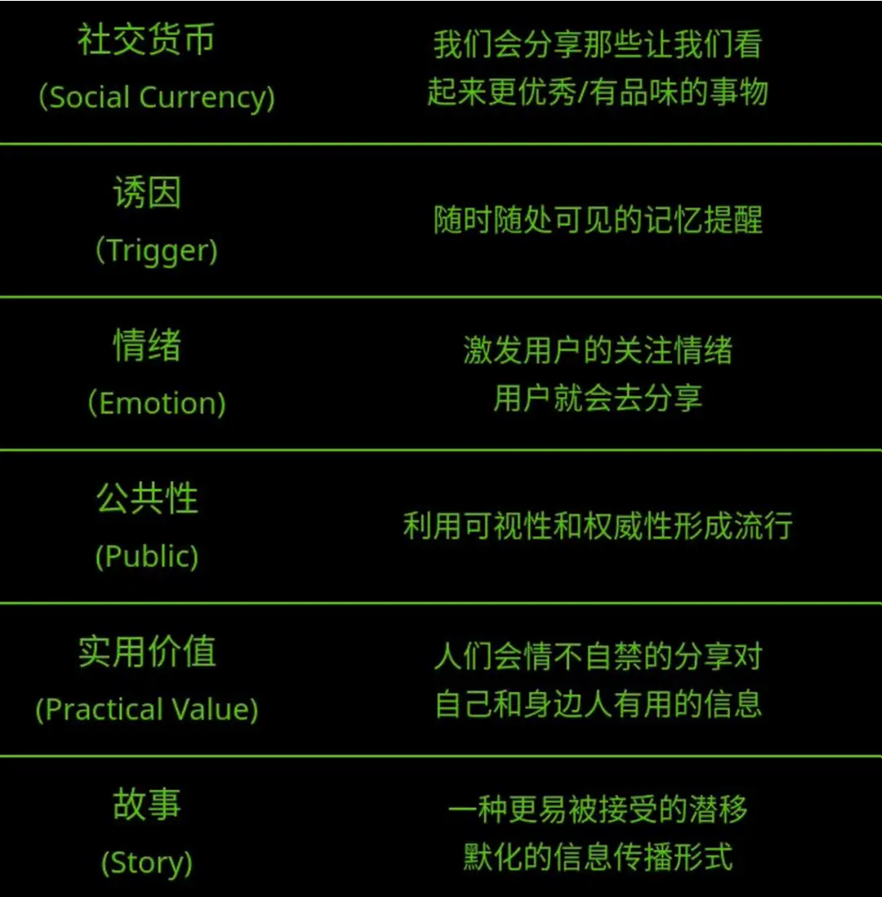

## Marketing Strategy
营销策略

美国营销大师乔纳·伯杰曾提出过病毒式爆发传播的6个点：社交货币（Social Currency）、诱因（Trigger)、情绪（Emotion)、公共性（Public）、实用价值（Practical Value）、故事（Story），称之为营销STEPPS六大原则。

##### 口碑营销
口碑营销是指企业通过产品或服务，通过用户和亲朋好友的交流将自己的品牌传播开来。

这种营销方式可信度强、成功率高。我们曾在论坛、微博上看到关于海底捞众多口碑的传播，还有快书包1小时到货给用户带来的惊喜分享，这些都是口碑碎片，通过用户自行分享出来。

##### 情感营销
情感营销就是把消费者个人情感差异和需求，作为企业品牌营销战略的核心，通过借助情感包装、情感促销、情感广告、情感口碑、情感设计等策略来实现企业的经营目标。

这个时候，消费者购买商品所看重的已不是商品价格高低、数量的多少以及质量好坏了，而是为了一种感情上的满足，一种心理上的认同

##### 恐吓营销
恐吓营销是指营销者通过广告、营销人员等方式，向目标客户告知某种现存的或者潜在的威胁、危害，以达到销售其自身产品的目的的一种营销方式。

这种策略适合一些对身体有益的健康类产品或服务、人身安全的产品或服务，比如保险公司、空气净化、安全座椅、保健品、药品、母婴用品、儿童教育……这些企业在使用此策略上效果很明显，但是不要夸大事实，甚至捏造谣言危害竞品。当营销者提供的事实或者数据存在夸大或者虚假时，这种行为一般不列入恐吓营销的讨论范畴。

##### 体验营销
体验通常是由于人对事件的直接观察或是参与造成的，不论这个事件是真实的，还是虚拟的。体验会涉及到顾客的情感、感官、情绪等一系列感性因素，当然也会涉及到智力、知识、思考等理性因素，再加上在体验中需要进行的一些身体活动。

为何进行体验营销呢？其实体验营销的重要性体现在：消费者的情感需求比重在增加；消费需求的日趋个性化、差异化、多样化；消费者价值观与信念转变迅速；消费者关注点向情感性利益转变。对于现代消费的观念转变，可通过体验式营销更深层的了解消费者需求。

##### 植入营销
植入营销通常是指将产品或品牌及其代表性的视觉符号，甚至服务内容策略性融入电视剧、电影或媒体节目等各种内容之中，通过场景的再现,让观众在不知不觉中留下对产品及品牌印象，继而达到营销产品的目的。

我们经常在众多电视剧、电影、微视频中看到不同品牌的植入。甚至可以在各种以内容输出的平台上来实现，比如网络游戏、微博段子、长微博图文，甚至小说之中。

##### 事件营销
事件营销的英文为EventMarketing，国内有人把他直译为“事件营销”或“活动营销”。

事件营销是企业通过策划、组织和利用具有名人效应、新闻价值以及社会影响的人物或事件，引起社会团体、媒体和消费者的兴趣与关注，以求提高企业或产品的知名度，树立良好品牌形象，并最终促成产品或服务的销售目的的手段和方式。

简单地说，事件营销就是通过把握新闻的规律，制造具有新闻价值的事件，并通过具体的操作，让这一新闻事件得以传播，从而达到广告的效果。我们常因为新产品知名度不够高而苦恼，在新品上市阶段，很多企业希望能有一个引爆的事件发生，将公众、媒体的目光聚集过来，这都是希望品牌迅速爆红的心理。

##### 饥饿营销
饥饿营销指商品提供者有意调低产量，以期达到调控供求关系，制造供不应求“假象”，维持商品较高售价和利润率的目的。

表面上，饥饿营销的操作很简单，定个叫好叫座的惊喜价，把潜在消费者吸引过来，然后限制供货量，造成供不应求的热销假现象，从而提高售价，赚取更高的利润。但“饥饿营销”的终极作用还不是调节了价格，而是对品牌产生的附加值，这个附加值分正负。

##### 比附营销
比附营销是一种比较有效的营销手段，能让目标受众迅速完成对我们的产品、服务或品牌，从认识到感兴趣甚至到购买的过程。

其操作思路是想方设法将自己的产品或品牌与行业内的知名品牌发生某种联系(即攀附知名品牌)，并与其进行比较，但承认自己比其稍逊一筹。

##### 会员营销
会员营销是一种基于会员管理的营销方法。

商家通过将普通顾客变为会员，分析会员消费信息，挖掘顾客的后续消费力汲取终身消费价值，并通过客户介绍等方式，将一个客户的价值实现最大化。

与传统营销方式在操作思路和理念上有众多不同。在数字营销战役中，我们更愿意使用数字化手段对企业的会员进行分群、清洗、优化，并制定有针对性的营销策略，比如通过梳理一个电商企业的会员，根据年龄、地域、性别、习惯购买品类、购买次数等多个维度进行分群，在促销时针对不同群体进行不同内容的传播。

